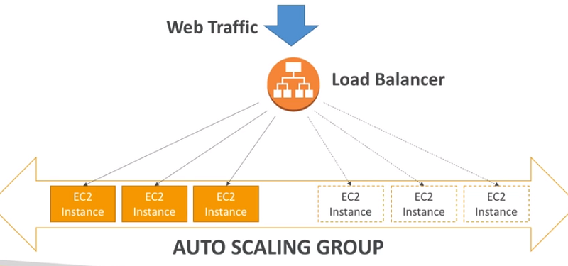
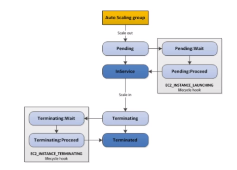

Hi guys, In this tutorial we are going to discuss about Auto scaling groups. ASGs are used to scale out or scale in to match the network load. This helps the creation and removal of instances easy and quick. We talked about load balancers in the previous tutorial.

Using that knowledge we know how load balancers handle the network load. What is does is dividing the load among the instances. If you can remember if we have cross zone load balancing then this load will be divided equally among all the instances. But think of a situation where these instances set is not enough to handle the load. In this type of a scenario ASG helps a lot. It will create new instances according to the load.

Now you might think what if the application start to create thousands of instances, in such a scenario we can configure ASG with auto scaling alarms. These alarms are based on cloudwatch alarms. Further these alarms can be used to create scale in/out policies.

Now let’s talk about ASG — Dynamic scaling policies. So there are like 4 ways to do this,

- Target tracking scaling — Simple just check for certain metric exceed or not
- Simple/Step scaling — If one metric exceed this value this number of instances should be created and vice versa.
- Scheduled actions — In a certain day in certain time period number instances should be increase
- Predictive scaling

Following are some good metrics to scale on

- CPUUtilization
- ResquestCountPerTarget
- Average Network In/Out
- Any custom metric

ASG default termination policy is as follows,

- Find the available zone (AZ) which has the most number of instances
- If there are multiple instances in the AZ to choose from, delete the one with the oldest launch configuration

ASG tries to balance the number of instances across AZ by default. Following is the life cycle of the instances in ASG.

You can configure the Auto Scaling Group to determine the EC2 instances’ health based on Application Load Balancer Health Checks instead of EC2 Status Checks (default). When an EC2 instance fails the ALB Health Checks, it is marked unhealthy and will be terminated while the ASG launches a new EC2 instance.

For each Auto Scaling Group, there’s a Cooldown Period after each scaling activity. In this period, the ASG doesn’t launch or terminate EC2 instances. This gives time to metrics to stabilize. The default value for the Cooldown Period is 300 seconds (5 minutes).
