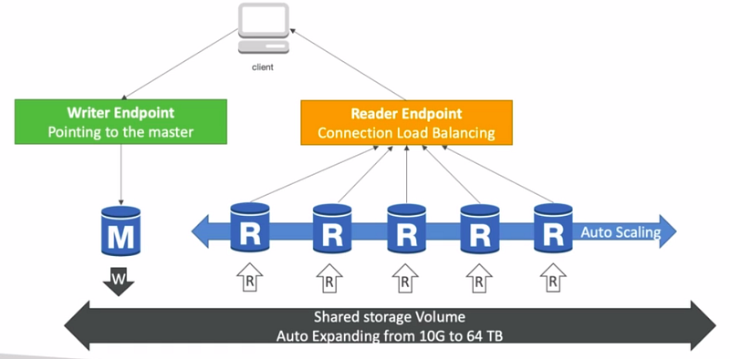
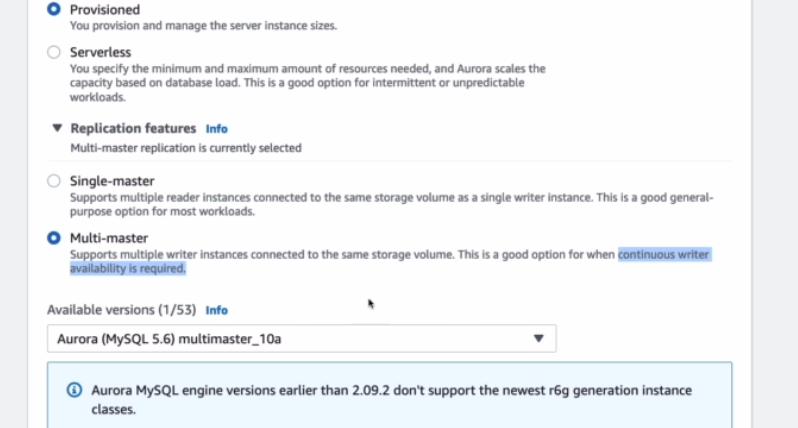
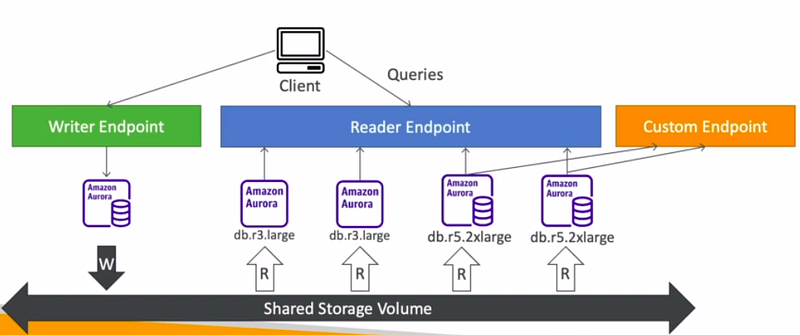

Hi Guys, In our last tutorial we talked about AWS RDS and talked a lot about how to create and manage RDS instances.

In this tutorial first we are going to look at Aurora DB which is a AWS owned DB type. This supports both PostgresSQL and MySQL and performance wise this is really a great choice. In increments of 10GB, sorag can be scaled up to 128TB. Further when deploying Aurora it creates a cluster instead of just one instance with read replicas and replication process is also faster. Main disadvantage is it cost more than 20% we spent on normal RDS but efficiency wise this is the best.

For the high availability and scaling as i mentioned before Aurora cluster gives up to 15 read replicas and these could be spread across multiple available zones (AZ).

So looking at the diagram we can see one writer end point and multiple read replicas which can be scaled up to 15 and the most cool feature is read replicas are connected through a load balancing endpoint. If you need multiple writer instances there is also an option when creating the database called multi master.

Following are the features of Aurora,

- Automatic fail-over
- Backup and Recovery
- Isolation and Security
- Industry compliance
- push-button scaling
- Automated patching with Zero downtime
- Advanced monitoring
- Routine maintenance
- Backtrack — restore data any point of time without backups

Since this is using the same RDS engine, all the security features are same as the ones we discussed in the [RDS tutorial](/blogs/aws-certified-solution-architect-rds).

If we need to run analytical queries on some the read replicas. Then those replicas could be provisioned with large instances and then create an special type of endpoint called custom endpoints.

Aurora even provide server-less option to pay per second which is cost effective for infrequent, intermittent or unpredictable workloads. Database instantiation is automated and auto scaling is based on actual usage.

Furthermore we have functionalities like Aurora multi master and Aurora global. These really helps for disaster recovery and high availability. Aurora also provide options to include AWS based ML models to data in the databases. Amazon SageMaker and Amazon Comprehend are supported.
