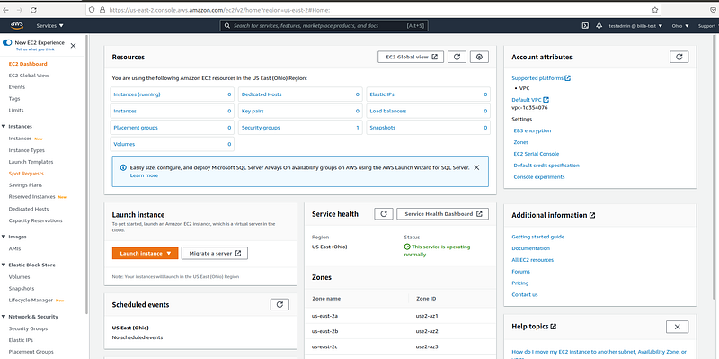
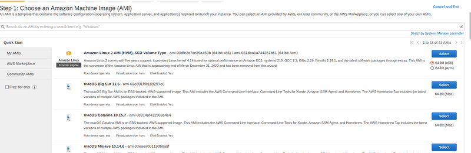
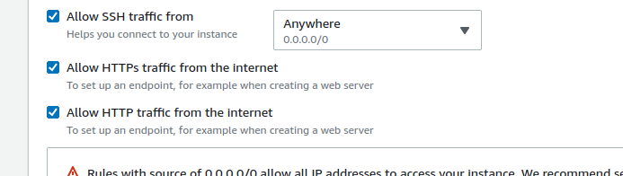
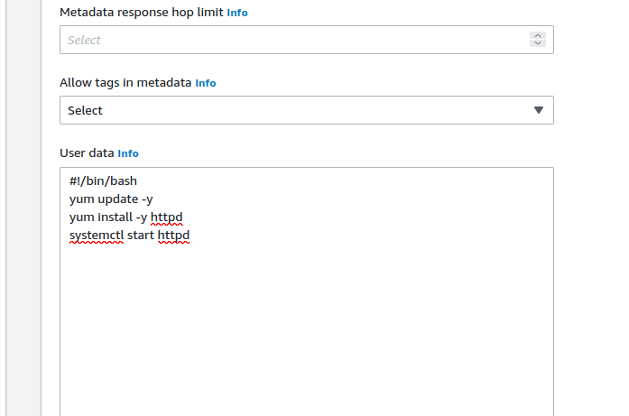
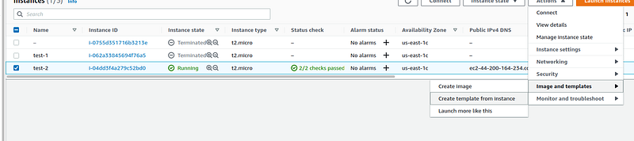
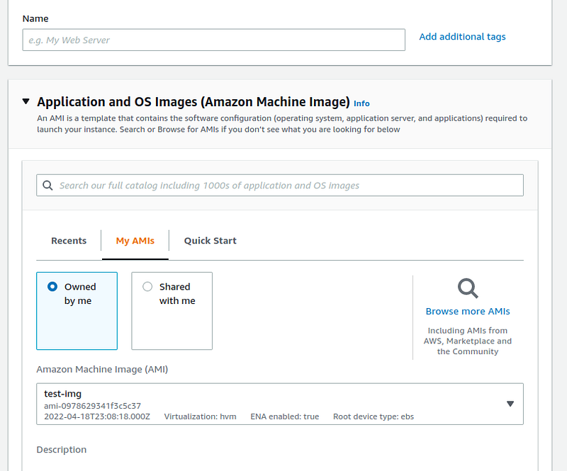

Hi guys in this tutorial we will be looking at one of the most popular AWS services, EC2 (Elastic compute cloud). In other words we are renting virtual machines from AWS using this service. So as an AWS solution architect when creating an EC2 instance we need to think about some main points before deciding on what virtual machine we are going to rent.

- OS — Linux, Windows or Mac OS
- CPU
- RAM
- Storage
- Network card — Speed and public IP address
- Security groups — Firewall rules
- EC2 user data — Bootstrap script

So in our last tutorial we created an AWS account an we learnt about IAM. To access those tutorials please click on following links.

Now you guys know how to visit the AWS console. Just as same as we search for IAM search EC2 in the search box. After clicking on it you will be in the EC2 section. Now you will have a view like this.



To create a EC2 instance click on the instances in left corner tab and then in the view we get there is a button called launch instance. click on it. Now the first step for us is to select the AMI (Amazon Machine Image). For this tutorial i will use Amazon Linux 2 AMI. Press on the select button there.



In this tutorial will create a free tier(Amazon doesn’t charge us). For that we use **_t2.micro_** instance type in the next screen.Here t means instance class (Here it’s general purpose), 2 means the instance generation and micro means the size of the instance. There are like 5 different classes of instances.

- General purpose
- Compute optimized
- Memory optimized
- Storage optimized

Remember that these things are asked in the AWS architect exam. So try to map these with real life situations where you have to come up with an EC2 server. We have talked about OS, CPU and RAM for instances, Now lets talk a little bit about network cards.

So for an EC2 instance there are 2 different IP4 addresses. Private IP and public IP. Private IP is used for AWS internal network and public IP is used for internet(WWW). When we stop and start a EC2 instance this IP address can be changed, to avoid this we have Elastic Ips in AWS. So we just have to go to EC2 dashboard and go to Elastic IPs and then create it. AWS normally allows 5 different Elastic IPs per an account. But in best practices it is not recommended to use elastic IPs. We can use random public IPs and register them a DNS name or we can use a load balancer and avoid using public IP at all. EC2 instances are created inside VPCs. These VPCs have a logical component called virtual network card and these cards provide EC2 instances a Elastic Network Interface (ENI). An ENI can have IP4 private and public addresses, security groups and a MAC address. In AWS we can create ENI and attach them on the fly on EC2 instances for failover. Elastic Network Interfaces (ENIs) are bounded to a specific AZ. You can not attach an ENI to an EC2 instance in a different AZ.

Security groups are used to add firewall rules to the EC2 instances. Creating a security group is so easy. We just have to go to EC2 dasboard and then go to security groups and in there create a new security group. Security groups can be attached to multiple EC2 instances and we can use them to lock down an instance to a specific region.

Best practices when using the security groups includes using a different security group SSH always and always use IAM roles to give authorization to EC2 instances. Furthermore when we face technical issues in our hosted app, if the issue is a timeout issue it can be a security group issue. By default all inbound connection are restricted and all outbound connection are authorized in security groups.

To terminate EC2 instances while memory preserved AWS has a new option called AWS Hibernate. Here RAM state is preserved and OS is not stopped just restarted so the boot time is less. Here RAM is state is written to a file in the root of EBS volume. This is used for long running processes, services that take time to initialize. Root volume must be encrypted to use this and RAM size of the instance should be less than 150GB. An instance cannot be hibernated more than 60 days. To enable EC2 Hibernate, the EC2 Instance Root Volume type must be an EBS volume and must be encrypted to ensure the protection of sensitive content.

Cluster Placement Groups place your EC2 instances next to each other which gives you high-performance computing and networking. Spread Placement Group places your EC2 instances on different physical hardware across different AZs.

There are mainly 4 ways to purchase EC2 instances. This is very critical when you become a solution architect. You should have the knowledge to get the best thing for your solution with the lowest cost.

- On demand — Short workload
- Reserved — Long workloads (Convertible and Scheduled) — (1–3Yrs)
- Spot reserved — Predict price then enter a spot price to be more than current value of the spot or can use spot block to block the instance for a scheduled time frame (By using Spot Block Instances, you reserve a set of Spot EC2 instances for a specified duration (1–6 hours) without interruption.). Spot Fleet is a set of Spot Instances and optionally On-demand Instances. It allows you to automatically request Spot Instances with the lowest price.
- Dedicated — Entire physical server — 3Yrs up

When terminating a spot reserved instance, first cancel the spot request and then terminate the instance.

More recent developments in EC2 are as follows.

- EC2 Nitro — Next gen EC2, New virtualization Tech, Better performance (Higher speed EBS (Nitro — 64000IOPS while non Nitro — 32000IOPS), Better networking (High performance computing, enhanced networking, IPv6), better underlying security
- EC2 vCPU — Multiple threads on one CPU and one thread is called vCPU. 4CPUs and 2 thread per CPU then 8 vCPUs. These vCPUs can be optimized to use each CPU as our need — RAM or HPC (High performance computing)
- EC2 Capacity reservation — No need of 1–3 year commitment but ensure we have EC2 capacity when needed (Cost saving)

Now we have talked a lot about EC2. So now it’s the time to check AMIs. Amazon machine images are used when creating a EC2 instance. So we saw some inbuilt images but now we are going to create a customized AMI. Steps to do this really simple,

- Create a EC2 instance and do the customization we need on that instance
- Convert it to an AMI

When creating a new EC2 there is a section called **“Advanced details” **click on it and then you will see a text box called User Data. In this text box we can include a certain script to be run when instance is created. Another important thing is to set HTTPs and HTTP traffic ticks as below.



Enter the user details as below.



```
#!/bin/bash
yum update -y
yum install -y httpd
sudo su
systemctl start httpd
```

Here the first line is very important as it describe the rest of the lines as bash commands. After creating the EC2 instance, try to access that instance using the Public IPv4 DNS. Just copy this value and paste in a browser. If everything has worked out correctly you should see a web page with Apache server details. (Make sure to put http instead of https in copied url). For example [http://ec2-3-239-27-105.compute-1.amazonaws.com/](http://ec2-3-239-27-105.compute-1.amazonaws.com/).

Now let’s create an AMI of this instance. For that got to the instances screen and select the instance you need to convert. Now click on create image.



Then give a name and create the AMI. Now go to launch instance and create a new EC2. Here for the AMI use the AMI you created as follow,



Now without adding User data just launch the instance but remember to tick the HTTP in the network section. Now check the URL. You will see the apache server, which means this is the image we customized before.
