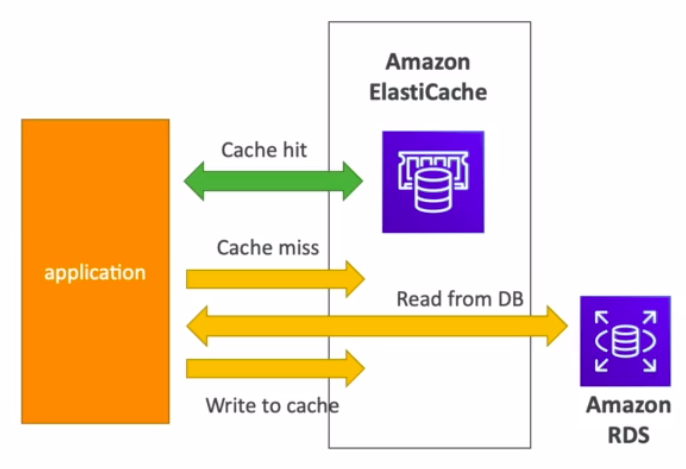

Hi Guys, Caches are in memory databases with super fast performance. In our previous tutorials we talked about RDS.

The same way RDS is to manage relational databases, ElastiCache is to manage Redis or Memcached. For read intensive workloads this helps to reduce load off. This makes the application stateless.

Normally in an application we use cache to store data which are used frequently. Before directly read from DB it first check int he cache. Cache should have a better invalidation technique to ensure the data in the cache are in sync with the database.

Since ElastiCache is used to manage Redis and Memcached, let’s see the differences between them. Redis is kind of similar to RDS and it uses replication to support scalability and high availability but Memcached uses sharding to put data in multi nodes and since this use no replication no high availability is present. While Redis support persistence, Memcached doesn’t support. Redis has backups while Memcached doesn't.

In case of security Redis has redis Auth and this supports SSL in flight encryption. Memcached supports SASL based authentication. Security groups can be added to control the access.

There are 3 patterns for ElastiCache,

- Lazy loading — Read data is cached, since no update happen data can be stale
- Write through — Adds or update data in the cache when written to DB
- Session store — Store temporary session data in a cache.

In use case like gaming leader boards, Redis sorted sets ca be used because it has uniqueness and element ordering.

This is about how caching is supported in AWS and thank you very much for going through this tutorial.
