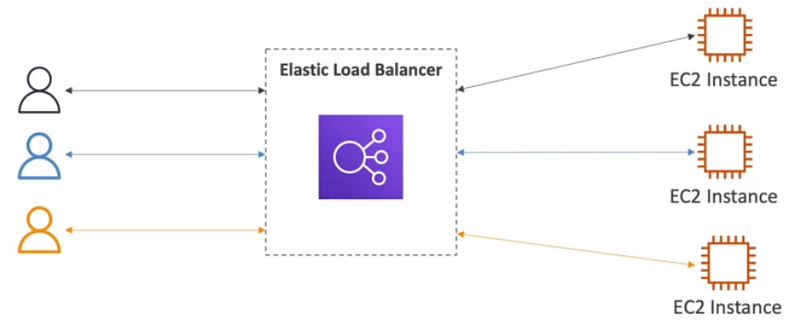
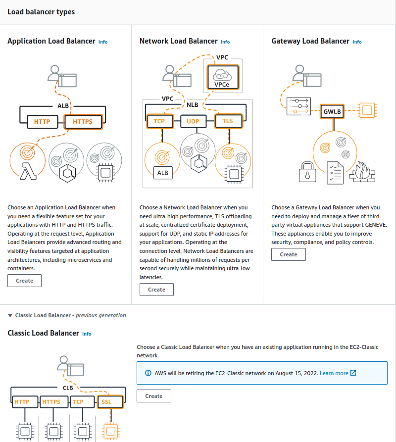

Hi Guys, In this tutorial we will be talking about load balancers. Before diving in to that let’s learn what is scalability. Scalability means that an application or a system can handle greater loads by adapting. There are two types of scalability,

- Vertical Scalability — Increasing the size of the instance of your application
- Horizontal Scalability — Increasing number of instances of your application

Now let’s discuss what is load balancing. Load balances are servers that forward traffic to multiple downstream servers.

Load balancers,

- Spread load across multiple downstream instances
- Expose a single point of access (DNS) to your app
- Handle failures of downstream instances
- Do regular health checks to your instances
- Provide SSL termination (HTTPS) for your websites
- Enforce stickiness with cookies
- High availability across zones
- Separate public traffic from private traffic

ELB means Elastic Load Balancer and this is a **managed load balancer**. This load balancer is managed by AWS and they guarantee it will be working with newest upgrades, high availability and easy maintenance. Health checks are done to downstream instances to check the availability. If a instance is unhealthy or serve an another task then connection draining happen.

There are 4 types of load balancers in AWS,

- CLB — Classic load balancer (Supports TCP, HTTP & HTTPS, Health checks are TCP or HTTP based, fixed host name)
- ALB — Application load balancer (HTTP, target groups, containers, support HTTP/2 and WebSocket, Redirects) — Great fit for micro services & container based applications like docker and Amazon ECS. Port mapping feature to redirect to a dynamic port in ECS. Cross zone looad balancing is always on.
- NLB — Network load balancer (Forward TCP & UDP traffic to your instances, less latency, millions per requets for seconds, has one static IP per AZ)
- GWLB — Gateway load balancer (Operates at Network layer IP Packets. transparent network gateway, load balancer, GENEVE protocol at port 6081

Network Load Balancer has one static IP address per AZ and you can attach an Elastic IP address to it. Application Load Balancers and Classic Load Balancers have a static DNS name.

To create a load balancer go to the EC2 service and in the left side of the page you can see a section called Load balancing. Click on that and in the screen click on the Create Load balancer button.

Here you can select which load balancer you need. Here going forward you can add the created load balancer to a EC2 instance.

Although we cant select which client will connect with which instance in load balancers there is a way to make sure a client to conect only with one instance. This is called sticky sessions. An application based cookie is used here. Since only CLB and ALB does HTTP based balancing, only these 2 are compatible with sticky sessions.

When using an Application Load Balancer to distribute traffic to your EC2 instances, the IP address you’ll receive requests from will be the ALB’s private IP addresses. To get the client’s IP address, ALB adds an additional header called “X-Forwarded-For” contains the client’s IP address.

As an another feature we can use SSL certificate to allow traffic between clients and the load balancer to be encrypted in transit. Using SSL socket layer can be encrypted and using TLS which is a newer version where transport layer security provided same can be done. When implementing this there can be several SSLcertificates in load balacer. SNI solve this problem to find the correct certificate for correct target. SNI suport only ALB and NLB.

With the knowledge we have so far lets say You are running a website on 10 EC2 instances fronted by an Elastic Load Balancer. Your users are complaining about the fact that the website always asks them to re-authenticate when they are moving between website pages. You are puzzled because it’s working just fine on your machine and in the Dev environment with 1 EC2 instance. What could be the reason?

Here you can see different requests most likely to go in to different instances. So to connect client to one particular instance will have to use sticky session enabled. In this scenario it might have been disabled.

Hope you learn something about ELBs. See you in next tutorial. Bye :)
