IAM means Identity and Access Management service. Earlier when we created the AWS account in our previous tutorial, we created the Root account for our AWS account. If i’m an organization there will be different teams with different people. So IAM is used to give permission to these people. In IAM Users are people and they can be grouped and Group contains only users not other groups. One user can be in different groups. Users or Groups can be assigned to policies. These policies are written as JSON documents. Policies are used to give permission and when giving permission you should practice “Least privilege principle” which means we don’t give more permission than a user needs.

Link to the previous tutorial is shown below.

To access IAM service go to the search bar in the AWS console and type IAM and click on the IAM button.

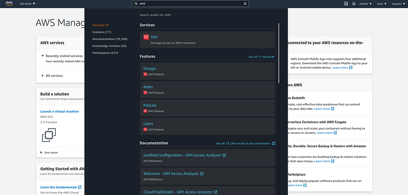

After clicking you will come to the IAM dashboard.

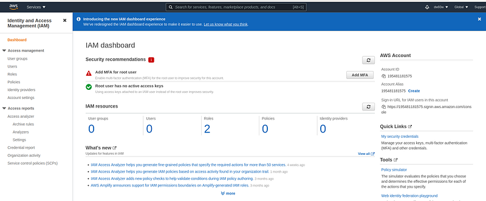

As the first thing let’s create a user group. Click on the User groups which is in the left side of the screen and then give a name.

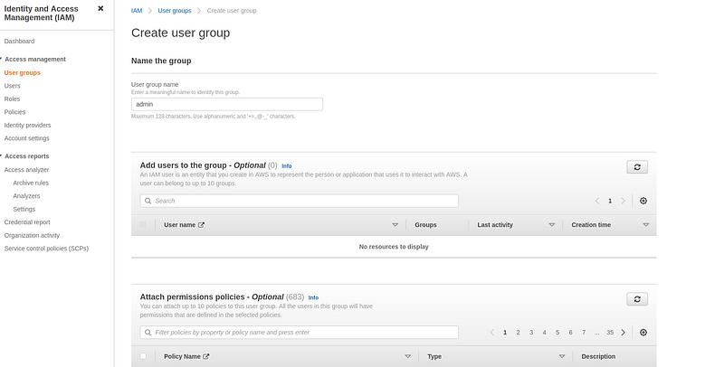

Now in the attach permission policies there is a search bar and in it type admin and find the Administrative access policy set and select it.

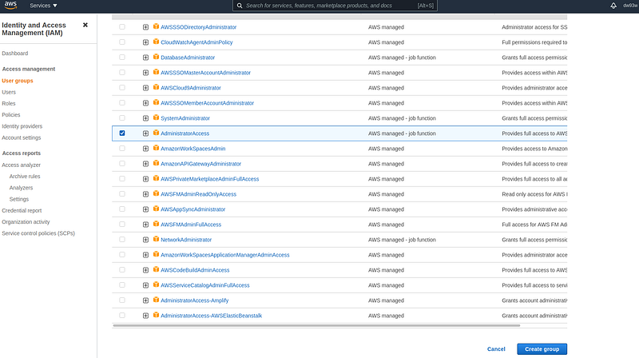

If we click on the + button in the policy we will see a policy document like this.

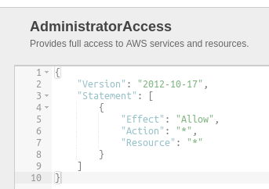

Here the Version is the AWS policy version, Effect is to whether allow or deny. Action means list of actions this policy applies to and resources means list of resources this policy allows. So looking at this we can understand admin user get access to all the resources and all the actions.

Now press the create group button. Now we have successfully created the admin user group and as the next step will create a user to add to this group. For this go to the Users tab in the dashboard and press it. In the appearing screen press the Add users button. Add the details as below.

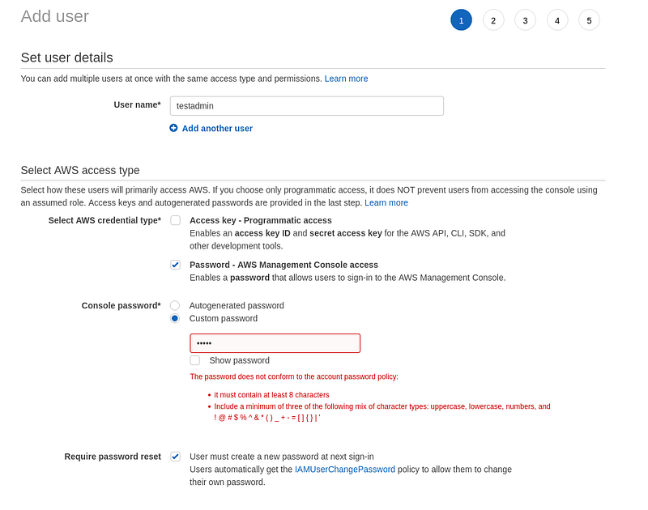

Here if we select the credential type Access key we will get a access key id and a secret key to use the AWS API. This is the preferred method in most software companies which are using AWS services. In the next screen we have to add that user to a group. So we will add the testadmin user to the admin group. In the next screen we will get an option to add tags to the users. So this is just to give some info about the user so i’m not going to add any tags. As the final step click on the create user button.

Before login using the created user will change the account Alias to get an IAM account name to remember easily. For that go to the IAM dashboard and in the right corner you will see a create button near account alias. Give a unique name to your account after clicking on that create button.

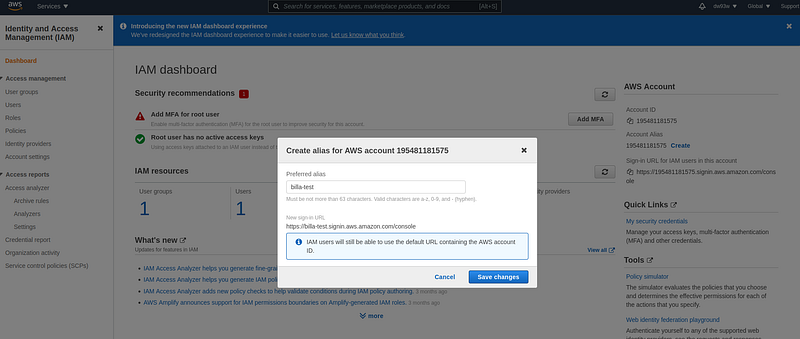

Now lets logout and login from the IAM admin user. In the login screen click on the signin as IAM user and there give the account alias we created. Then give the username and password and in the next screen we will have to change the password. After that we will be redirected to the AWS management console.

One other main fetaure of IAM is we can change password policy and even we can add multi factor auth mechanisms. For this go to the IAM dashboard and in the left side corner we have Account setting tab. Click on it and in the new screen we will have a button to Change password policy.

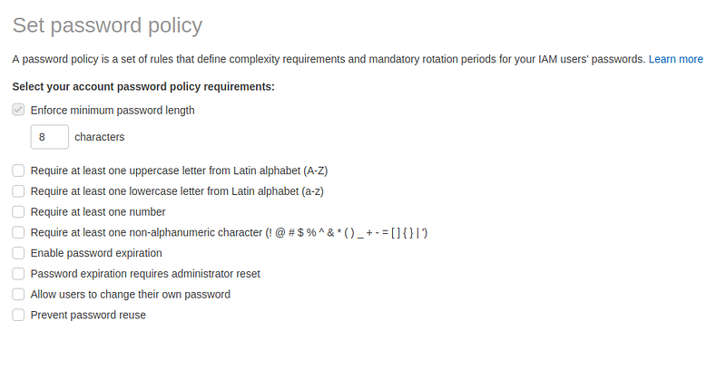

To add multi factor authentication click on the user name in menu bar and click on the My security credentials tab

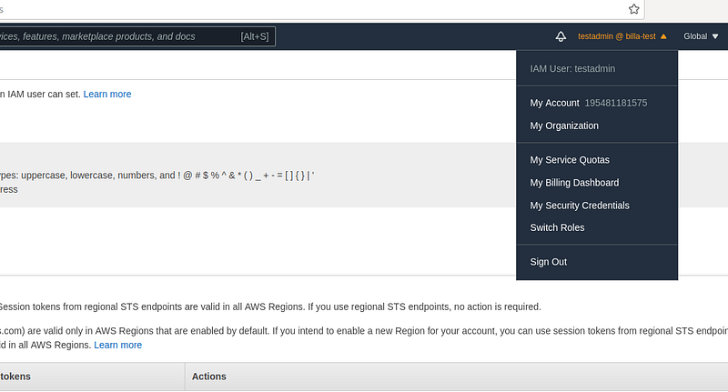

In the coming screen we have options to add MFA.

Next will learn about **access keys in AWS IAM**. Access keys are just as same as passwords. Here we have access key Id which is like the username and then secret access key which is similar to the password. Access keys are mostly used to access AWS CLI and AWS SDK. Lets see how to create access keys.

- First go to the Users section in IAM and click on the created user then in the next screen click on the Security credentials section.

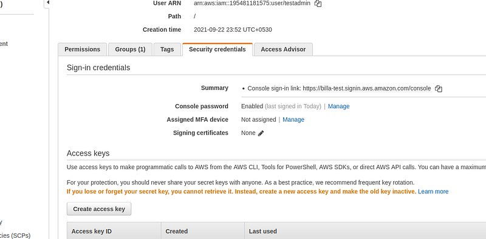

**Here press on the create access key button. Download the csv file with the credentials. To test the access key will use ASW CLI**. By accessing the following link we can install the AWS CLI.

After installing get a terminal and in there type.

```bash
aws configure
```

Then you will be prompted to enter the access key details. These details are in the csv file you downloaded previously. For region name and output format just press enter. Now type following command in the terminal.

```bash
aws iam list-users
```

Here you should get the details of the created user. So we have used aws from our terminal without password and only using access keys.

Next will see how to create a user role in IAM. IAM roles are used assign permission to AWS services. For this go to the IAM dashboard and then clock on Roles. Now click on add new role.

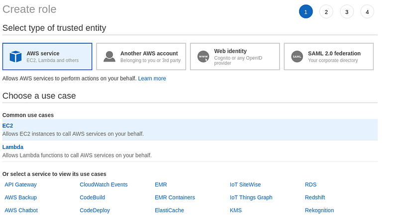

Here select EC2 and then in next view we will have to give policy for this role. Here we will give read only access for that search IAM and in the suggested policies select the IAMReadOnlyAccess.

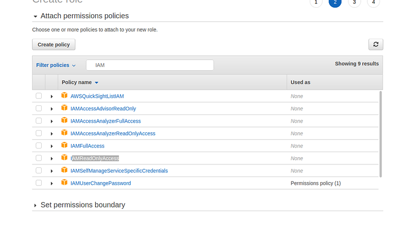

Now in the next view we can add tags but i’m skipping it. So in the final view we have to give the role name.

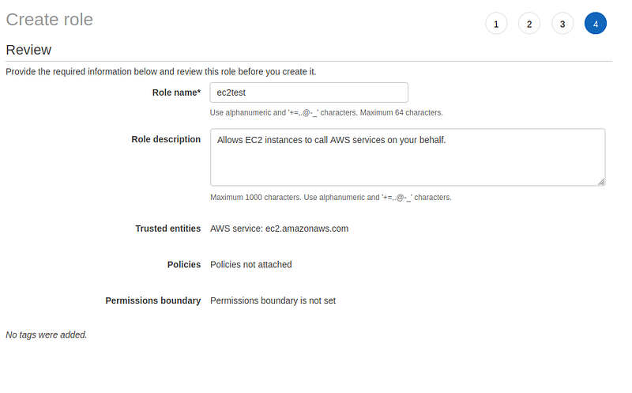

You can see by the role description (which is a auto generated one) that the purpose of role is to allow a service on behalf of you.

These are the best practices when using IAM.

- Don’t use root account — Except for creating the AWS account
- Don’t create multiple users for 1 physical users
- Assign permissions to groups and then assign users to group
- Create strong password policy
- Use MFA — Multi Factor Authentication
- When giving permissions to services use IAM roles
- For AWS CLI dont use passwords use Access keys — Similar for other programs

So in this tutorial we learn about IAM service in AWS. Which is a fundamental service. Using this knowledge in next tutorial will learn how to manage EC2 service. Happy coding guys!!!
