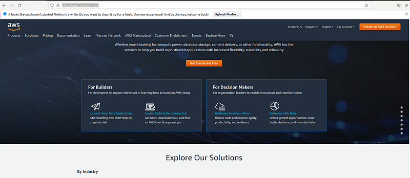
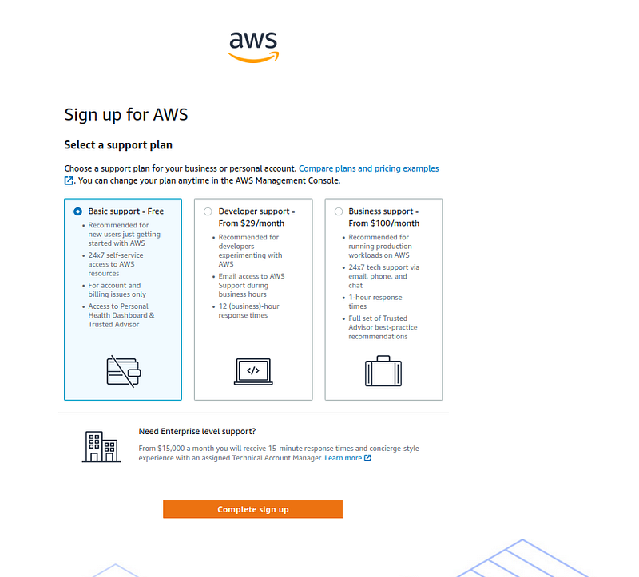
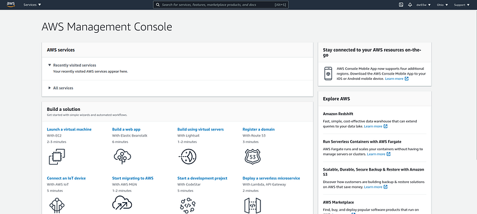

Hi Guys, So this is the new tutorial series and hopefully your main helper in the AWS certified solution architect exam. So first of all, lets see what is AWS. AWS(Amazon web services) is a cloud provider which gives servers and services on demand.

I’m currently working as a Senior software engineer for SyscoLABS and all most all of our systems are hosted in AWS. If you guys don’t know about SyscoLABS its the technology partner for the world largest food company Sysco. So in other words, world largest food cooperation relies on AWS and its not alone even Netflix does the same. Amazon have many cool services to help our problems in IT. So first point you all need to keep in mind is all these services are meant to be simple and meant to be helpful. So with that positive mind lets dig in to the basics of AWS.

First things first lets create a AWS account.

- First go to [https://aws.amazon.com/](https://aws.amazon.com/) and click on the Create an AWS Account button.

- Fill up your details and then press the Continue button and in the next screen also fill up your personal data and press Continue. Then you will have to input your billing details. For this we will have to give our credit card info. Although we will not be charged for free services still there will be a hold of 1$ for 3–5 days for secure verification. Then there will be security verification and you will receive a OTP to your phone. After that you will be coming to the final stage to select the type of account.

Here select the Basic support free option and complete the signup. Keep in mind for this to work properly you should have minimum 1$ in your account :P.

- Now you will have a button Go to AWS Management Console, press on it. Now in the login screen give the email address you used to register and give the password. Finally you will be inside the console.

AWS cloud enables you to build advanced scalable applications. Enterprise IT applications, Website hosting, Database management and even big data analytics is made available to end users using AWS services. With these services AWS has data centers all around the world. To learn about their AWS global infrastructure we have to learn about following things.

- AWS regions
- AWS availability zones
- AWS data centers
- AWS edge locations/point of presence

By accessing the [https://aws.amazon.com/about-aws/global-infrastructure/regions_az/](https://aws.amazon.com/about-aws/global-infrastructure/regions_az/) You can see these points.

So one of the main thing to consider when we host our application in AWS is to choose the AWS region. Following are the facts we need to think before choosing an AWS region.

- Compliance — Legal concerns for data
- Proximity — Latency related things
- Pricing — Pricing is different in different regions
- Availability of services — Not all the services are available in every region

Each AWS region have many availability zones. These zones are completely isolated from one another so in a disaster it will not affect to all. These zones are connected using high bandwidth network so the latency is minimum.

Learning AWS is very critical as its the best cloud infrastructure service available. So getting a certification in AWS will make sure to get your dream job and if your are an entrepreneur this tutorial will show you how to start using elastic(On demand — Scalable) cloud for your applications. In the next tutorial on this series we will start learning about basic AWS services.
