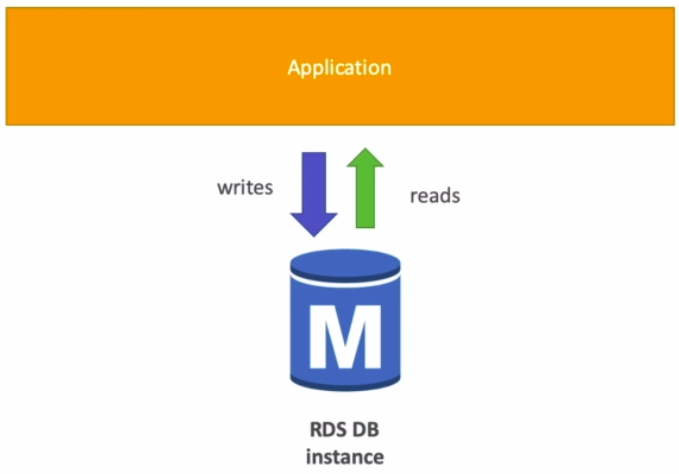
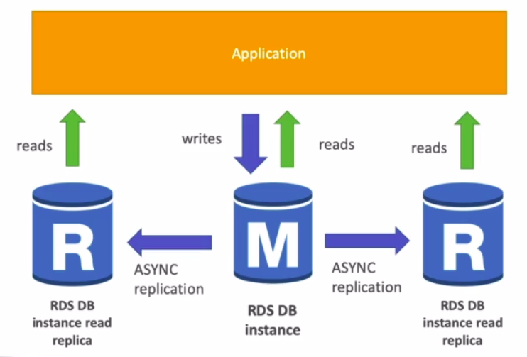
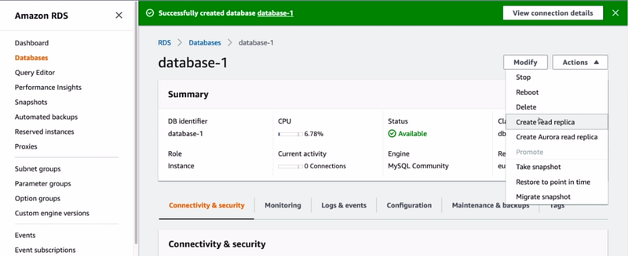
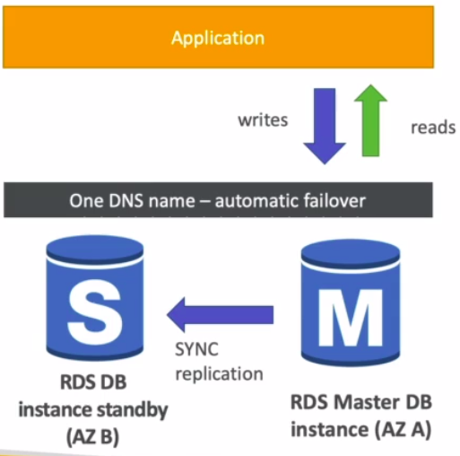
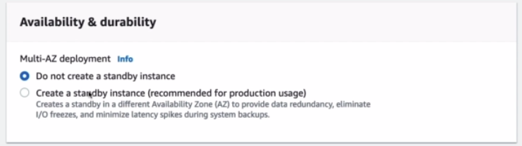
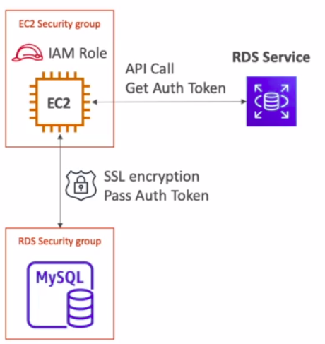

Hi Guys, In this tutorial we are going to discuss about the Relational Database Service. This service allows users to create AWS managed relational databases (SQL) in the cloud. Following are the databases we can create using RDS,

- Postgres
- MySQL
- MariaDB
- Oracle
- Microsoft SQL Server
- Aurora

Now you might think with the knowledge you have on EC2 if you have gone through the following tutorial,

that we don’t need some RDS to create DBs. Instead we could just manually install database in to an EC2 and manage. But there are many advantages of using RDS. Since RDS is a managed service there are advantages like,

- Automated provisioning, OS patching
- Continuous backups and restore to specific timestamp
- Monitoring dashboards
- Read Replicas for improved read performance
- Multi available zone (AZ) setup for disaster recovery (DR)
- Maintenance window for upgrades
- Scaling capabilities
- Storage backup by EBS (gp2 or io1)

One of the main disadvantage is that we can’t SSH in to the DB instance.

_Normal RDS instance_

Now let’s talk about the RDS Backups. Automatically backups are enabled in RDS. This is a daily full backup of the database. Transaction logs are backed up every 5 minutes. Normally there is a 7 day retention period which can be extended up to 35 days. These backups are stored as automatically created snapshots. But we can also manually trigger snapshots. Difference between these manual snapshots and automatic ones is that when DB instance is deleted automatic snapshots are also getting deleted but manually created ones stays.

Another cool feature in RDS is that it has storage auto scaling. In the beginning of this tutorial I told you that storage is done on top of EBS. So EBS has auto scaling thus RDS get that too. Still we can set a **Maximum Storage Threshold**. If the workload is unpredictable this approach is very helpful.

When we use relational databases for our applications it always has performance issues. Mainly because there are too many read and write request comes to the database. AWS RDS has a cool feature called RDS read replicas which improves the read scalability and avoid performance issues.

Replication is asynchronous which makes the reads consistent. Even these replicas can be updated to their own DB. To use read replicas the main application must update the connection string. Example use cases are when running reporting applications on top of a production application. If these replicas stays in the same AZ, then no cost to create read replicas but if this cross region then we have to pay. Following screen show how we can enable read replicas.

We saw that read replicas added scalability to our database, Now let’s see how RDS add high availability. For this we have a feature called RDS multi AZ.

Unlike read replicas this is a synchronous replication and this replica is not used for scaling. When the master DB fails automatically it redirects to stand by instance. Now you might have a question whether we can use read replicas for high availability. If we use cross region read replica setup (which costs) we can use it for disaster recovery. We can go from single AZ to multi AZ with zero downtime. The process is really simple. They take a snapshot of the RDS DB instance and then restore it as another instance. Then it creates a link to establish synchronization. Following is the setting we have to enable to use Multi AZ.

RDS is really useful when we have to add security to our database. There are main 2 ways of adding encryption in this process.

- At rest encryption — Using AWS KMS-AES-256 encryption we can encrypt master database and read replicas. For Oracle and SQL server we can use transparent data encryption.
- In-flight encryption — SSL certificates can be used to encrypt data to RDS in flight. This provides SSL options with trust certificate when connecting to database. PostgresSQL: rds.force_ssl=1, MySQL: GRANT USAGE ON *.* TO ‘mysqluser’@’%’ REQUIRE SSL.

To encrypt an un-encrypted RDS instance we have to first create a snapshot of this instance and then copy the snapshot and for the copy we have to enable encryption. Then we can restore this encrypted copy and delete the older instance.

As the RDS database instances are usually deployed within private subnets, it ensure the network security for the database. Security groups also can be used to ensure network security.

Using IAM policies RDS user’s permissions can be managed which comes really handy when controlling access management. Although traditional user name and password approach can be used to login to the database, we can also use IAM based authentications as well. But this is only applicable to MySQL and PostgresSQL.

In IAM authentication we don’t need a password. The authentication token obtained through the IAM and RDS API calls can be used here. These auth token have a lifetime of 15 minutes. benefits of this are,

- Network in/out must be encrypted using SSL
- IAM to centrally manage users instead of DB
- Can leverage IAM roles and EC2 instance profiles for easy integration

As summary when using RDS please check the ports/IP/security groups inbound rules in security group of the database and try to manage database user permission through IAM. Using parameter groups try to allow SSL connections.
