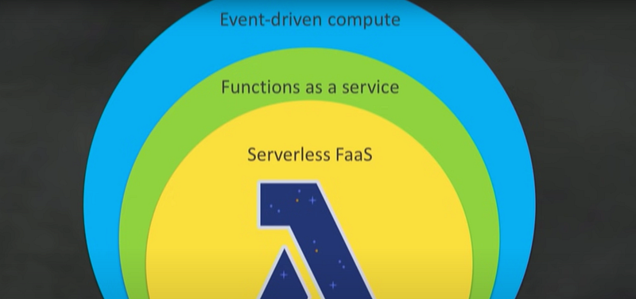
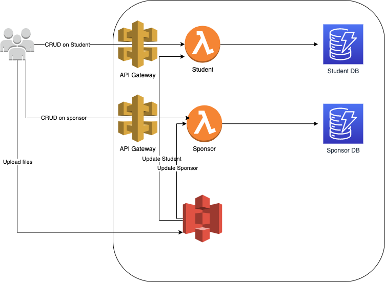

Currently I’m working on a project where I need to store Student and Sponsor data related to a scholarship fund. As this is a charity work without any profit, first concern for the organisation is the cost. I have considered various options like AWS EC2 free tier, AWS ECS, Heroku etc. But when I came across AWS Lambda, I stopped right there. Reason is AWS Lambda start costing after a certain threshold and with the scale of the work I’m doing right now, I’m sure it will never cross that threshold.

Since deciding going with AWS Lambda, there were many problems in my mind. Why should I go serverless. Am I taking the right decision. So I went over 100s of related documents and videos. In a normal customer point of view these are the advantages I saw.

- Greater agility
- Less overhead
- Better focus
- Increased scale
- More flexibility
- Faster time to market

In a more devops or technical point of view, following are the advantages I saw,

- No servers to provision or manage
- scales with usage
- Pay for value
- Availability and fault tolerance are built in

Now I’m confident about the accuracy of the decision I took to go with Lamda. Before using it in the project, let’s learn about it a bit.

With the micro services becoming a popular choice, event driven computing became popular too. So basically we seperate out workflows of the application and connect them between different micro services using events. These events can be aligned with a function in more micro level. Thus serverless functions as a service became popular. Out of many, AWS Lambda has become a popular choice when going serverless. Following are some of the functionalities handled by Lambda itself.

- Load balancing
- Auto scaling
- Handling failures
- Security isolation — (Execution policies and function policies manage lambda security)
- OS management
- Managing utilisation

Even the workflow can be managed using step up functions. There are lot of things we can talk about Lambda functions but as a reference to my future work, I will go back to my use case where I need this to store student and sponsor information for a scholarship fund.

Following are the requirements for my application,

- Able to create, delete, update, deactivate Students and Sponsors
- File upload for Students and Sponsors
- Assign Students for a Sponsor

Following are the AWS services we are going to use to address these requirements. S3 free tier exists only for 1 year.

- AWS Lambda (Always free) — Functions with handlers for Student and Sponsor
- AWS API Gateway (12 months free tier)
- AWS S3 (12 months free tier) — Store uploaded files (Lambda function will be triggered when file is uploaded and it will update the file entries in database)
- AWS Dynamo DB (Always free)
- Front end hosted in [Github pages](/blogs/react-with-typescript-series-charity-web-app-deploying-to-github-pages).

Following is a high level architecture of our application.

Now our project my focus is to use AWS CDK for cloud formation stuff. This will help us to deploy the functions without using terraform or other library. As the first thing we will create the Student handler and the database. See you in the next tutorial. Happy coding :P
