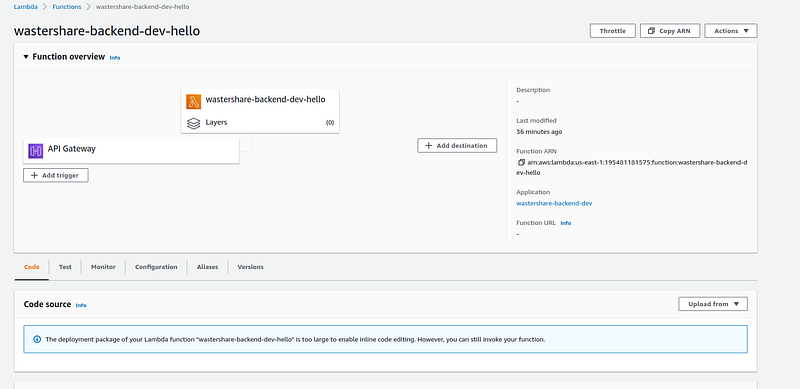

Hi guys, In our last tutorial we learnt how to create a simple lambda function with serverless and kotlin. In this tutorial we are going to create a full API using these technologies. To access last tutorial please use the following link

Now, before dive in to the User API stuff let’s just revisit the lambda function we created before. If we login to our AWS account and go to the lamda function service our waste share function will be listed as wastershare-backend-dev-hello. If you click on that you will get something like this.



> **Here when you create and deploy your Kotlin project if this API gateway is not there you can create it manually using +Add trigger button.**

Now if we try to understand this diagram, what we have here is the lambda function we created and then the API gateway which gives the public access to this function. So the one we have created in the previous tutorial is a get request. If we did this without using serverless and for the **User API **we are going to create there could be at least 4 end points, Then we will have to create 4 different lambda functions separately. But the cool thing about serverless framework is that it create everything we define in serverless.yml file in AWS.

Now for the best practices let’s create 2 folders as handlers and responses and put our already created files inside these folders. Our lambda function will be the Handler class and all other files are just supporting files. For our User API let’s have 6 different end points at this stage.

- Add
- Edit
- Delete
- Get all users
- Get one user
- Edit status

So with the knowledge from the previous paragraph you should know, Now we have to create 6 Handler classes to handle each of these scenarios and those classes must be included in the serverless.yml file with the End point path.

Now before start creating the Handler classes, Let’s decide what database we are going to use in this application. So the main question when choosing a DB is whether we are going to have large volume of data. If it’s the case still Aurora and DynamoDB both are options. But if we don’t have complex queries we can just use Dynamo DB. So to add DynamoDB we just have to edit our serverless.yml file like this.

```
service: wastershare-backend
frameworkVersion: '3'

provider:
  name: aws
  runtime: java11
  environment:
    DYNAMODB_CUSTOMER_TABLE: ${self:service}-userTable-${sls:stage}
  iam:
    role:
      statements:
        - Effect: 'Allow'
          Action:
            - 'dynamodb:PutItem'
            - 'dynamodb:Get*'
            - 'dynamodb:Scan*'
            - 'dynamodb:UpdateItem'
            - 'dynamodb:DeleteItem'
          Resource: arn:aws:dynamodb:${aws:region}:${aws:accountId}:table/${self:service}-userTable-${sls:stage}

package:
  artifact: build/libs/hello-dev-all.jar

functions:
  hello:
    handler: com.serverless.Handler

resources:
  Resources:
    UsersTable:
      Type: AWS::DynamoDB::Table
      Properties:
        AttributeDefinitions:
          - AttributeName: primary_key
            AttributeType: S
        BillingMode: PAY_PER_REQUEST
        KeySchema:
          - AttributeName: primary_key
            KeyType: HASH
        TableName: ${self:service}-userTable-${sls:stage}
```

Here we have set of values for provider and a new resources set here. All these are there to configure the DynamoDB table. Let’s cover the API creating task in the next tutorial. Happy coding :)
