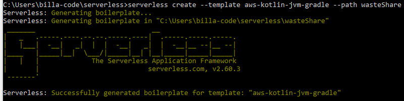
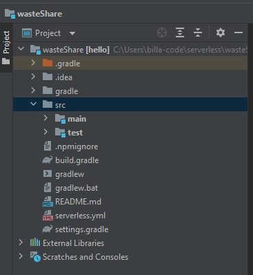
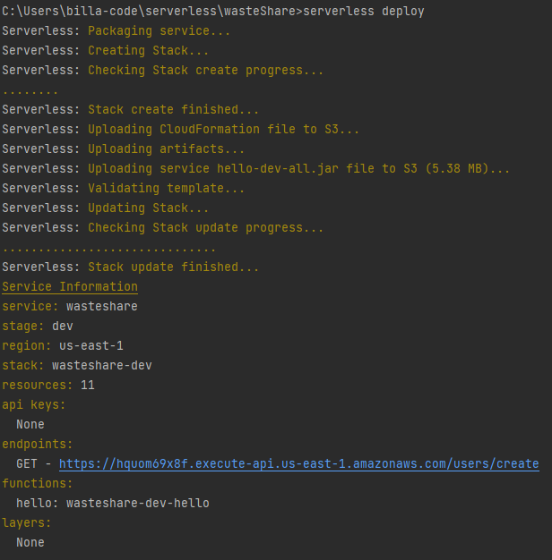
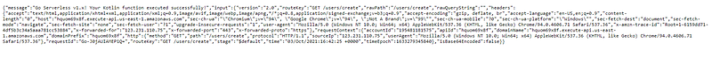
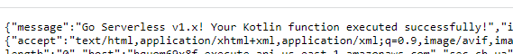

So before start creating the application I just want you guys to know that we are implementing the backend for this application using these tech stack. For the front end application i’m hoping to use React and it will be another series. Ok that’s the main announcement I needed to make before starting the tutorial. Now let’s dive in to the Tech Stack.

Many companies in the world are now using AWS to host their applications because it’s more convenient these days. You don’t have to maintain physical servers and you just have to have an AWS account, many hosting solutions are at your doorstep. As software engineers we should come up with cost effective ways to host these applications. In this context AWS lambda is a great service to use for backend development. Following is the definition given by AWS to AWS lambda.

_“AWS Lambda is a serverless compute service that lets you run code without provisioning or managing servers, creating workload-aware cluster scaling logic, maintaining event integrations, or managing runtimes.”_

Lambda automatically and precisely allocates compute execution power and runs your code based on the incoming request or event, for any scale of traffic. Now we don’t need ELB (Elastic load balancer), EC2 servers and etc to host our application. AWS will charge only if our lambda function get triggered.

Now the reason why we use Serverless Framework instead of directly uploading code to the AWS lambda is, Serverless Framework provides a simple and effective abstraction of the AWS Lambda package and deploy process. So we can code configurations locally and then with a command application will be in AWS.

Now why Kotlin instead of Java?. Kotlin is a statically typed programming language that runs on the JVM and can also be compiled to JavaScript source code as well as use the LLVM compiler infrastructure. And it had addressed some of the Java issues by implementing solutions like** eliminating the danger of these null references**, **Invariant Arrays, Function Types, lambda expression or an anonymous function can access the variables declared in the outer scope and more. **Still this isn’t better than Java but fairly good and syntax are easy. Now are you ready to start? If no read this again 😜.

For this project I’m using **Node 12.16.0, Java 11(OpeJDK), Intellij 2021 Community Edition (Free).**

As the first thing lets install Serverless in our computer. I’m assuming you guys know how to install NodeJS. (I’m using nvm so i can have multiple Node versions read about it). We just have to open a CMD or a terminal and type this.

```bash
npm install -g serverless
```

There are other ways to do this too, but this is what i prefer. After that we have **one time work** to do. Its to configure **serverless **to our AWS account. For that i will need the access key and secret key for the AWS account. Please go to this link to see how to find that key.

After getting the key details enter this command in the terminal

```
serverless config credentials --provider aws --key AWSACCESSKEY --secret AWSSECRETKEY
```

Now lets create a new project which supports Kotlin and AWS using following command.

```
serverless create --template aws-kotlin-jvm-gradle --path wasteShare
```

If the creation is success you should get a response like this in the terminal.



Now we will get a folder with the name **wasteShare **with the code needed. Open this using intellij and you will get a folder structure like this.



Before deploy and test this project let’s change and clean the serverless.yml file. Initially there are many commented lines but what we need really is just the following code.

```
service: wasteshare
frameworkVersion: '2'

provider:
  name: aws
  runtime: java11
  lambdaHashingVersion: 20201221

package:
  artifact: build/libs/hello-dev-all.jar

functions:
  hello:
    handler: com.serverless.Handler
    events:
      - httpApi:
          path: /users/create
          method: get
```

Now what happen in this function is when we do a GET request for this it will call the Handler.kt file. Here in this example code it is printing a message with the response data. Code for the Handler,kt.

```
package com.serverless

import com.amazonaws.services.lambda.runtime.Context
import com.amazonaws.services.lambda.runtime.RequestHandler
import org.apache.logging.log4j.LogManager

class Handler:RequestHandler<Map<String, Any>, ApiGatewayResponse> {
  override fun handleRequest(input:Map<String, Any>, context:Context):ApiGatewayResponse {
    LOG.info("received: " + input.keys.toString())

    return ApiGatewayResponse.build {
      statusCode = 200
      objectBody = HelloResponse("Go Serverless v1.x! Your Kotlin function executed successfully!", input)
      headers = mapOf("X-Powered-By" to "AWS Lambda & serverless")
    }
  }

  companion object {
    private val LOG = LogManager.getLogger(Handler::class.java)
  }
}
```

Now lets build and deploy this. For that we have to enter following commands.

```
gradlew clean build (Windows) | ./gradlew clean build (Linux)
```

```
serverless deploy
```

Now the function will be uploaded in to a S3 bucket and function will be ready to test. After deploy we will get a response like this in the terminal.



You can see there is a URL in endpoint section which we can use to test our function. click on the link and in the browser you will get a response like this.



Here we have the response. Let me show you a zoom version of what we need to see.



This message value is set from the Handler.kt file. Let’s study the code now. When we do a GET request to this function it will trigger the Handler.kt file. Then handler will return this,

```
return ApiGatewayResponse.build {
      statusCode = 200
      objectBody = HelloResponse("Go Serverless v1.x! Your Kotlin function executed successfully!", input)
      headers = mapOf("X-Powered-By" to "AWS Lambda & serverless")
    }
```

Here we send the statusCode = 200, and then message and other details are created in the ApiGatewayResponse.kt file. I think you got the basic idea of how to use these 3 technologies. Then will start the real app development in our next tutorial. Till then Happy Coding Guys !!! 😎
