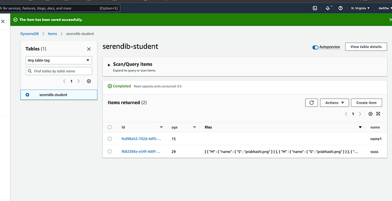

Hey Guys !!!, This would be my last tutorial for the Charity Web App. To complete the whole project, next steps would be to implement Sponsor detail section. That’s going to be lot of duplicate work, So I will not bore with you it. If you are curious, you can go to the Github links related to the project and view the whole implementation. Up to now we have covered many areas related to React, AWS Lambda, AWS SAM, AWS DynamoDB and AWS S3. Without any further ado Let’s jump on to the implementation of S3 file upload event handling in the Lambda function. View the previous tutorials related to this project using following links.

As the first step, let’s work on the infrastructure related to the S3 bucket. Similar to previous tutorials we update the infrastructure details in our template.yml file. After adding S3 bucket details and Event details related to it, file should look like this.

```
AWSTemplateFormatVersion: '2010-09-09'
Transform: AWS::Serverless-2016-10-31
Description: serendib-scholarship-ws
Globals:
  Function:
    Timeout: 3

Resources:
  StudentFunction:
    Type: AWS::Serverless::Function
    Properties:
      CodeUri: student/
      Handler: app.lambdaHandler
      Runtime: nodejs16.x
      Architectures:
        - x86_64
      Policies:
        - DynamoDBCrudPolicy:
            TableName: !Ref SampleTable
        - S3CrudPolicy:
            BucketName: !Ref FileBucket
      Environment:
        Variables:
          SAMPLE_TABLE: !Ref SampleTable
          FILE_BUCKET: !Ref FileBucket
      Events:
        Student:
          Type: Api
          Properties:
            Path: /student
            Method: get
        FileUpload:
          Type: S3
          Properties:
            Bucket: !Ref FileBucket
            Events:
              - 's3:ObjectCreated:*'

    Metadata:
      BuildMethod: esbuild
      BuildProperties:
        Minify: true
        Target: "es2020"
        EntryPoints: 
        - app.ts

  FileBucket:
    Type: 'AWS::S3::Bucket'

  SampleTable:
    Type: AWS::Serverless::SimpleTable
    Properties:
      PrimaryKey:
        Name: id
        Type: String
      ProvisionedThroughput:
        ReadCapacityUnits: 2
        WriteCapacityUnits: 2

Outputs:
  WebEndpoint:
    Description: "API Gateway endpoint URL for Prod stage"
    Value: !Sub "https://${ServerlessRestApi}.execute-api.${AWS::Region}.amazonaws.com/Prod/"
```

You can see we are catching the Object created event in S3. Now let’s define the **FILE_BUCKET **environment variable in our env.json file.

```json
{
    "StudentFunction": {
        "SAMPLE_TABLE": "serendib-student",
        "FILE_BUCKET": "serendib-ui"
    }
}
```

Now let’s jump in to the implementation. So in the app.ts file, I would be checking whether the event triggering the Lambda function has a httpMethod or not. If it has it will be treated as Normal API gateway implementation, else it will be treated as a S3 event trigger. Now what I would do is I will catch the name of the newly created file, which is the key in the event object. Other than this I need to have the ID of the student related to this file. For now I will hardcode this but I will give you a possible solution later. After doing this I will call the DynamoDB update for the Student. Before calling update I will get the Item first and then update the files array for it. I do this, because for the files there can be multiple values. Following is the handling part in the hanlder.

```
} else if (event['Records'][0]['s3']) {
    const key = event['Records'][0]['s3']['object']['key'];
    const id = "f682386e-e34f-4d9f-b6f4-9398fb6a131d";
    results = await updateStudentFileName(key, id);
}
```

Following is the updateStudentFileName function.

```typescript
const updateStudentFileName = async (key: string, id: string) => {
    console.log(key);

    try {
        const paramsGet = {
            TableName: tableName,
            Key: marshall({ id: id })
        };

        const { Item } = await client.send(new GetItemCommand(paramsGet));
        const item = unmarshall(Item);
        console.log(item.files);
        const files = item.files ? [...item.files, {name: key}] : [{name: key}]

        const params = {
          TableName: tableName,
          Item: {
            id: id,
            files: files,
            name: item.name,
            age: item.age
          }
        };

        const docClient = DynamoDBDocumentClient.from(client);

        let res = await docClient.send(new PutCommand(params));
        console.log(res)
    
        return res;
    } catch(e) {
        console.error(e);
        throw e;
    }
}
```

You might see a difference between the updateStudents function and this. I have used a new function from another function to show another way. To accomodate this I have to update the package.json file to include the dependancy. DynamoDBDocumentClient and PutCommand are from this dependancy.

```json
{
  "name": "student",
  "version": "1.0.0",
  "description": "Student service for serendib scholarship ws",
  "main": "app.js",
  "repository": "https://github.com/deBilla/serendib-scholarship-ws/student",
  "author": "SAM CLI",
  "license": "MIT",
  "dependencies": {
    "@aws-sdk/client-dynamodb": "3.194.0",
    "@aws-sdk/util-dynamodb": "3.194.0",
    "@aws-sdk/lib-dynamodb": "3.194.0",
    "esbuild": "^0.14.14"
  },
  "scripts": {
    "unit": "jest",
    "lint": "eslint '*.ts' --quiet --fix",
    "compile": "tsc",
    "test": "npm run compile && npm run unit"
  },
  "devDependencies": {
    "@types/aws-lambda": "^8.10.92",
    "@types/jest": "^27.4.0",
    "@types/node": "^17.0.13",
    "@typescript-eslint/eslint-plugin": "^5.10.2",
    "@typescript-eslint/parser": "^5.10.2",
    "esbuild-jest": "^0.5.0",
    "eslint": "^8.8.0",
    "eslint-config-prettier": "^8.3.0",
    "eslint-plugin-prettier": "^4.0.0",
    "jest": "^27.5.0",
    "prettier": "^2.5.1",
    "ts-node": "^10.4.0",
    "typescript": "^4.5.5"
  }
}
```

OK 👌. Now this is pretty much over let’s look at the whole code in app.ts.

```typescript
import { APIGatewayProxyEvent, APIGatewayProxyResult } from 'aws-lambda';
import { DynamoDBClient,  ScanCommand, PutItemCommand, GetItemCommand, DeleteItemCommand, UpdateItemCommand } from "@aws-sdk/client-dynamodb";
import { DynamoDBDocumentClient, PutCommand } from "@aws-sdk/lib-dynamodb";
import { marshall, unmarshall } from "@aws-sdk/util-dynamodb";
import { v4 as uuidv4 } from 'uuid';

const tableName = process.env.SAMPLE_TABLE;
const client = new DynamoDBClient({ region: "us-east-1" });

export const lambdaHandler = async (event: APIGatewayProxyEvent): Promise<APIGatewayProxyResult> => {
    let results: any;
    let response: APIGatewayProxyResult;

    try {
        if (event.httpMethod) {
            switch (event.httpMethod) {
                case 'GET':
                    if (event.pathParameters.id != null) {
                        results = await getStudent(event.pathParameters.id);
                    } else {
                        results = await getStudents();
                    }
                    
                    break;
                case 'POST':
                    results = await createStudents(event);
                    break;
                case 'PUT':
                    results = await updateStudents(event)
                    break;
                case 'DELETE':
                    results = await deleteStudents(event.pathParameters.id)
                    break;
                default:
                    throw new Error('Unidentified event!!!');
            }
        } else if (event['Records'][0]['s3']) {
            const key = event['Records'][0]['s3']['object']['key'];
            const id = "f682386e-e34f-4d9f-b6f4-9398fb6a131d";
            results = await updateStudentFileName(key, id);
        }
        
        response = {
            statusCode: 200,
            body: JSON.stringify({
                message: results,
            }),
        };
    } catch (err: unknown) {
        console.log(err);
        response = {
            statusCode: 500,
            body: JSON.stringify({
                message: err instanceof Error ? err.message : 'some error happened',
            }),
        };
    }

    return response;
};

const getStudents = async () => {
    try {
        const params = {
            TableName : tableName
        };
        const { Items } = await client.send(new ScanCommand(params));

        return Items;
    } catch (e) {
        throw e;
    }
}

const getStudent = async (studentId: string) => {
    try {
        const params = {
            TableName: tableName,
            Key: marshall({ id: studentId })
        };

        const { Item } = await client.send(new GetItemCommand(params));

        return (Item) ? unmarshall(Item) : {};
    } catch(e) {
        throw e;
    }
}

const createStudents = async (event: APIGatewayProxyEvent) => {
    try {
        const student = JSON.parse(event.body);
        const studentId = uuidv4();
        student.id = studentId;

        const params = {
            TableName: tableName,
            Item: marshall(student || {})
        };

        return await client.send(new PutItemCommand(params));
    } catch(e) {
        throw e;
    }
}

const updateStudents = async (event: APIGatewayProxyEvent) => {
    try {
        const requestBody = JSON.parse(event.body);
        const objKeys = Object.keys(requestBody);   
    
        const params = {
          TableName: tableName,
          Key: marshall({ id: event.pathParameters.id }),
          UpdateExpression: `SET ${objKeys.map((_, index) => `#key${index} = :value${index}`).join(", ")}`,
          ExpressionAttributeNames: objKeys.reduce((acc, key, index) => ({
              ...acc,
              [`#key${index}`]: key,
          }), {}),
          ExpressionAttributeValues: marshall(objKeys.reduce((acc, key, index) => ({
              ...acc,
              [`:value${index}`]: requestBody[key],
          }), {})),
        };
    
        return await client.send(new UpdateItemCommand(params));
    } catch(e) {
        console.error(e);
        throw e;
    }
}

const updateStudentFileName = async (key: string, id: string) => {
    console.log(key);

    try {
        const paramsGet = {
            TableName: tableName,
            Key: marshall({ id: id })
        };

        const { Item } = await client.send(new GetItemCommand(paramsGet));
        const item = unmarshall(Item);
        console.log(item.files);
        const files = item.files ? [...item.files, {name: key}] : [{name: key}]

        const params = {
          TableName: tableName,
          Item: {
            id: id,
            files: files,
            name: item.name,
            age: item.age
          }
        };

        const docClient = DynamoDBDocumentClient.from(client);

        let res = await docClient.send(new PutCommand(params));
        console.log(res)
    
        return res;
    } catch(e) {
        console.error(e);
        throw e;
    }
}

const deleteStudents = async (studentId: string) => {
    try {
        const params = {
          TableName: tableName,
          Key: marshall({ id: studentId }),
        };
    
        return await client.send(new DeleteItemCommand(params));
    } catch(e) {
        throw e;
    }
}
```

Now to trigger this locally we have to have a S3 event created by us. Following is an official event taken from one of AWS sample code base. Save this file as s3event.json inside the events folder.

```json
{
    "Records": [
        {
            "eventVersion": "2.0", 
            "eventName": "ObjectCreated:Put", 
            "eventTime": "1970-01-01T00:00:00.000Z", 
            "userIdentity": {
                "principalId": "EXAMPLE"
            }, 
            "eventSource": "aws:s3", 
            "requestParameters": {
                "sourceIPAddress": "127.0.0.1"
            }, 
            "s3": {
                "configurationId": "testConfigRule", 
                "object": {
                    "eTag": "1c43a0c9dcc31572b5e49c0b42f8b17f", 
                    "key": "prabhashi.png", 
                    "sequencer": "0A1B2C3D4E5F678901", 
                    "size": 1024
                }, 
                "bucket": {
                    "ownerIdentity": {
                        "principalId": "EXAMPLE"
                    }, 
                    "name": "serendib-ui", 
                    "arn": "arn:aws:s3:::serendib-ui"
                }, 
                "s3SchemaVersion": "1.0"
            }, 
            "responseElements": {
                "x-amz-id-2": "EXAMPLE123/5678abcdefghijklambdaisawesome/mnopqrstuvwxyzABCDEFGH", 
                "x-amz-request-id": "EXAMPLE123456789"
            }, 
            "awsRegion": "us-east-1"
        }
    ]
}
```

As the last step, call the SAM invoke to run this event.

```
sam local invoke StudentFunction --event events/s3event.json --env-vars env.json
```

Now you should get something like this.

```
START RequestId: 22d0b73e-25cf-42b4-a661-ca095f297ca5 Version: $LATEST
2022-10-26T12:31:46.694Z        22d0b73e-25cf-42b4-a661-ca095f297ca5    INFO    prabhashi.png
2022-10-26T12:31:47.879Z        22d0b73e-25cf-42b4-a661-ca095f297ca5    INFO    [ { name: 'prabhashi.png' }, { name: 'prabhashi.png' } ]
} ItemCollectionMetrics: undefined4BGVP83BVV4KQNSO5AEMVJF66Q9ASUAAJG',  INFO    {
END RequestId: 22d0b73e-25cf-42b4-a661-ca095f297ca5
REPORT RequestId: 22d0b73e-25cf-42b4-a661-ca095f297ca5  Init Duration: 0.21 ms  Duration: 1616.00 ms    Billed Duration: 1616 ms        Memory Size: 128 MB     Max Memory Used: 128 MB
{"statusCode":200,"body":"{\"message\":{\"$metadata\":{\"httpStatusCode\":200,\"requestId\":\"0IVRUNGTHVDDH5C32G4BGVP83BVV4KQNSO5AEMVJF66Q9ASUAAJG\",\"attempts\":1,\"totalRetryDelay\":0}}}"}%
```

And if you go to your DynamoDB table you should see the updated column like this.



Pretty cool right. Now if you do a `sam deploy` . This will be going to the cloud, and your application will be fully functional. Previously I told you I have a method to take the student ID from the fileName.

_“I will add the studentId to the file name and when retrieving it here, I will add take the ID from it.”_

I think this is completed now. If you have any questions please feel free to drop a comment here. I will answer any. Thank you guys for reading these and hoping to meet you with another cool project in future. Till then Happy Coding !!!.

Deployment issue fixes

;)
