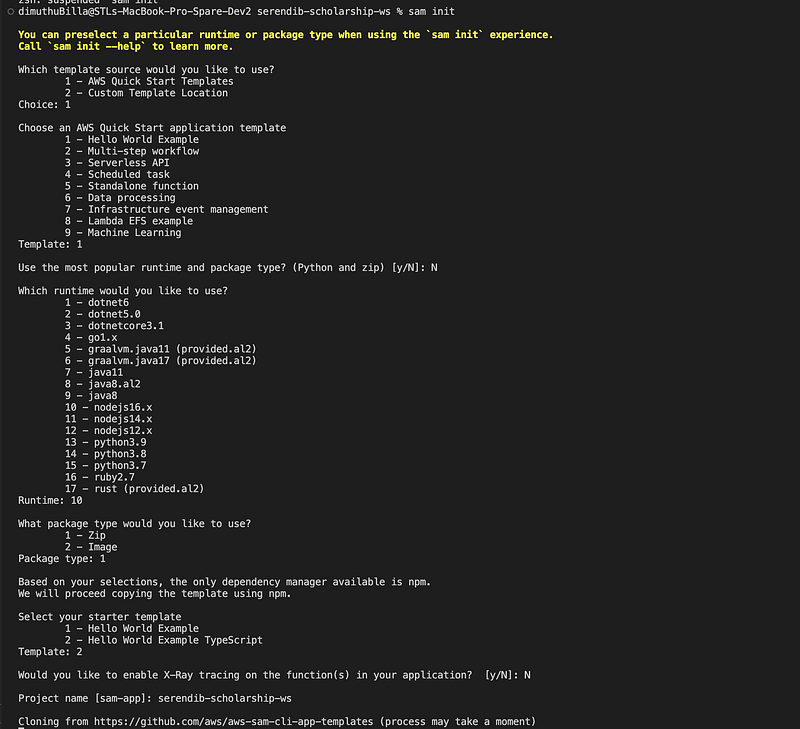
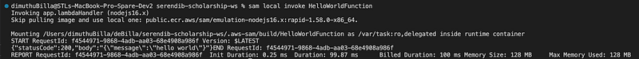

Hey Guys, This is a continuation of the Charity web app we were building. If you guys can go back and look, we have gone through the UI and some intro about the backend in our previous tutorials. Just in case I’m mentioning them here for you to refer.

In this tutorial, our focus is to create a Lambda function using NodeJS and Typescript.

As the first step we have to install AWS SAM. Before installing make sure to up the **docker service**. You should have docker installed before hand.

AWS SAM is a framework for building server-less applications. Installation details will be in the following link.

After installing, go to the terminal (command prompt, power shell whatever) type the following command

```
sam init
```

When you enter this, you will be ask several question until you get your project with Typescript. Screenshot is given below.



Now a hello world application will be generated. Now go to the created folder and enter the following command to build the project.

```
sam build
```

This will build the Lambda function and we don’t have to worry about installing dependencies for the Node JS app. After building is completed, enter the following command to test the application in the local environment.

```
sam local invoke HelloWorldFunction
```

Now you will get a response like this.



You can see our response is there with the status code of 200. Pretty cool right. You don’t have to have a AWS account to try this, that’s the best part. So before starting any work, let’s try to understand what are all these files. After we do the sam init, we get several folders and files. **events folder** contains the **event** which we can use to do local function invoking, then we have the **hello-world** folder, it contains all the files related to our **HelloWorld Lambda function** handler. Then we have the **template.yaml** file. This is the blueprint which is used to create the cloud stack related to our Lambda function. I will describe more bout this after I change the file for our use case.

Now let’s go back to our use case. We have to implement a Lambda function for the Student. As the first step I have renamed the hello-world folder to student. Next I changed the package.json file.

```json
{
  "name": "student",
  "version": "1.0.0",
  "description": "Student service for serendib scholarship ws",
  "main": "app.js",
  "repository": "https://github.com/deBilla/serendib-scholarship-ws/student",
  "author": "SAM CLI",
  "license": "MIT",
  "dependencies": {
    "esbuild": "^0.14.14"
  },
  "scripts": {
    "unit": "jest",
    "lint": "eslint '*.ts' --quiet --fix",
    "compile": "tsc",
    "test": "npm run compile && npm run unit"
  },
  "devDependencies": {
    "@types/aws-lambda": "^8.10.92",
    "@types/jest": "^27.4.0",
    "@types/node": "^17.0.13",
    "@typescript-eslint/eslint-plugin": "^5.10.2",
    "@typescript-eslint/parser": "^5.10.2",
    "esbuild-jest": "^0.5.0",
    "eslint": "^8.8.0",
    "eslint-config-prettier": "^8.3.0",
    "eslint-plugin-prettier": "^4.0.0",
    "jest": "^27.5.0",
    "prettier": "^2.5.1",
    "ts-node": "^10.4.0",
    "typescript": "^4.5.5"
  }
}
```

Then I changed the template.yaml file like this.

```
AWSTemplateFormatVersion: '2010-09-09'
Transform: AWS::Serverless-2016-10-31
Description: serendib-scholarship-ws
Globals:
  Function:
    Timeout: 3

Resources:
  StudentFunction:
    Type: AWS::Serverless::Function
    Properties:
      CodeUri: student/
      Handler: app.lambdaHandler
      Runtime: nodejs16.x
      Architectures:
        - x86_64
      Events:
        Student:
          Type: Api
          Properties:
            Path: /student
            Method: get
    Metadata:
      BuildMethod: esbuild
      BuildProperties:
        Minify: true
        Target: "es2020"
        EntryPoints: 
        - app.ts

Outputs:
  StudentApi:
    Description: "API Gateway endpoint URL for Prod stage for Student function"
    Value: !Sub "https://${ServerlessRestApi}.execute-api.${AWS::Region}.amazonaws.com/Prod/student/"
  StudentFunction:
    Description: "Student Function ARN"
    Value: !GetAtt StudentFunction.Arn
  StudentIamRole:
    Description: "Implicit IAM Role created for Student function"
    Value: !GetAtt StudentFunctionRole.Arn
```

Before going any further let’s try to understand this template.yaml file. From the top first 3 configs are some general things. but the timeout is something we can change. Right now it’s set to **3 seconds**. This can be increased up to **900 seconds (15 minutes)**, more than that not possible.

Then under the resources config we have our function, and inside it we have the configs needed for our app to run.

Finally under the outputs we have defined certain other services needed for this lambda function to run. StudentApi is API Gateway endpoint URL, then we have defined the AWS IAM role needed for lambda function, permissions can be altered if needed.

In the next tutorial let’s create the Student service properly and try to finish our project. Till then happy coding. Code related to this project will be in the following Github link.

Happy Coding !!!! 🙏

Deployment issue fixes,

;)
