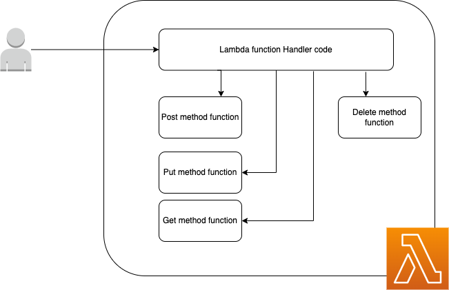

Hey Guys, Up to now we have successfully created a Hello World application using typescript and NodeJS.

In this tutorial let’s create the Student service. Before that will take a minute and discuss about our use case. So if we go to the function level, for each operation there should be Lambda functions. For example for creating a Student, one Lambda then to update a Student, another Lambda, likewise. So you can see this is going to create a mess if we continue like that. So as a remedy we have the event driven computing. Here what we do is, we create a Lambda function which will handle the http event and using the http method we use in the request, it will trigger different functionalities. So with one function, we can cover all the CRUD operations for Student.



Now we are clear on the implementation and up to now we have created a [Hello World application](/blogs/aws-lambda-typescript-charity-web-app-start-using-event-driven-server-less-computing). So what happen is, when we make a request from the URL related to the Lambda function, API Gateway will capture our request and then create an event based on that. This event will then trigger the Lambda function. **💡 OK **now you should understand what are we going to do. We are going to read this event and find the httpMethod and according to the method we will call different functions inside the app.ts file. Up to now we haven’t integrated any database, So in this tutorial I will just use dummy methods with hard coded responses. Go to the app.ts file in the student folder and change the code like this.

```typescript
import { APIGatewayProxyEvent, APIGatewayProxyResult } from 'aws-lambda';

/**
 *
 * Event doc: https://docs.aws.amazon.com/apigateway/latest/developerguide/set-up-lambda-proxy-integrations.html#api-gateway-simple-proxy-for-lambda-input-format
 * @param {Object} event - API Gateway Lambda Proxy Input Format
 *
 * Return doc: https://docs.aws.amazon.com/apigateway/latest/developerguide/set-up-lambda-proxy-integrations.html
 * @returns {Object} object - API Gateway Lambda Proxy Output Format
 *
 */

export const lambdaHandler = async (event: APIGatewayProxyEvent): Promise<APIGatewayProxyResult> => {
    let results: any;
    let response: APIGatewayProxyResult;

    try {
        switch (event.httpMethod) {
            case 'GET':
                if (event.pathParameters.id
```

```typescript
!= null) {
                    results = await getStudent(event.pathParameters.id);
                } else {
                    results = await getStudents();
                }
                
                break;
            case 'POST':
                results = await createStudents(event);
                break;
            case 'PUT':
                results = await updateStudents(event.pathParameters.id)
                break;
            case 'DELETE':
                results = await deleteStudents(event.pathParameters.id)
                break;
            default:
                throw new Error('Unidentified event!!!');
        }
        
        response = {
            statusCode: 200,
            body: JSON.stringify({
                message: results,
            }),
        };
    } catch (err: unknown) {
        console.log(err);
        response = {
            statusCode: 500,
            body: JSON.stringify({
                message: err instanceof Error ? err.message : 'some error happened',
            }),
        };
    }

    return response;
};

const getStudents = async () => {
    return ['james', 'john'];
}

const getStudent = async (studentId: string) => {
    return studentId;
}

const createStudents = async (event: APIGatewayProxyEvent) => {
    return event;
}

const updateStudents = async (event: APIGatewayProxyEvent) => {
    return event;
}

const deleteStudents = async (studentId: string) => {
    return studentId;
}
```

Ok, now you should have the problem of how to create these events. When we did the sam init, we did got a folder named events and inside events folder we have the file events.json. If you just peek a little you would see, these few important fields.

- body
- httpMethod
- pathParameters

Other things are general fields. So for the sake of our use case. I’m creating 5 different events for create, get all, get one, update and delete. Go to the following link you can see those 5 files.

Now what’s left for us, is triggering these events. Without deploying to AWS we can do this using SAM in local environment.

```
sam local invoke StudentFunction --event events/student_get_one.json
```

Likewise you can try invoking other 4 events too. Now we have a working Student service. What is left is to connect this with a database. Let’s try it in the next tutorial. Until then Happy Coding !!! :p

Deployment issue fixes

;)
