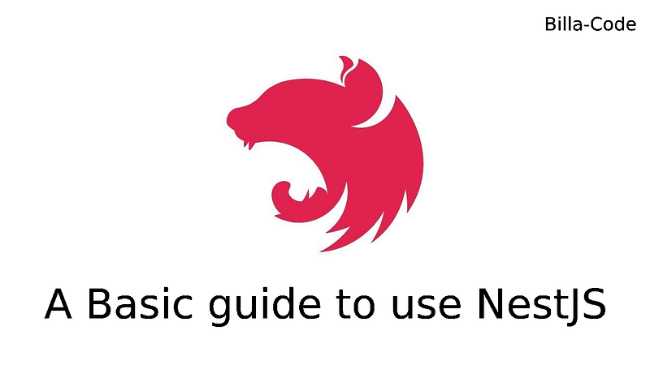

NestJS, a progressive Node.js framework, is known for its efficiency, reliability, and ease of use in building server-side applications. Leveraging TypeScript, it combines elements of OOP (Object-Oriented Programming), FP (Functional Programming), and FRP (Functional Reactive Programming). To maximize the potential of NestJS, adhering to best practices is crucial. Here are some key practices to follow:



## 1. Embrace Modular Architecture

**Why?** Modular architecture promotes scalability and maintainability by breaking down the application into manageable, self-contained modules.

**How?**

- **Feature Modules**: Group related components, services, and controllers within feature-specific modules.
- **Shared Modules**: Create shared modules for reusable components across multiple modules, such as utility functions or common services.

```typescript
@Module({
  imports: [TypeOrmModule.forFeature([User])],
  controllers: [UsersController],
  providers: [UsersService],
})
export class UsersModule {}
```

## 2. Utilize Dependency Injection

**Why?** Dependency Injection (DI) enhances testability and reduces coupling between components.

**How?**

- Use NestJS’s built-in DI to inject services and repositories into controllers and other services.
- Define providers in module metadata to manage the injection.

```typescript
@Injectable()
export class UsersService {
  constructor(@InjectRepository(User) private userRepository: Repository<User>) {}
}
```

## 3. Implement DTOs (Data Transfer Objects)

**Why?** DTOs ensure type safety and validation, reducing errors and improving code quality.

**How?**

- Define DTOs using TypeScript classes.
- Use class-validator decorators to enforce validation rules.

```bash
export class CreateUserDto {
  @IsString()
  @IsNotEmpty()
  readonly name: string;

  @IsEmail()
  readonly email: string;
}
```

## 4. Leverage Interceptors and Middleware

**Why?** Interceptors and middleware enable cross-cutting concerns like logging, authentication, and transformation.

**How?**

- Use interceptors for tasks like response transformation and logging.
- Use middleware for request pre-processing, such as authentication and authorization checks.

```typescript
@Injectable()
export class LoggingInterceptor implements NestInterceptor {
  intercept(context: ExecutionContext, next: CallHandler): Observable<any> {
    console.log('Before...');
    return next.handle().pipe(tap(() => console.log('After...')));
  }
}
```

## 5. Optimize Error Handling

**Why?** Effective error handling enhances user experience and makes debugging easier.

**How?**

- Use NestJS’s built-in exception filters to handle errors globally.
- Create custom exception filters for specific error handling scenarios.

```typescript
@Catch(HttpException)
export class HttpErrorFilter implements ExceptionFilter {
  catch(exception: HttpException, host: ArgumentsHost) {
    const ctx = host.switchToHttp();
    const response = ctx.getResponse<Response>();
    const status = exception.getStatus();
    
    response.status(status).json({
      statusCode: status,
      timestamp: new Date().toISOString(),
      message: exception.message,
    });
  }
}
```

## 6. Secure Your Application

**Why?** Security is paramount to protect sensitive data and ensure user trust.

**How?**

- Use environment variables to manage sensitive configuration.
- Implement guards for authentication and role-based authorization.
- Use libraries like helmet for setting secure HTTP headers.

```typescript
@UseGuards(AuthGuard('jwt'))
export class UsersController {
  // Controller methods here
}
```

## 7. Write Comprehensive Tests

**Why?** Testing ensures your application behaves as expected and makes it easier to refactor and extend code.

**How?**

- Use Jest, the default testing framework in NestJS, for writing unit and integration tests.
- Mock dependencies to isolate the unit being tested.

```javascript
describe('UsersService', () => {
  let service: UsersService;
  let repository: MockType<Repository<User>>;

  beforeEach(async () => {
    const module: TestingModule = await Test.createTestingModule({
      providers: [
        UsersService,
        { provide: getRepositoryToken(User), useFactory: repositoryMockFactory },
      ],
    }).compile();

    service = module.get<UsersService>(UsersService);
    repository = module.get(getRepositoryToken(User));
  });

  it('should find a user by id', async () => {
    const user = new User();
    user.id = 1;
    repository.findOne.mockReturnValue(user);
    expect(await service.findOne(1)).toEqual(user);
  });
});
```

## 8. Maintain Consistent Code Style

**Why?** Consistent code style enhances readability and maintainability, making collaboration easier.

**How?**

- Use a linter like ESLint to enforce coding standards.
- Follow a style guide, such as Airbnb's or NestJS's recommended practices.
- Use Prettier for consistent code formatting.

```json
{
  "extends": ["airbnb-base", "plugin:@typescript-eslint/recommended"],
  "rules": {
    "@typescript-eslint/explicit-module-boundary-types": "off"
  }
}
```

## 9. Document Your Code

**Why?** Good documentation makes it easier for new developers to understand and contribute to your project.

**How?**

- Use decorators like @ApiTags, @ApiOperation, and @ApiResponse from the @nestjs/swagger package to generate API documentation.
- Write JSDoc comments for your functions and classes.

```typescript
@ApiTags('users')
@Controller('users')
export class UsersController {
  @ApiOperation({ summary: 'Create user' })
  @ApiResponse({ status: 201, description: 'The user has been successfully created.' })
  @Post()
  create(@Body() createUserDto: CreateUserDto) {
    return this.usersService.create(createUserDto);
  }
}
```

## 10. Integrate Third-Party Tools

**Why?** Third-party tools like Joi, Husky, and others can enhance development workflows, enforce code quality, and streamline processes.

**How?**

### Joi for Advanced Validation

**Why?** Joi provides a powerful schema description language and validator for JavaScript objects, offering more advanced validation than the built-in class-validator.

**How?**

- Install Joi and its NestJS module integration.

```bash
npm install @hapi/joi @nestjs/joi
```

- Use Joi schemas in your DTOs or directly in your controllers/services.

```typescript
import * as Joi from '@hapi/joi';

export const createUserSchema = Joi.object({
  name: Joi.string().required(),
  email: Joi.string().email().required(),
});

@Injectable()
export class JoiValidationPipe implements PipeTransform {
  constructor(private schema: Joi.ObjectSchema) {}

  transform(value: any, metadata: ArgumentMetadata) {
    const { error } = this.schema.validate(value);
    if (error) {
      throw new BadRequestException('Validation failed');
    }
    return value;
  }
}
```

### Husky for Git Hooks

**Why?** Husky helps to enforce code quality by running scripts during the Git lifecycle, such as pre-commit hooks to run linters or tests.

**How?**

- Install Husky and configure it in your project.

```bash
npm install husky --save-dev
```

- Add a pre-commit hook to run ESLint and tests.

```json
{
  "husky": {
    "hooks": {
      "pre-commit": "npm run lint && npm test"
    }
  }
}
```

### Lint-Staged for Code Quality

**Why?** lint-staged works with Husky to run linters on only the staged files, ensuring faster feedback and maintaining code quality.

**How?**

- Install lint-staged and configure it in your project.

```bash
npm install lint-staged --save-dev
```

- Add lint-staged configuration to run ESLint on staged files.

```json
{
  "lint-staged": {
    "*.ts": ["eslint --fix", "git add"]
  }
}
```

## Conclusion

Following these best practices in NestJS development ensures your applications are scalable, maintainable, and secure. By embracing a modular architecture, leveraging dependency injection, integrating third-party tools, and maintaining consistent code style, you can build robust applications that are easy to test, document, and extend. Whether you're a seasoned developer or just starting with NestJS, these practices will help you get the most out of this powerful framework. Happy coding!
