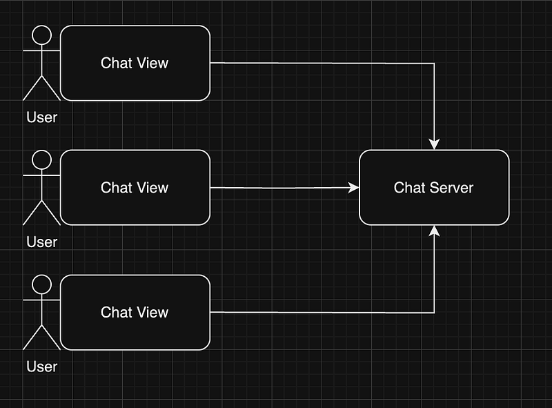
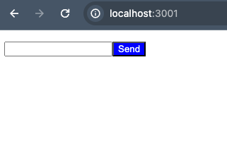
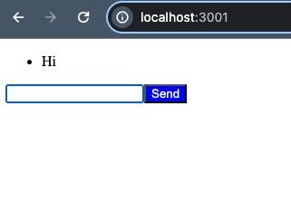
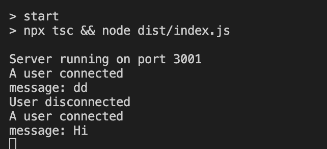

Hi Guys, This would be a very simple tutorial and I need to make this article an entry point to the next tutorial I’m going to write which will be on a more scalable chat solution.

Let’s consider our high level architecture



As I mentioned in the beginning, in this article I’m just going to create a very simple chat server.

## **Getting started**

Create a new directory for your project and navigate into it. Then, initialize a new Node.js project:

```bash
mkdir chat-app
cd chat-app
npm init -y
```

Install dependencies:

```bash
npm install express socket.io
```

## Creating the Server

Create a file named `index.ts` in the `src` directory (create the `src` directory if it doesn't exist):

```typescript
import express from "express";
import http from "http";
import { Server, Socket } from "socket.io";
import path from "path";

const app = express();
const server = http.createServer(app);
const io = new Server(server);

app.use(express.static(path.join(__dirname, "../public")));

io.on("connection", (socket: Socket) => {
  console.log("A user connected");

  socket.on("disconnect", () => {
    console.log("User disconnected");
  });

  socket.on("chat message", (msg: string) => {
    console.log("message: " + msg);
    io.emit("chat message", msg);
  });
});

app.get("/", (req, res) => {
  res.sendFile(path.join(__dirname, "../public", "index.html"));
});

const PORT = process.env.PORT || 3000;

server.listen(PORT, () => {
  console.log(`Server running on port ${PORT}`);
});
```

Initializes an Express server to serve static files and an HTTP server to handle requests. The Socket.IO server listens for incoming connections, logging a message when a user connects or disconnects. When a “chat message” event is received, the message is logged and broadcast to all connected clients. The root URL serves an index.html file, which includes a form for sending messages and a script to handle message submission and display using Socket.IO. The application listens on a specified port and logs a message confirming the server is running.

Now let’s create the index.html file

```
<!DOCTYPE html>
<html lang="en">
<head>
  <meta charset="UTF-8">
  <meta name="viewport" content="width=device-width, initial-scale=1.0">
  <title>Chat</title>
  <style>
    #sendButton {
      background-color: blue;
      color: aliceblue;
    }
  </style>
</head>
<body>
  <ul id="messages"></ul>
  <input id="messageInput" autocomplete="off" /><button id="sendButton">Send</button>

  <script src="https://cdnjs.cloudflare.com/ajax/libs/socket.io/4.2.0/socket.io.js"></script>
  <script>
    const socket = io();

    const messages = document.getElementById('messages');
    const messageInput = document.getElementById('messageInput');
    const sendButton = document.getElementById('sendButton');

    function sendMessage() {
      const message = messageInput.value;
      if (message.trim() !== '') {
        socket.emit('chat message', message);
        messageInput.value = '';
      }
    }

    sendButton.addEventListener('click', () => {
      sendMessage();
    });

    document.addEventListener('keypress', () => {
      if (event.key === 'Enter') {
        sendMessage();
      }
    });

    socket.on('chat message', (msg) => {
      const item = document.createElement('li');
      item.textContent = msg;
      messages.appendChild(item);
    });
  </script>
</body>
</html>
```

This HTML document creates a simple real-time chat interface using Socket.IO. It includes a text input field and a button for sending messages, styled with CSS to have a blue background and white text. The JavaScript within the script tag establishes a connection to the Socket.IO server, and defines functions for sending messages when the button is clicked or the ‘Enter’ key is pressed. Messages are emitted to the server and then displayed in an unordered list on the page. When a “chat message” event is received from the server, the message is appended as a new list item in the messages list, ensuring real-time updates across all connected clients.

Run the follolwing command

```bash
npx tsc && node dist/index.js
```

Now your server will be running in 3000 port.

If you access [http://localhost:3000](http://localhost:3000) you would see something like this



Now if you type something here and press enter, UI would look like this



And the server log would look like this



So multiple users can connect to this server and message. (Open multiple browser tabs with [http://localhost:3000](http://localhost:3000) and try this.

That’s about it. Let’s explore a scalable solution in a next tutorial.

Happy Coding !!! :P
