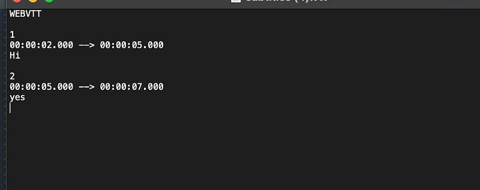

Have you ever needed to create subtitles for a video? Manually creating and formatting subtitle files can be a tedious task. In this article, we’ll explore how to build a Subtitle Creator using React, which allows users to add, edit, and generate subtitle files with ease.



## Prerequisites

To follow along with this tutorial, make sure you have the following installed on your development machine:

- Node.js (v12 or above)
- npm or Yarn package manager

## Setting Up the Project

To begin, let’s set up a new React project using Create React App. Open your terminal and run the following command:

```bash
npx create-react-app subtitle-creator-app
```

Once the project is set up, navigate into the project directory:

```bash
cd subtitle-creator-app
```

Next, install the required dependencies:

```bash
npm install react-datetime node-webvtt moment
```

## Building the Subtitle Creator

The Subtitle Creator will allow users to input the start time, end time, and text for each subtitle. It will dynamically display the added subtitles and provide an option to generate a subtitle file.

Let’s start by creating a new file called `SubtitleCreator.js` in the `src` directory. Open the file and copy the following code:

```typescript
import React, { useState } from "react";
import WebVTT from "node-webvtt";
import DateTime from "react-datetime";
import "react-datetime/css/react-datetime.css";
import "./SubtitleCreator.css";
import moment from "moment";

function SubtitleCreator() {
  const [subtitles, setSubtitles] = useState([]);
  const [startTime, setStartTime] = useState("");
  const [endTime, setEndTime] = useState("");
  const [subtitleText, setSubtitleText] = useState("");

  const handleSubtitleTextChange = (event) => {
    setSubtitleText(event.target.value);
  };

  const convertToSeconds = (timeString) => {
    const timeParts = timeString.split(":");
    const hours = parseInt(timeParts[0], 10);
    const minutes = parseInt(timeParts[1], 10);
    const secs = parseInt(timeParts[2], 10);

    return hours * 3600 + minutes * 60 + secs;
  };

  const convertSecondsToTime = (totalSeconds) => {
    const hours = Math.floor(totalSeconds / 3600);
    const minutes = Math.floor((totalSeconds % 3600) / 60);
    const seconds = totalSeconds % 60;

    const formattedTime = `${String(hours).padStart(2, "0")}:${String(
      minutes
    ).padStart(2, "0")}:${String(seconds).padStart(2, "0")}`;
    return formattedTime;
  };

  const handleAddSubtitle = () => {
    const newSubtitle = {
      startTime: convertToSeconds(startTime),
      endTime: convertToSeconds(endTime),
      text: subtitleText,
    };
    setSubtitles([...subtitles, newSubtitle]);
    setStartTime(endTime);
    setSubtitleText("");
  };

  const handleGenerateSubtitleFile = () => {
    const parsedSubtitle = {
      cues: [],
      valid: true,
    };

    subtitles.forEach((subtitle, index) => {
      const cue = {
        identifier: (index + 1).toString(),
        start: subtitle.startTime,
        end: subtitle.endTime,
        text: subtitle.text,
        styles: "",
      };
      parsedSubtitle.cues.push(cue);
    });

    const modifiedSubtitleContent = WebVTT.compile(parsedSubtitle);
    const modifiedSubtitleBlob = new Blob([modifiedSubtitleContent], {
      type: "text/vtt",
    });
    const downloadLink = URL.createObjectURL(modifiedSubtitleBlob);
    const a = document.createElement("a");
    a.href = downloadLink;
    a.download = "subtitles.vtt";
    a.click();
  };

  const handleStartTimeChange = (selectedTime) => {
    const formattedTime = moment(selectedTime).format("HH:mm:ss");
    setStartTime(formattedTime);
  };

  const handleEndTimeChange = (selectedTime) => {
    const formattedTime = moment(selectedTime).format("HH:mm:ss");
    setEndTime(formattedTime);
  };

  return (
    <div className="container">
      <h1>Subtitle Creator</h1>
      <div className="subtitle-input">
        <div className="time-input">
          <label>Start Time:</label>
          <DateTime
            value={startTime}
            onChange={handleStartTimeChange}
            dateFormat={false}
            timeFormat="HH:mm:ss"
          />
        </div>
        <div className="time-input">
          <label>End Time:</label>
          <DateTime
            value={endTime}
            onChange={handleEndTimeChange}
            dateFormat={false}
            timeFormat="HH:mm:ss"
          />
        </div>
        <label>Subtitles:</label>
        <textarea
          rows={4}
          cols={30}
          placeholder="Subtitle text"
          value={subtitleText}
          onChange={handleSubtitleTextChange}
        />
        <button onClick={handleAddSubtitle}>Add Subtitle</button>
      </div>
      <div className="subtitle-list">
        <h2>Subtitles:</h2>
        {subtitles.map((subtitle, index) => (
          <div className="subtitle-item" key={index}>
            <p>
              [{convertSecondsToTime(subtitle.startTime)} -{" "}
              {convertSecondsToTime(subtitle.endTime)}]: {subtitle.text}
            </p>
          </div>
        ))}
      </div>
      {subtitles.length > 0 && (
        <div className="generate-button">
          <button onClick={handleGenerateSubtitleFile}>
            Generate Subtitle File
          </button>
        </div>
      )}
    </div>
  );
}

export default SubtitleCreator;
```

The `SubtitleCreator` component consists of state variables for subtitles, start time, end time, and subtitle text. It also includes various event handlers and functions for adding subtitles, converting time, and generating subtitle files.

To see the Subtitle Creator in action, open the `src/App.js` file and replace its contents with the following code:

```typescript
// App.js

import React from "react";
import SubtitleCreator from "./SubtitleCreator";

function App() {
  return (
    <div className="App">
      <SubtitleCreator />
    </div>
  );
}

export default App;
```

With these changes in place, you can now run the application using the following command:

```bash
npm start
```

The Subtitle Creator should be accessible at [http://localhost:3000](http://localhost:3000/). You should see the initial UI with a header and subtitle input section.

## Adding Styling

To enhance the visual appearance of our Subtitle Creator, we’ll apply some basic styling using CSS. Create a new file called `SubtitleCreator.css` in the `src` directory and add the following styles:

```css
/* SubtitleCreator.css */

.container {
  max-width: 600px;
  margin: 0 auto;
  padding: 20px;
  font-family: Arial, sans-serif;
}

h1 {
  text-align: center;
  margin-bottom: 20px;
}

.subtitle-input {
  display: flex;
  align-items: center;
  margin-bottom: 20px;
}

.subtitle-input label {
  margin-right: 10px;
  font-weight: bold;
}

.subtitle-input .time-input {
  display: flex;
  align-items: center;
}

.subtitle-input .time-input label {
  margin-right: 5px;
}

.subtitle-input textarea {
  width: 300px;
  height: 100px;
  resize: vertical;
}

.subtitle-input button {
  margin-left: 10px;
  padding: 8px 12px;
  background-color: #007bff;
  color: #fff;
  border: none;
  border-radius: 4px;
  cursor: pointer;
}

.subtitle-list {
  margin-top: 20px;
}

.subtitle-item {
  margin-bottom: 10px;
}

.subtitle-item p {
  margin: 0;
  line-height: 1.5;
}

.subtitle-item p:first-child {
  font-weight: bold;
}

.generate-button {
  margin-top: 20px;
  text-align: center;
}

.generate-button button {
  padding: 10px 20px;
  background-color: #007bff;
  color: #fff;
  border: none;
  border-radius: 4px;
  cursor: pointer;
}
```

Next, import the CSS file in the `SubtitleCreator.js` component by adding the following line at the top:

```
import './SubtitleCreator.css';
```

Save the changes, and you should see the Subtitle Creator component with the applied styling.

## Conclusion

In this article, we built a Subtitle Creator using React. Users can now add, edit, and generate subtitle files easily. This project can be extended further by adding more features, such as subtitle synchronization and customization options.

You can find the complete source code for this project on [GitHub](https://github.com/deBilla/subtitle-editor).

I hope you found this tutorial helpful and that it provides
