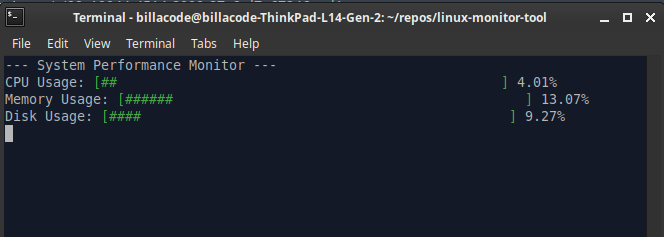

Monitoring system performance is crucial for diagnosing issues, optimizing resource usage, and ensuring smooth operations. In this article, we’ll create a simple utility program in C that tracks CPU, memory, and disk usage in real-time, displaying the data as colored progress bars in the terminal. We’ll leverage Linux headers for accessing system information and use ANSI escape codes for terminal manipulation.

## Overview

This utility program will:

- Monitor CPU, memory, and disk usage.
- Display usage data as progress bars in the terminal.
- Use colors (green, yellow, red) to indicate low, medium, and high usage levels.

## Features:

- **CPU Usage Monitoring**: Shows the CPU usage as a percentage and updates dynamically.
- **Memory Usage Monitoring**: Displays current memory usage.
- **Disk Usage Monitoring**: Shows disk space usage for the root directory (`/`).

Let’s dive into the implementation!

## Getting Started

## Prerequisites

To follow along, you’ll need:

- A Linux environment.
- GCC (GNU Compiler Collection) installed.

## Understanding Linux Headers

**Linux headers** are files that provide function declarations, macros, constants, and data structures required to interact with the Linux kernel and system-level services. For this project, we utilize headers like:

- `<sys/sysinfo.h>`: Provides the `sysinfo` function, which gathers system statistics, such as uptime, available RAM, and load averages.
- `<sys/statvfs.h>`: Contains the `statvfs` function used to retrieve file system statistics like block size, total blocks, and available blocks.

These headers are essential for accessing kernel-level data to monitor the system’s state and performance.

## The Code

Below is the complete code for our system performance monitor:

```
#include <stdio.h>
#include <stdlib.h>
#include <unistd.h>
#include <sys/sysinfo.h>
#include <sys/statvfs.h>
// Function to print progress bar with color based on usage
void print_progress_bar(double usage) {
    int width = 50;  // Width of the progress bar
    int pos = usage * width;
    // Determine color: Green (low usage), Yellow (medium), Red (high)
    const char *color;
    if (usage < 0.5) {
        color = "\033[32m";  // Green
    } else if (usage < 0.75) {
        color = "\033[33m";  // Yellow
    } else {
        color = "\033[31m";  // Red
    }
    printf("%s[", color);  // Set color
    for (int i = 0; i < width; ++i) {
        if (i < pos) {
            printf("#");
        } else {
            printf(" ");
        }
    }
    printf("]\033[0m %.2f%%\n", usage * 100);  // Reset color
}
// Function to calculate CPU usage
double get_cpu_usage() {
    FILE *file = fopen("/proc/stat", "r");
    if (!file) {
        perror("fopen");
        return 0.0;
    }
    char buffer[256];
    fgets(buffer, sizeof(buffer), file);
    fclose(file);
    unsigned long user, nice, system, idle;
    sscanf(buffer, "cpu %lu %lu %lu %lu", &user, &nice, &system, &idle);
    unsigned long total = user + nice + system + idle;
    unsigned long used = total - idle;
    return (double)used / total;
}
// Function to calculate memory usage
double get_memory_usage() {
    struct sysinfo info;
    if (sysinfo(&info) != 0) {
        perror("sysinfo");
        return 0.0;
    }
    return (double)(info.totalram - info.freeram) / info.totalram;
}
// Function to calculate disk usage for a given path
double get_disk_usage(const char *path) {
    struct statvfs buf;
    if (statvfs(path, &buf) != 0) {
        perror("statvfs");
        return 0.0;
    }
    unsigned long total = buf.f_blocks * buf.f_frsize;
    unsigned long used = total - (buf.f_bfree * buf.f_frsize);
    return (double)used / total;
}
int main() {
    while (1) {
        printf("\033[H\033[J");  // Clear the screen and move the cursor to the top
        printf("--- System Performance Monitor ---\n");
        // CPU usage
        printf("CPU Usage: ");
        double cpu_usage = get_cpu_usage();
        print_progress_bar(cpu_usage);
        // Memory usage
        printf("Memory Usage: ");
        double memory_usage = get_memory_usage();
        print_progress_bar(memory_usage);
        // Disk usage
        printf("Disk Usage: ");
        double disk_usage = get_disk_usage("/");
        print_progress_bar(disk_usage);
        sleep(1);  // Refresh every second
    }
    return 0;
}
```

## Important Functions Explained

**CPU Usage Calculation**:

- Reads data from `/proc/stat`, which provides system statistics since boot, including CPU time spent in various modes (user, system, idle).
- Calculates the CPU usage percentage by comparing the total time to the idle time.

**Memory Usage Calculation**:

- Utilizes the `sysinfo()` function from `<sys/sysinfo.h>` to obtain system memory details.
- Calculates the memory usage percentage by comparing free and total RAM.

**Disk Usage Calculation**:

- Uses the `statvfs()` function from `<sys/statvfs.h>` to retrieve file system statistics for the specified path.
- Calculates disk usage as the proportion of used blocks to total blocks.

**Displaying Progress Bars**:

- The `print_progress_bar()` function visualizes usage data as a progress bar.
- Uses ANSI escape codes to dynamically change colors:
- **Green** for low usage (< 50%).
- **Yellow** for medium usage (50–75%).
- **Red** for high usage (> 75%).
- The escape code `\033[H\033[J` clears the terminal screen and moves the cursor to the top to refresh the display seamlessly.

## Running the Program

**Compile the Code**:

```
gcc -o monitor monitor.c
```

**Run the Program**:

```
./monitor
```



## Conclusion

Creating a system performance monitor in C provides a hands-on approach to learning about Linux headers and system programming. This project showcases how to interact with low-level system data and visualize it effectively with terminal graphics. It’s an excellent exercise for anyone interested in systems programming or performance optimization.

Give it a try and explore how you can extend this basic monitor with additional features or customizations! Happy coding :P
