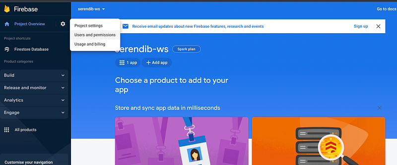
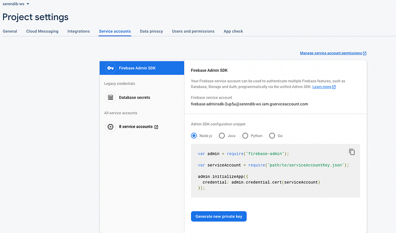
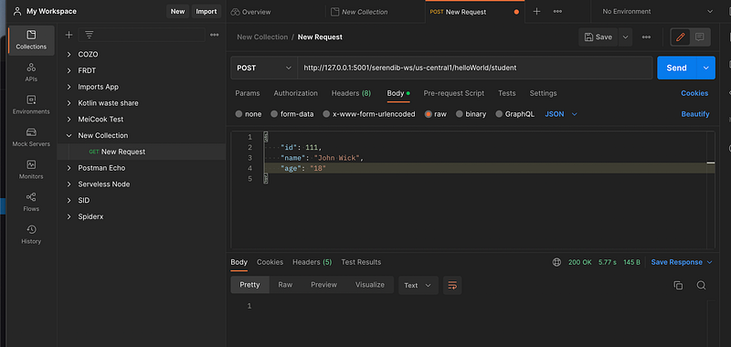
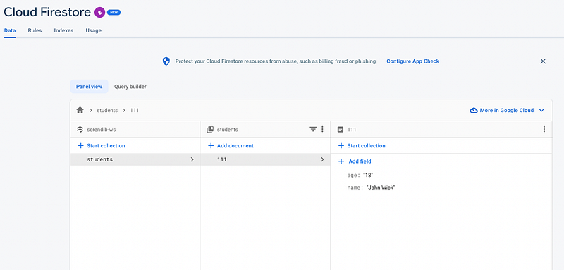

Hi Guys, Quick reference to the last tutorial is given below.

Now in this tutorial our focus is to create an express node js app with firebase cloud functions. Up to now we have a working endpoint from a firebase function. Now what I would do is adding express js in to the current project. For this you have to change the index.js file as this.

```javascript
const functions = require("firebase-functions");
const express = require('express');

const app = express();

app.get('/hello', (req, res) => {
    return res.status(200).send('Hello');
});

exports.helloWorld = functions.https.onRequest(app);
```

If you carefully look, you will see what we have done is we have passed the app in to the function body of the onRequest method. Now we can create our Student API by connecting this app with firestore database.

As the first step go to the firebase console and click on the user permissions like this.



And then go to the service account section, you will get the Node JS code you need.



Copy and paste that code in the index.js file. You can see for the service account, we need a JSON file. To obtain that click on the Generate new private key button, and you will get a JSON file. Rename it to serviceAccountKey.json and put in the functions folder.

Now the application is connected as Firebase Admin therefore we can access Database from the application. Now let’s start creating endpoints for Student CRUD operations. As the first one let’s create the endpoint for creating a Student. For this we will use POST method. Now the index.js file should like this.

```javascript
const functions = require("firebase-functions");
const express = require('express');

var admin = require("firebase-admin");

var serviceAccount = require("./serviceAccountKey.json");

admin.initializeApp({
  credential: admin.credential.cert(serviceAccount)
});

const app = express();
const db = admin.firestore();

app.get('/hello', (req, res) => {
    return res.status(200).send('Hello');
});

app.post('/student', async (req, res) => {
    try {
        await db.collection('students').doc('/' + req.body.id + '/').create({
            name: req.body.name,
            age: req.body.age
        })

        return res.status(200).send();
    } catch (error) {
        console.error(error);

        return res.status(500).send(error);
    }
});

exports.helloWorld = functions.https.onRequest(app);
```

To test this we can use Postman, if you have no exposure to this, I highly recommend you to use. Go there and send a request. If everything is Ok, you will get a 200 response.



Now go to the console and check the firestore database. There you can see newly added data like this.



Pretty easy right !!!. Compared to AWS technologies I personally find Google cloud more easy to work with. Similar to the create operation in the following code I have implemented read, update and delete.

```javascript
const functions = require("firebase-functions");
const express = require('express');

var admin = require("firebase-admin");

var serviceAccount = require("./serviceAccountKey.json");

admin.initializeApp({
  credential: admin.credential.cert(serviceAccount)
});

const app = express();
const db = admin.firestore();

app.get('/hello', (req, res) => {
    return res.status(200).send('Hello');
});

// Create
app.post('/student', async (req, res) => {
    try {
        await db.collection('students').doc('/' + req.body.id + '/').create({
            name: req.body.name,
            age: req.body.age
        })

        return res.status(200).send();
    } catch (error) {
        console.error(error);

        return res.status(500).send(error);
    }
});

// Get one
app.get('/student/:id', async (req, res) => {
    try {
        const document = db.collection('students').doc(req.params.id);
        const product = await document.get();
        const response = product.data();

        return res.status(200).send(response);
    } catch (error) {
        console.error(error);

        return res.status(500).send(error);
    }
});

// Get all
app.get('/student', async (req, res) => {
    try {
        const ref = db.collection('students');
        let response = [];

        await ref.get().then(snapshot => {
            let docs = snapshot.docs;

            for (let doc of docs) {
                const student = {
                    id: doc.id,
                    name: doc.data().name,
                    age: doc.data().age
                }

                response.push(student);
            }
        });

        return res.status(200).send(response);
    } catch (error) {
        console.error(error);

        return res.status(500).send(error);
    }
});

// Update
app.put('/student/:id', async (req, res) => {
    try {
        const document = db.collection('students').doc(req.params.id);
        await document.update({
            name: req.body.name,
            age: req.body.age
        });

        return res.status(200).send();
    } catch (error) {
        console.error(error);

        return res.status(500).send(error);
    }
});

// Delete
app.delete('/student/:id', async (req, res) => {
    try {
        const document = db.collection('students').doc(req.params.id);
        await document.delete();

        return res.status(200).send();
    } catch (error) {
        console.error(error);

        return res.status(500).send(error);
    }
});

exports.helloWorld = functions.https.onRequest(app);
```

Test them out using Postman, you will see our REST API is good to be used. In the next tutorial we will see a different functionality implemented in GCP we used to do using AWS technologies.

Happy Coding :P
