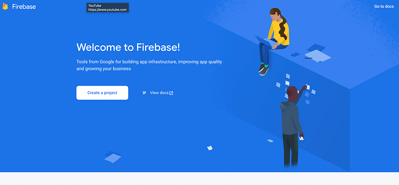
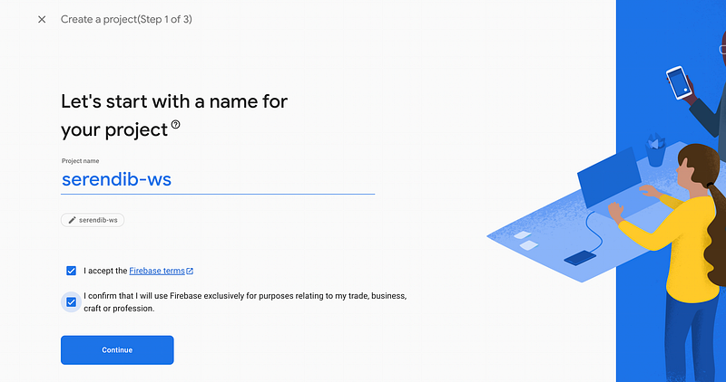
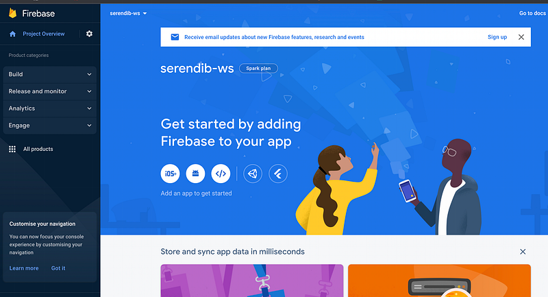
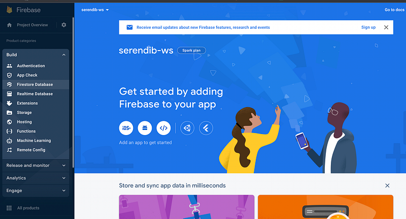
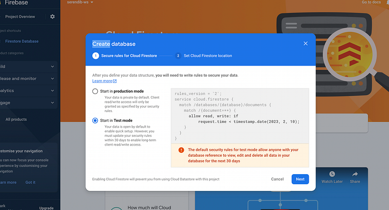
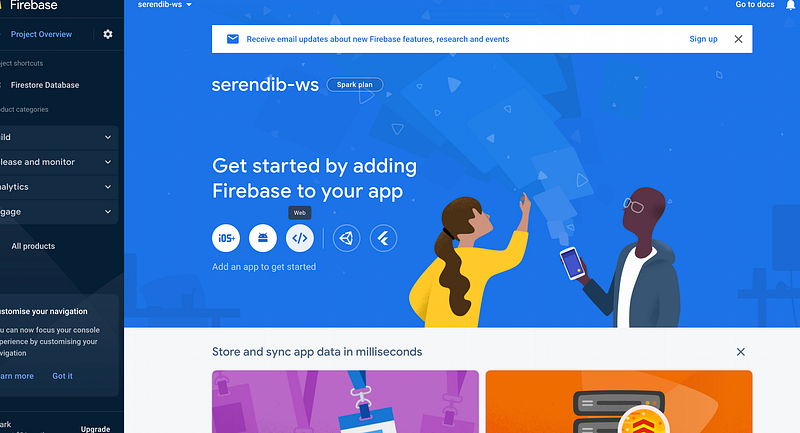
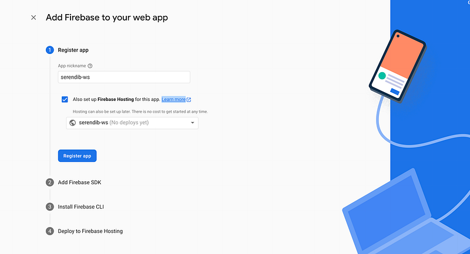
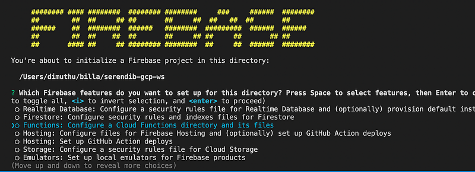
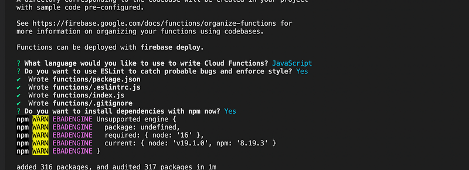
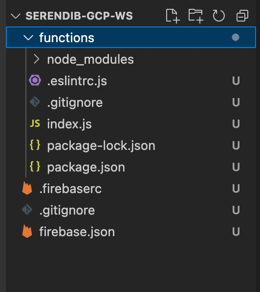

Hi Guys, So if you have followed my tutorials for sometime, you might know, I’m picking real world projects and then work on them parallel to the blog. I worked on a charity web app for some time and for the backend I used AWS Lambda and some AWS technologies.

It was working fine and everything was good. But now I need to learn firebase api with cloudstore. Without starting a new project at this moment, I thought of implementing the Charity web app backend using GCP (Google cloud platform). The main reason is, I started working for a new company and they are using GCP and I need to practice. What other way to learn than teaching right? Let’s start !!!

As the first step we need to access firebase console. Please visit this link [https://console.firebase.google.com/](https://console.firebase.google.com/) you might need to login if you haven’t login to the google account from your browser and you will be landed on a page like this.



Now the second step for us is to create a new project here. Click on that Create a project button and you will see something like this.



Give your project name and then press on continue. Next step will be to enable google analytics, for the moment disable it. And if everything went smoothly, you will see a page where it says your project is now ready. After you click on the continue button, you will be redirected to a page like this.



There are mainly 2 database options for us. One is to go with real time database and other one is to use firestore database. So firestore database is recommended for having complex queries and all. Although we don’t need much complex queries for our project, I decided to use firestore database. Now to create a firestore database, click on the Build button and click on Firestore database.



Press on create database button there. Then you will get a prompt like this.



Choose Test mode for the moment and press on next. Next select the region (I used the deafult one) and continue. Now we have a database, next thing we need to do is registering this with an app. For that click on the project overview side tab and in the screen click on web button.



Then you will see a screen like this.



After registering the app press continue until the project creation is completed.

Before starting work install firebase cli using `npm install -g firebase-tools`. for this you have to have node js installed in your computer and at the moment please use **version 16**.

Now check `firebase` command in the terminal, if it’s working then we can continue. Before everything you need to login to the firebase from the cli. It’s not hard as AWS, you just have to type `firebase login` Now you will get a browser tab with google login. After you successfully logged in, you are good to go in the terminal.

As the first step create new folder and inside it open a terminal and run `firebase init` command. You will get something like this.



Here select the Functions press space, and press enter. In the next step, it would ask whether we need to use an already created project. Remember, we created the project from the console !!!. When you select that option, the name of the project you created would appear in the terminal. Next it would ask for few questions about the app. Language, code style etc. These are my answers.



Now you will get a set of files like this.



Now if you open the index.js file. You will see the content like this.

```javascript
const functions = require("firebase-functions");

// // Create and deploy your first functions
// // https://firebase.google.com/docs/functions/get-started
//
// exports.helloWorld = functions.https.onRequest((request, response) => {
//   functions.logger.info("Hello logs!", {structuredData: true});
//   response.send("Hello from Firebase!");
// });
```

Now the HelloWorld example is commented out here. Let’s uncomment that section.

```javascript
const functions = require("firebase-functions");

// // Create and deploy your first functions
// // https://firebase.google.com/docs/functions/get-started
//
exports.helloWorld = functions.https.onRequest((request, response) => {
  functions.logger.info("Hello logs!", {structuredData: true});
  response.send("Hello from Firebase!");
});
```

Now go to the terminal and type `firebase serve` You will get your cloud fucntion up and running in this URL [http://localhost:5000/serendib-ws/us-central1/helloWorld](http://localhost:5000/serendib-ws/us-central1/helloWorld)

When you open this link in a browser you will get **Hello from Firebase!**

That’s the first tutorial for this series. Stay in touch with me. There are lot of interesting articles coming up. Stay safe guys !!!

HAPPY CODING :P
