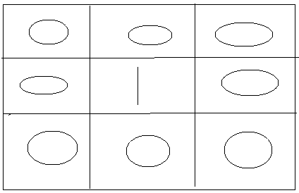

Hi Guys, These types of questions are very popular in Codability tests and other kind of programming tests. Consider a scenario where we have a piece of paper with grids and we only allow someone to go in only cells denoted by “0”s. If you find a “1” on the way it is a obstacle. When doing this there are various methods to do but here I’m going to discuss the optimum solution which uses dynamic programming.



_Game board_

Here the hings we should consider are as follows,

- We need to reach the bottom right cell of the grid step by step
- We have to make a choice at every step we take, the choices are: Go right or Go down!
- There are some places in the path on which we can not put our step
- We need to tell that in how many unique (distinct) ways are there to reach the end point!

So the approach we will be using as follows,

- Start traversing through the given Game board 2D matrix row-wise and fill the values in it.
- For the first row and the first column set the value to 1 if an obstacle is not found.
- For the first row and first column, if an obstacle is found then start filling 0 till the last index in that particular row or column.
- Now start traversing from the second row and column ( eg: board[ 1 ][ 1 ]).
- If an obstacle is found, set 0 at particular Grid ( eg: board[ i ][ j ] ), otherwise set sum of upper and left values at board[ i ][ j ].
- Return the last value of the 2D matrix.

JavaScript code for the solution is as follows.

```
function uniquePathsWithObstacles(board) {
    let r = board.length;
    let c = board[0].length;

    if (board[0][0] != 0) return 0;

    board[0][0] = 1;

    for (let j = 1; j < c; j++) {
        if (board[0][j] == 0) {
            board[0][j] = board[0][j - 1];
        } else {
            board[0][j] = 0;
        }
    }

    for (let i = 1; i < r; i++) {
        if (board[i][0] == 0) {
            board[i][0] = board[i - 1][0];
        } else {
            board[i][0] = 0;
        }
    }

    for (let i = 1; i < r; i++) {
        for (let j = 1; j < c; j++) {
            if (board[i][j] == 0) {
                board[i][j] = board[i - 1][j] + board[i][j - 1];
            } else {
                board[i][j] = 0;
            }
        }
    }

    return board[r-1][c-1];
}

let board = [[0, 0, 0], [0, 1, 0], [0, 1, 0]];

console.log(uniquePathsWithObstacles(board));
```

Save this file as game-board.js and then to run the program use the following command.

```
node game-board.js
```

Happy coding guys !!!
