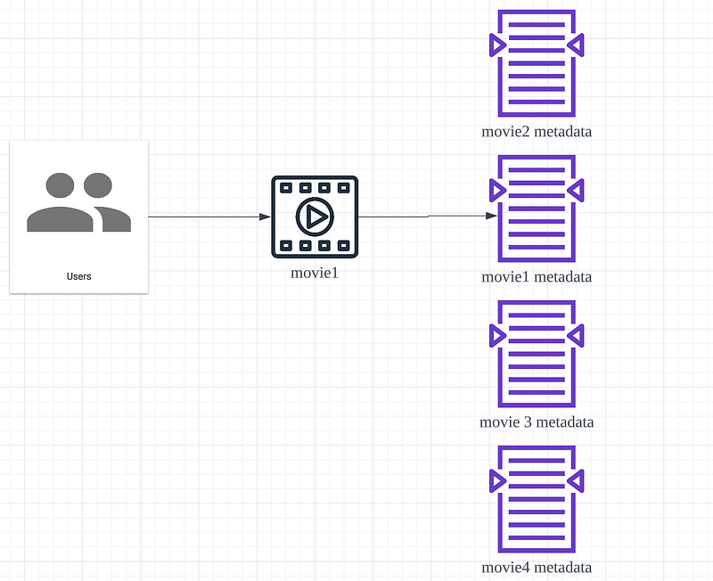
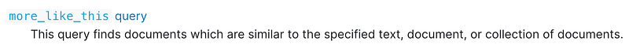

Hi Guys, In this article I will be trying to build a content recommendation system using Elastic Search.

First of all, let’s try to understand what a recommendation system really is. In practise there are mainly 2 types of recommendation systems.

- Collaborative Filtering (CF)
- Content-Based

## Content based recommendation

Content-based recommendation is a type of recommendation system that suggests items to users based on the characteristics or features of the items themselves. In practice there are many ways to do this.

- Bag of Words (BOW)
- Word2Vec
- Bidirectional Encoder Representations from Transformers (BERT)
- Term frequency — Inverse document frequency (TF-IDF)

Out of these Word2Vec and BERT are more computationally expensive operations as they involve deep learning to find the context of the text we are referring. BOW is more of term frequency model and inverse document frequency is not supported (So we can’t match with other documents). So in this article I will be focusing on TF-IDF method of content recommendation.

First of all let’s understand what is TF and what IDF. TF is the frequency of a term we are concerned relative to a document. IDF means how common a term we are concerned within a set of documents (corpus). This is very linear with our context where content metadata is stored as documents in Elastic Search.



## Implementation using Elastic Search

Implementing TF-IDF in Elastic search is very simple. They have their special query for this called more_like_this.



The definition given by Elastic team in their documentation matches the TF-IDF (Similar to specified text (TF) Collection of documents (IDF)).

So the implementation will be something like this,

```bash
GET /your_index/_search
{
  "query": {
    "more_like_this": {
      "fields": ["title", "description"],
      "like": "Once upon a time",
      "min_term_freq": 1,
      "max_query_terms": 12
    }
  }
}
```

Now in this query we are requesting for all the movies which has once upon a time in title and description in a movie metadata store. But this is the black box solution, that means the internal implementation of TF-IDF is not visible for us. In elastic search we also have a more technical way to achieve TF-IDF, it’s the Term Vectors API.

Now the implementation of this is trickier. Let’s checkout the same example we had above. Use `term_vector` to retrieve terms from an indexed document. Here I will be doing it to document id 1.

```bash
GET /your_index/_doc/1/_termvectors
{
  "fields": ["title", "description"],
  "offsets": true,
  "payloads": true,
  "positions": true,
  "term_statistics": true
}
```

Now in the response for example you will get something like this.

```json
{
  "_index": "your_index",
  "_type": "_doc",
  "_id": "1",
  "_version": 1,
  "found": true,
  "took": 10,
  "term_vectors": {
    "title": {
      "field_statistics": {
        "sum_doc_freq": 3,
        "doc_count": 1,
        "sum_ttf": 3
      },
      "terms": {
        "once": {
          "term_freq": 1,
          "tokens": [
            {
              "position": 0,
              "start_offset": 0,
              "end_offset": 4
            }
          ]
        },
        "upon": {
          "term_freq": 1,
          "tokens": [
            {
              "position": 1,
              "start_offset": 5,
              "end_offset": 9
            }
          ]
        },
        "a": {
          "term_freq": 1,
          "tokens": [
            {
              "position": 2,
              "start_offset": 10,
              "end_offset": 11
            }
          ]
        },
        "time": {
          "term_freq": 1,
          "tokens": [
            {
              "position": 3,
              "start_offset": 12,
              "end_offset": 16
            }
          ]
        }
      }
    },
    "description": {
      "field_statistics": {
        "sum_doc_freq": 2,
        "doc_count": 1,
        "sum_ttf": 2
      },
      "terms": {
        "story": {
          "term_freq": 1,
          "tokens": [
            {
              "position": 0,
              "start_offset": 0,
              "end_offset": 5
            }
          ]
        },
        "life": {
          "term_freq": 1,
          "tokens": [
            {
              "position": 1,
              "start_offset": 6,
              "end_offset": 10
            }
          ]
        }
      }
    }
  }
}
```

Now using these values we will check the similar documents like this

```bash
GET /your_index/_search
{
  "query": {
    "bool": {
      "should": [
        { "match": { "title": "once" }},
        { "match": { "title": "upon" }},
        { "match": { "title": "a" }},
        { "match": { "title": "time" }},
        { "match": { "description": "story" }},
        { "match": { "description": "life" }}
      ]
    }
  }
}
```

So this is one of the ways to implement TF-IDF in Elastic search to recommend content based on content similarity. Now looking at the 2 implementation it’s clear black box solution `more_like_this` is the better solution because it’s simple and we don’t need do 2 different API calls. But it’s always best to learn something like `term_vector` as it gives us a good knowledge about the frequencies of certain terms in a document.

So this is it for recommendation using Elastic search based on content similarity, in the next article let’s see how to implement collaborative filtering using Elastic search and some other technologies. Stay tuned guys and please let me know if you have any questions.

Happy Coding !!! :P
