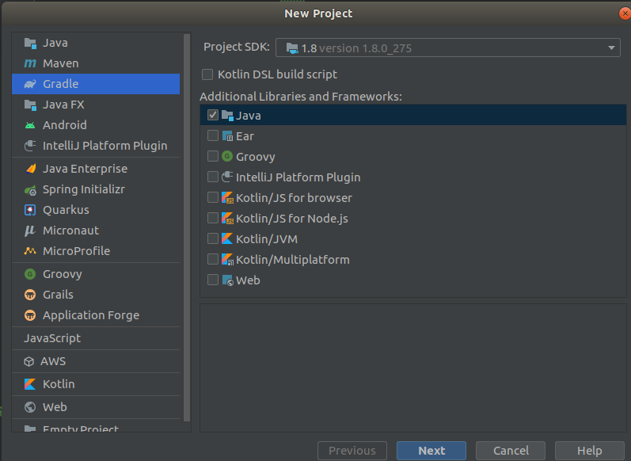
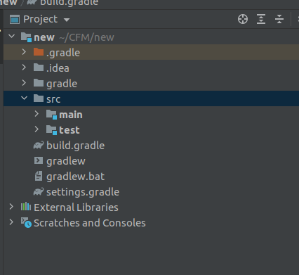

I’m not going to go in to many of the features and descriptions but just dive in to the world of Spring boot by creating a new application. To initialize the spring boot application we can either use gradle or maven. If you face any problem type it in comments i will personally look in to it. Final tutorial for this series,

IDE : Intelij

Build tool : Gradle

Java — 1.8

So first lets create a empty gradle project using intellij as follows.



After creating the project we will get a project with just two files. build.gradle and settings.gradle. So these are the files which we are going to configure to make this a spring boot application. First step we replace the code in build.gradle using following code.

So after we add this code we have to press ctrl + shift + o to sync the gradle changes. The the dependencies we have specifiied in the build.gradle will be downloaded. After the syncing now lets build the project and then run it. I will take some time to download dependencies.



here inside the main folder we can find two folders called java and resources. These folders are the place where we are going to do our most of the coding.

Now we have to create a controller for this program. I will create a controller called StockController.java file inside java folder.

```
import org.springframework.boot.SpringApplication;
import org.springframework.boot.autoconfigure.EnableAutoConfiguration;
import org.springframework.web.bind.annotation.RequestMapping;
import org.springframework.web.bind.annotation.RestController;

@RestController
@EnableAutoConfiguration
public class StockController {

    @RequestMapping("/")
    String home() {
        return "Hello World!";
    }

    public static void main(String[] args) {
        SpringApplication.run(StockController.class, args);
    }
}
```

Now we can see a file called gradlew is created. So if you are using Windows then we have to use gradlew.bat if we are using linux we have to use gradlew file to build and run. Thing is in linux we can’t use this file at once from terminal. First we have to change the read write permission for the file for that use the following command.

```bash
sudo chmod +x gradlew
```

Now in the command line or the terminal we have to build the spring boot project. For windows type the following command.

For Linux

```
./gradlew clean build
```

Now to run the application just type

```
./gradlew bootRun
```

Happy coding. In next lesson lets see how we can create a simple project and how we are going to deploy it in to a production environment.

_Originally published at _[_http://billacode.wordpress.com_](https://billacode.wordpress.com/2021/06/02/spring-boot-basics/)_ on June 2, 2021._
