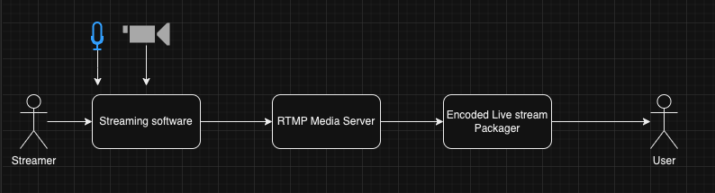
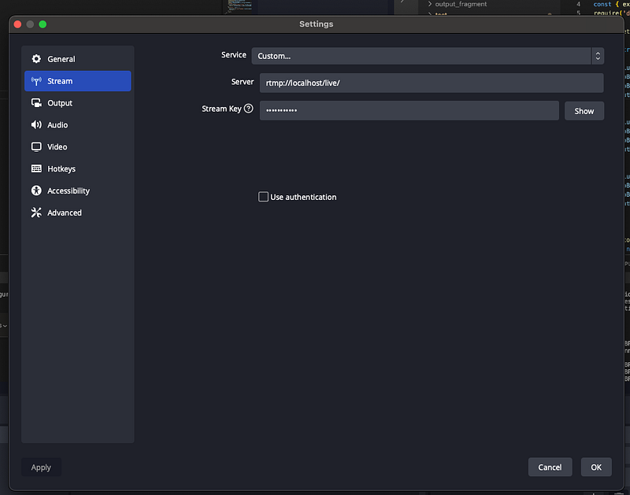
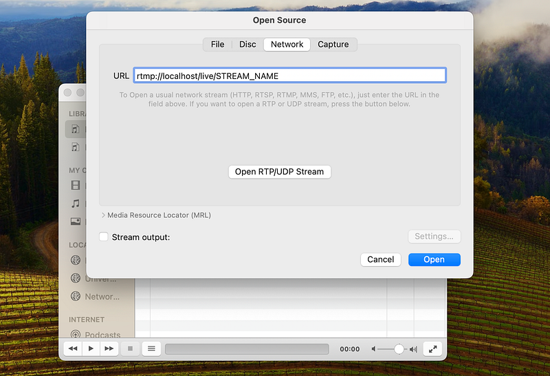
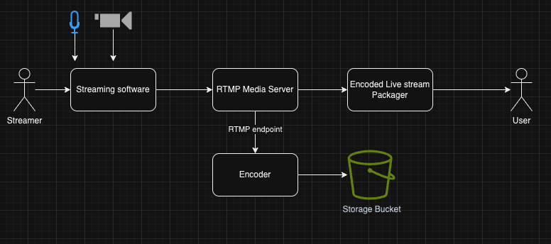

Previously on Billa Code Blog,

We created an video encoder using FFMPEG, Node JS, Bento4 and BuyDRM.

Now let’s focus on live streaming. Live streaming has several components, before going in to details I will give you a high level overview of the plan.



Streamer will be using a streaming application like [OBS](https://obsproject.com/) to get the input of his microphone and video camera as a RTMP input. You can build your own streamer using FFMPEG but as OBS is open source and free, at this point I’m not much concerned about that.

> RTMP stands for Real-Time Messaging Protocol. It’s a proprietary protocol developed by Adobe Systems for high-performance transmission of audio, video, and data over the internet between a server and a Flash player. RTMP is designed to provide low-latency communication and is commonly used for streaming live video and audio content on the internet.

> One of the key features of RTMP is its ability to maintain a persistent connection between the streaming server and the client, allowing for efficient data transfer and real-time interaction. This makes it well-suited for applications like live video streaming, online gaming, and interactive multimedia content delivery.

> RTMP operates over TCP/IP and typically uses port 1935 for communication. It supports various types of data, including audio, video, and metadata, and can be encrypted for secure transmission.

> However, it’s worth noting that while RTMP has been widely used in the past, especially for streaming Flash content, its usage has declined in recent years in favor of more modern and open protocols like HLS (HTTP Live Streaming) and MPEG-DASH (Dynamic Adaptive Streaming over HTTP). These newer protocols offer better compatibility with modern devices and platforms, as well as improved support for adaptive bitrate streaming.

Next step is to send this RTMP input to a RTMP media server, in our scenario I will be using [Node Media Server](https://www.npmjs.com/package/node-media-server) for this. The implementation is very simple. You just have to follow the documentation provided by the Node Media Server npm package and you will be good.

So let’s create a file named app.js

```javascript
const NodeMediaServer = require('node-media-server');

const config = {
  rtmp: {
    port: 1935,
    chunk_size: 60000,
    gop_cache: true,
    ping: 30,
    ping_timeout: 60
  },
  http: {
    port: 8000,
    mediaroot: './media',
    allow_origin: '*'
  }
};

var nms = new NodeMediaServer(config)
nms.run();
```

Obviously we have to install node-media-server package.

```bash
npm i node-media-server
```

Now run the app.js file

```
node app.js
```

You will see 2 servers running, one http server in 8000 port and one RTMP server in 1935 port. Now the RTMP server is accepting RTMP input `rtmp://localhost/live/STREAM_NAME` url.

Go to OBS and in settings select streams and change the settings like this. In our case, stream key is `STREAM_NAME`



Now start stream from OBS and if you use a player like VLC, you can check the live feed coming from OBS using rtmp link.



Great !!!. Everything is good but we can’t expect our users to rely on rtmp link. So now comes the video encode component we did previously in our tutorial series but in this case turning live feed in to HLS and DASH is supported by the Node media server package itself.

```javascript
const NodeMediaServer = require('node-media-server');
require('dotenv').config()

const config = {
  rtmp: {
    port: 1935,
    chunk_size: 60000,
    gop_cache: true,
    ping: 30,
    ping_timeout: 60
  },
  http: {
    port: 8000,
    mediaroot: './media',
    allow_origin: '*'
  },
  trans: {
    ffmpeg: process.env.FFMPEG_PATH,
    tasks: [
      {
        app: 'live',
        hls: true,
        hlsFlags: '[hls_time=2:hls_list_size=3:hls_flags=delete_segments]',
        hlsKeep: true, // to prevent hls file delete after end the stream
        dash: true,
        dashFlags: '[f=dash:window_size=3:extra_window_size=5]',
        dashKeep: true // to prevent dash file delete after end the stream
      }
    ]
  }
};

var nms = new NodeMediaServer(config)
nms.run();
```

For this to work we have to install FFMPEG in our local machine. If you are a mac user like me, you probably install it through brew. Now my path is something like this which i keep in a file called .env.

```
FFMPEG_PATH = '/opt/homebrew/Cellar/ffmpeg/7.0/bin/ffmpeg'
```

You don’t need to rely on local installed FFMPEG if you are using docker. I will discuss this later.

Now when you run the app.js file and do the same thing using OBS and if you access this URL `[http://localhost:8000/live/STREAM_NAME/index.mpd](http://localhost:8000/live/STREAM_NAME/index.mpd)` you would see the same feed. This means I juts have to use this URL in a player like video js as we did in our previous tutorials, you would see the feed.

## **Recording**

If you check the configs we newly introduced to support HLS and DASH live streaming, you would see we are keeping streaming content without deleting. But this doesn’t keep everything, So we will have to introduce another component to do the recording part.



We will be using same encoder we create in previous tutorials for this task, just change the input to the rtmp link. You can access this code from here

```javascript
// previous code
const encoder = async () => {
  const inputVideo = "rtmp://localhost/live/STREAM_NAME";
  const outputDirectory = "output_folder";
  const outputDirectoryDash = "output_dash";
  const outputDirectoryFragment = "output_fragment";

  const permissions = 0o777;

  try {
    if (fs.existsSync(outputDirectory)) {
      fs.rmSync(outputDirectory, { recursive: true });
    }

// code after this
```

Now if you run this and previous app.js and start streaming. You would see at the end of the day, we have total live streamed content recorded, encoded and ready to be serve later.

As promised following is the Dockerfile for the live stream project

```bash
# Use the official Node.js 14 image
FROM node:18-alpine3.19

# Install ffmpeg
RUN apk update && apk add ffmpeg

# Set the working directory in the container
WORKDIR /app

# Copy package.json and package-lock.json to the working directory
COPY package*.json ./

# Install dependencies
RUN npm install

# Copy the application code to the working directory
COPY . .

# Expose RTMP and HTTP ports
EXPOSE 1935 8000

ENV FFMPEG_PATH='/usr/bin/ffmpeg'

# Run the Node-Media-Server when the container starts
CMD ["node", "app.js"]
```

So this is about live streaming and recording. In the next tutorial let’s create a real-time chat server solution to be used with the video stream. Happy coding! :P
