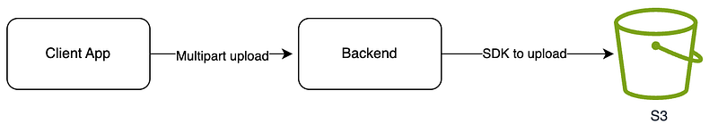
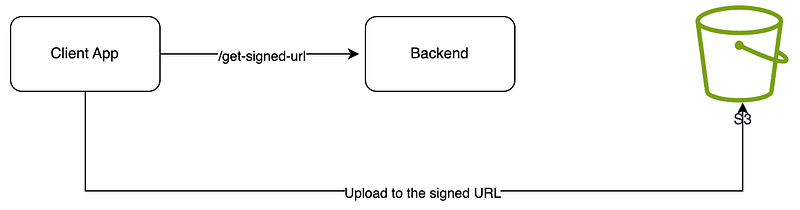
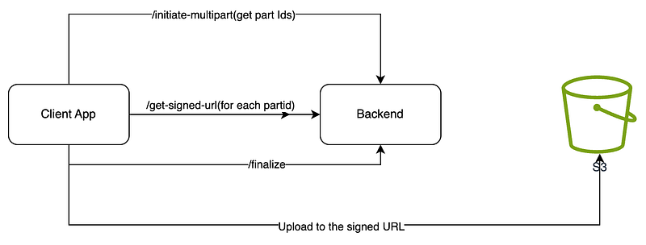
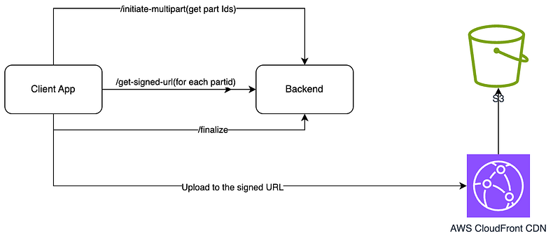
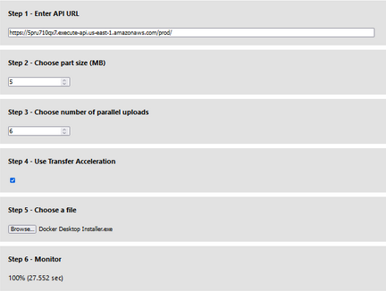

Hi Guys, In this tutorial I will be looking at 2 specific features in S3 which helps us to upload files in a ultra fast way. Before that let’s talk about how we would normally upload a file in to the AWS S3.

_Basic upload workflow_

Now this could give us different issues based on the web server configuration like max upload size, timeouts and etc. So the next recommended thing is to use a signed URL from AWS SDK to initiate a file upload directly from client to S3. It would look like this.

_Upload flow using signed URL_

So this would solve above mentioned issues but still could take days for a very large file. To solve this AWS has introduced 2 features, which will give you an ultra boost when uploading.

- Multi part upload
- Transfer acceleration

Before dive in to the implementation, let’s try to understand what each of these methods are.

> A multipart upload allows an application to upload a large object as a set of smaller parts uploaded in parallel. Upon completion, S3 combines the smaller pieces into the original larger object.

> By using S3 transfer acceleration, the application can take advantage of the globally distributed edge locations in [Amazon CloudFront](https://aws.amazon.com/cloudfront/). When combined with multipart uploads, each part can be uploaded automatically to the edge location closest to the user, reducing the upload time.

So let’s look at how the high level architecture would look like for AWS multipart upload.

_high level architecture for multipart_

So this is 3 step process,

- Splitting the main content in to set of parts using file metadata and AWS S3 SDK
- Get signed URLs for each part and upload to S3 using it
- Finalise the part upload using AWS SDK

Now let’s look at the Transfer acceleration added high level overview.

_Transfer accelarated high level overview_

Here we have to configure the S3 bucket to support Transfer accelaration, which in return will provide us a bucket endpoint with CDN added. Now from anywhere in the world if you upload a file, it would be added to the closest location of the client and internally change the regions. (Simple as that)

Now for the implementation, AWS themselves has created a test repository for this.

This has a backend app using 3 lambda functions and Front end using react. Just do a `cdk deploy` inside backend folder and cdk stack will be deployed to your AWS account. Front end app you can host anywhere and would look like this.

Based on your responses for this article, If needed I would create another tutorial to go through the code in that code base. Anyways it’s described here as well.

So see you in a next tutorial. Happy Coding :P
