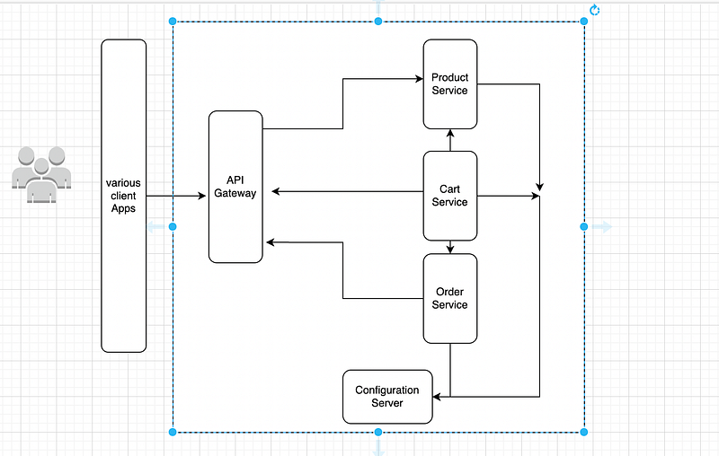
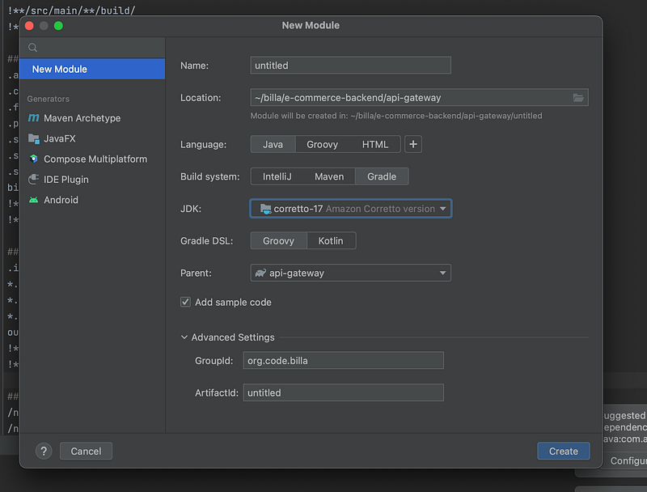
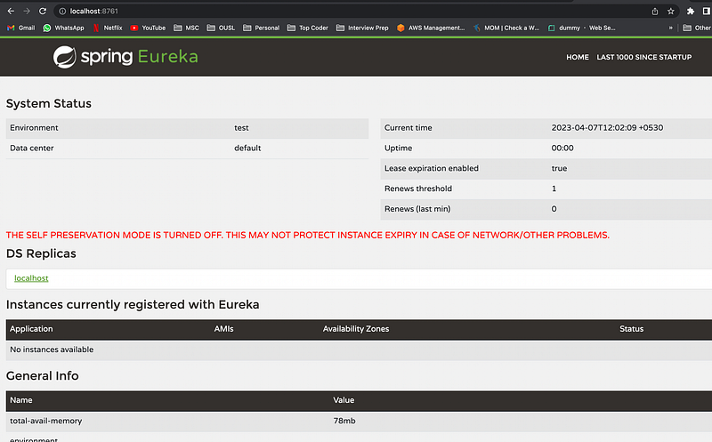
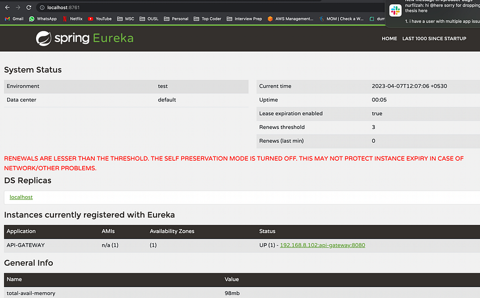

Hi Guys, After our little adventure with Apache Kafka, I decided to create a scalable e-commerce backend using Spring boot, Spring cloud and Eureka. So this will be the first of the series and after using Eureka, may be we will also use Kubernetes later on for the learning purposes.

All right, When I was planning this, I had various technologies in my mind. As this was to be build as micor services, I was in between Micronaut and Spring boot. Micronaut and Spring Boot are both popular Java-based frameworks for building modern, cloud-native applications. Both frameworks provide a rich set of features and tools to simplify and accelerate the development process.

However, there are some differences between the two frameworks. Here are some of the key differences:

- Startup time: Micronaut has faster startup times than Spring Boot. This is because Micronaut uses ahead-of-time (AOT) compilation to generate native executable code, whereas Spring Boot relies on just-in-time (JIT) compilation.
- Configuration: Micronaut uses compile-time dependency injection to generate the necessary configuration metadata at build time, whereas Spring Boot uses runtime reflection to generate configuration metadata at runtime.
- Size: Micronaut applications are generally smaller in size than Spring Boot applications. This is because Micronaut includes only the necessary dependencies at build time, whereas Spring Boot includes a larger number of dependencies by default.
- Annotation-based programming model: Spring Boot has an extensive set of annotations and conventions that simplify application development, whereas Micronaut has a more minimalistic approach to annotations.
- Integration testing: Micronaut has better support for integration testing, as it provides a built-in testing infrastructure that allows for faster and more efficient testing.

In summary, both Micronaut and Spring Boot are excellent frameworks for building modern Java applications, and the choice between the two ultimately comes down to the specific needs and requirements of your application. Although Micronaut provide various plus points when it comes to Micro services, I chose Spring boot, because it has in build support for Spring cloud. Don’t get me wrong here, Micronaut is also supported by Spring cloud, but due to the reason micronaut dependency injection mechanism is different from Spring boot, we would have compatibility issues.

And next thing is Eureka. Eureka is a service discovery tool that is part of the Spring Cloud framework. It is used to register, discover, and route requests to microservices in a cloud-native application environment. In a microservices architecture, there can be many small, independent services that need to communicate with each other over a network. Service discovery is the process of finding and connecting to these services, and Eureka simplifies this process by providing a registry of all the available services in a system. Eureka works by having each service register itself with the Eureka server when it starts up. The Eureka server then maintains a list of all the available services, along with their metadata such as IP address, port number, and health status. When a client needs to communicate with a service, it queries the Eureka server to find the appropriate service instance and route the request to it. Eureka also provides load balancing and failover capabilities. By maintaining a list of available instances of each service, it can distribute requests to different instances in a round-robin or random fashion. If an instance becomes unavailable, Eureka can detect the failure and remove it from the list, so that requests are routed only to healthy instances.

Ok, back to the project. I will give you a high level overview of what we are going to do by giving an architectural diagram of the project.



Ok. So let’s start coding, I will be using Java 17, Gradle , Spring boot, spring cloud and Eureka for todays code. As you can see in our backend we have 5 services. I’m going to use intellij community edition as the IDE. Create an empty foldor named e-commerce-ws and open it using intellij. Then add a module from the new button in the IDE, here configure the module to use Java 17 and Gradle.



Now likewise create the 5 services as modules inside this folder. Now you should have 5 projects with different gradle confgurations and source code. Now the important thing we have to do is to add Spring boot dependencies to the project (If you have intellij pro this can be done when creating the module it self). Go to the build.gradle file and change the code to this.

```bash
plugins {
    id 'java'
    id 'org.springframework.boot' version '2.6.3'
    id 'io.spring.dependency-management' version '1.0.11.RELEASE'
}

group 'org.code.billa'
version '1.0-SNAPSHOT'

repositories {
    mavenCentral()
}

dependencies {
    implementation 'org.springframework.boot:spring-boot-starter:2.6.3'
    implementation 'org.springframework.boot:spring-boot-starter-web:2.6.3'
    testImplementation 'org.junit.jupiter:junit-jupiter-api:5.8.1'
    testRuntimeOnly 'org.junit.jupiter:junit-jupiter-engine:5.8.1'
}

test {
    useJUnitPlatform()
}
```

Then rename the class with main method with another name. For example APIGatewayApp and change the code like this.

```typescript
package org.code.billa;

import org.springframework.boot.SpringApplication;
import org.springframework.boot.autoconfigure.SpringBootApplication;

@SpringBootApplication
public class APIGatewayApp {
    public static void main(String[] args) {
        SpringApplication.run(APIGatewayApp.class, args);
    }
}
```

Here we have added SpringBootApplication annotation and also we are running it in the main method which will open the embedded tomcat server.

Now let’s create the configuration server. Our plan is to run the Eureka server here. So this will be the service registry for our micro services. For this we need an additional dependency and with that let’s change the build.gradle file for ConfigurationServer module.

```bash
plugins {
    id 'java'
    id 'org.springframework.boot' version '2.6.3'
    id 'io.spring.dependency-management' version '1.0.11.RELEASE'
}

group 'org.billa'
version '1.0-SNAPSHOT'

repositories {
    mavenCentral()
}

dependencies {
    implementation 'org.springframework.boot:spring-boot-starter:2.6.3'
    implementation 'org.springframework.boot:spring-boot-starter-web:2.6.3'
    implementation 'org.springframework.cloud:spring-cloud-starter-netflix-eureka-server:3.1.5'
    testImplementation 'org.junit.jupiter:junit-jupiter-api:5.8.1'
    testRuntimeOnly 'org.junit.jupiter:junit-jupiter-engine:5.8.1'
}

test {
    useJUnitPlatform()
}
```

Now as we did to the APIGateway, let’s change the main method here as well and let’s make this a Eureka server using an annotation from the package eureka.

```typescript
package org.billa;

import org.springframework.boot.SpringApplication;
import org.springframework.boot.autoconfigure.SpringBootApplication;
import org.springframework.cloud.netflix.eureka.server.EnableEurekaServer;

@SpringBootApplication
@EnableEurekaServer
public class ConfigServerApplication {
    public static void main(String[] args) {
        SpringApplication.run(ConfigServerApplication.class, args);
    }
}
```

under the resiurces folder create a file named application.properties and add following to support Eureka client service registry work.

```
server.port=8761
spring.application.name=eureka-server
eureka.client.register-with-eureka=false
eureka.client.fetch-registry=false
eureka.server.enable-self-preservation=false
eureka.server.eviction-interval-timer-in-ms=30000
```

Now run this application and if you go to the [http://localhost:8761](http://localhost:8761) you will see a web page like this.



Now we have to register our other 4 micro services to this service registry. For that as an example I would use the same module I used in the beginning (API Gateway). Let’s change the build.gradle to add dependencies first.

```bash
plugins {
    id 'java'
    id 'org.springframework.boot' version '2.6.3'
    id 'io.spring.dependency-management' version '1.0.11.RELEASE'
}

group 'org.code.billa'
version '1.0-SNAPSHOT'

repositories {
    mavenCentral()
}

dependencies {
    implementation 'org.springframework.boot:spring-boot-starter:2.6.3'
    implementation 'org.springframework.boot:spring-boot-starter-web:2.6.3'
    implementation 'org.springframework.cloud:spring-cloud-starter-netflix-eureka-client:3.1.5'
    testImplementation 'org.junit.jupiter:junit-jupiter-api:5.8.1'
    testRuntimeOnly 'org.junit.jupiter:junit-jupiter-engine:5.8.1'
}

test {
    useJUnitPlatform()
}
```

Here we have add **org.springframework.cloud:spring-cloud-starter-netflix-eureka-client** to create a Eureka client in our app. Now next thing we need to do is to change the Application file like this.

```typescript
package org.code.billa;

import org.springframework.boot.SpringApplication;
import org.springframework.boot.autoconfigure.SpringBootApplication;
import org.springframework.cloud.client.discovery.EnableDiscoveryClient;
import org.springframework.cloud.client.discovery.EnableDiscoveryClient;

@SpringBootApplication
@EnableDiscoveryClient
@EnableEurekaClient
public class APIGatewayApp {
    public static void main(String[] args) {
        SpringApplication.run(APIGatewayApp.class, args);
    }
}
```

Now to define the service registry URL and other config similar to the configuration server, let’s create an application.properties file here as well.

```
server.port=8080
spring.application.name=api-gateway
eureka.client.service-url.default-zone=http://localhost:8761/eureka/
```

We specify the port with different ports for each service as they have to run in same environment and application name is added to be easy to find in eureka registry. Service URL is the configuration server of ours. Now without running the configuration server first other services will not startup as they depend on this server. Now run the API Gateway service and if you refresh the web page in [http://localhost:8761](http://localhost:8761) you will see something like this.



Here under instances currently registered with Eureka, you can see the API-GATEWAY service. Do this for the rest of the services.

In the next tutorial let’s look at how to connect each of these services to different databases and implement our scalable solution.

Github: [https://github.com/deBilla/e-commerce-ws](https://github.com/deBilla/e-commerce-ws)

Have fun coding ;)
