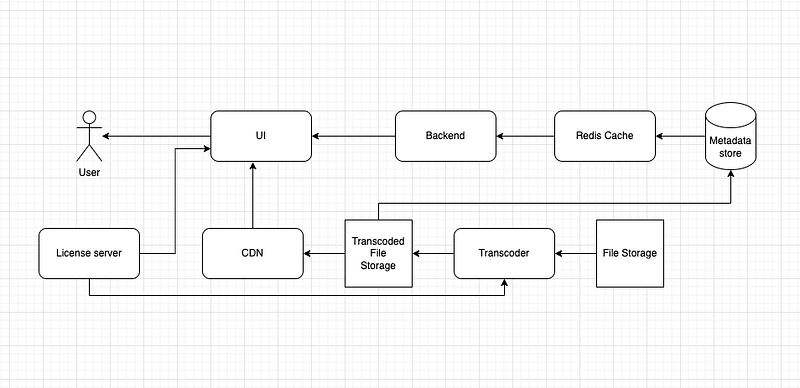

Hi Guys, Ever wondered how to create a video on demand service like netflix or amazon prime. I have written a article about how to design such a VOD application in the following link.

This article is the next step to that previous design. Here we will practically implement this system in AWS. I believe most of you should be familiar with AWS services. I highly recommend you to create an account in AWS and try to practically build this solution. If you need any help doing this have a set of articles around that area too.

In my last tutorial while designing the VOD system, we came up with a high level overview exactly like the following diagram.

Now in this article I will be going through the implementation of the above system using AWS services. Let’s start from the bottom.

- AWS S3 for media file storage
- AWS Media converter as the transcoder
- AWS S3 as the transcoded file storage
- AWS Cloudfront as the CDN
- I will be using BuyDRM as the DRM license server (Not an AWS solution)
- And the metadata store, caching, Backend and UI, I will be deploying in AWS EC2 as dockerized containers.

## Step 1: Uploading Media Files to S3

The first step in our VOD workflow is storing raw video files in an **S3 bucket**. This bucket will act as the source for our transcoding process.

Steps:

- Log in to the AWS Console.
- Navigate to Amazon S3 and create a new bucket (e.g., `vod-source-bucket`).
- Set appropriate permissions to allow MediaConvert to access files.
- Upload video files manually or automate this step using the AWS SDK.

## Step 2: Transcoding Using AWS MediaConvert

AWS MediaConvert will process raw media files into various formats suitable for different devices and network conditions.

Steps:

- Open the **AWS MediaConvert** console.
- Create a new MediaConvert job:
- Select **Input** from the S3 bucket (`vod-source-bucket`)
- Define **Output Groups** for HLS, DASH, or MP4 formats.
- Choose encoding settings (resolution, bitrate, codecs).
- Configure a destination S3 bucket for the output files (e.g., `vod-transcoded-bucket`).
- Submit the job and monitor progress.

## Step 3: Storing Transcoded Files in S3

Once MediaConvert processes the videos, they need to be stored in a separate S3 bucket to serve content efficiently via CloudFront.

Steps:

- Navigate to **Amazon S3** and create another bucket (`vod-transcoded-bucket`).
- Ensure proper permissions for CloudFront to access the files.
- Organize files based on quality (e.g., 1080p, 720p, 480p folders).

## Step 4: Setting Up AWS CloudFront as a CDN

CloudFront is used to distribute video content efficiently, reducing latency and improving user experience.

Steps:

- Navigate to **AWS CloudFront** and create a new distribution.
- Set the origin to `vod-transcoded-bucket`.
- Enable caching and configure origin policies.
- Use signed URLs for restricted access if required.
- Deploy the distribution and get the CloudFront URL for streaming.

## Step 5: Integrating DRM for Content Security

For content protection, we will use **BuyDRM** as the DRM license server.

Steps:

- Create an account with BuyDRM.
- Integrate DRM protection with AWS MediaConvert output settings.
- Configure the player to request and validate DRM licenses before playback.

## Step 6: Deploying Metadata Store, Backend, and UI on AWS EC2

The final step involves setting up the backend, caching, and user interface.

Steps:

- Set up an **EC2 instance** and install Docker.
- Deploy metadata storage using **PostgreSQL or DynamoDB**.
- Deploy backend services (Node.js, Python, or Java Spring Boot) in Docker containers.
- Implement caching using **Redis or ElastiCache**.
- Deploy the frontend (React, Angular, or Vue) to serve users.

Step 6 implementation is not recommended for a production grade application but more than enough if you are trying to create a MVP. And later on when the platform grows, you might need to connect all these services using SDK or APIs and automate the process.

Most of the time, we tend to rely on these types of services provided by cloud providers. Later on when the number of videos grow and the cost can be really high if we are not careful about how we use these services.

**For example raw file storage cost can have a big impact if we keep the files in S3 standard class for longer period of time.**

- _Here we can have lifecycle method in place for S3 bucket to move these files to archive classes_

**Media converter usually charge you per the duration for each quality you transcoding. And this can increase exponentially if the input video durations are high.**

- _Here we can allocate slots for Media converter instances_

These are few suggestions I can make but feel free to ask me in the comments if you have more problems. In a next tutorial I will be going through Google way of doing this. In a final tutorial for this series, I will show you how to do this cost effectively using Tencent cloud solutions.

Happy Coding ;P
