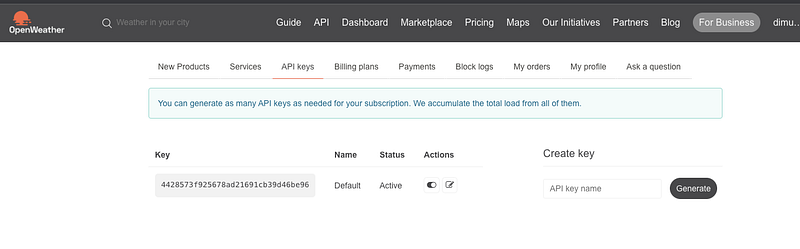

So this is how we approach our application. We are creating a Weather detail showing application and following features are there in the application

- Login and Registration system
- Location saving facility to get the coordinates for users
- According to the location showing weather information
- Weather history when date is entered
- Weather details of your location send to your email

First let’s create an account in openweathermap.org to use their API to get weather data. Follow the following steps to do that.

- [Sign up](https://home.openweathermap.org/users/sign_up) on OpenWeatherMap
- Login to the site and go to the API keys tab and copy the API key



Now you have an API key. Now our plan is to create a html file for the UI and then some PHP files to handle the database and finally css files and js files to support these operations. Let’s look at the index.html as the first step.

```
<!DOCTYPE html>
<html lang="en">
<head>
    <meta charset="UTF-8">
    <meta http-equiv="X-UA-Compatible" content="IE=edge">
    <meta name="viewport" content="width=device-width, initial-scale=1.0">
    <title>Responsive Weather App</title>
    <link rel="stylesheet" href="https://cdnjs.cloudflare.com/ajax/libs/font-awesome/5.15.2/css/all.min.css" />
    <link rel="preconnect" href="https://fonts.gstatic.com">
    <link href="https://fonts.googleapis.com/css2?family=Montserrat&display=swap" rel="stylesheet">
    <link rel="stylesheet" href="css/main.min.css">
    <link rel="stylesheet" href="css/login.css">
    <script src="https://smtpjs.com/v3/smtp.js"></script>
    <script src="js/main.js" type="module"></script>
</head>
<body>
    <main class="fade-in">
        <h1 class="offscreen">Responsive Weather App Powered by the Open Weather A P I</h1>
        <section id="searchBar" class="searchBar fade-in">
            <form id="searchBar__form" class="searchBar__form" role="search">
                <label for="searchBar__text" class="offscreen">Enter a new location</label>
                <input id="searchBar__text" class="searchBar__text" type="text" role="searchbox" size="40" autocomplete="off" placeholder="City, State, Country">
                <button id="searchBar__button" class="searchBar__button button" title="Submit Location" aria-label="Submit Search">
                    <i class="fa fa-search"></i>
                    <i class="fas fa-sync fa-spin none"></i>
                </button>
            </form>
        </section>
        <a href="#currentForecast" class="skip-link">Skip to Current Conditions</a>
        <section id="currentForecast" class="currentForecast fade-in" role="region" aria-labelledby="currentForecast__location">
          <h2 id="currentForecast__location" class="currentForecast__location">Current Conditions</h2>
          <div id="currentForecast__conditions" class="currentForecast__conditions"></div>
        </section>
        <a href="#dailyForecast" class="skip-link">Skip to Six Day Forecast</a>
        <nav id="navButtons" class="navButtons fade-in">
            <button id="getLocation" class="button" title="Get Location" aria-label="Get the current weather conditions for your current location">
                <i class="fas fa-map-marker-alt"></i>
                <i class="fas fa-sync fa-spin none"></i>
            </button>
            <button id="home" class="button" title="Home weather" aria-label="Get the current weather conditions for your home location">
                <i class="fas fa-home"></i>
                <i class="fas fa-sync fa-spin none"></i>
            </button>
            <button id="saveLocation" class="button" title="Save Location" aria-label="Save the current location as your home location">
                <i class="fas fa-save"></i>
                <i class="fas fa-sync fa-spin none"></i>
            </button>
            <button id="unit" class="button" title="Toggle Measurement Units" aria-label="Toggle between metric and imperial measurement units">
                <i class="fas fa-chart-bar"></i>
                <i class="fas fa-sync fa-spin none"></i>
            </button>
            <button id="refresh" class="button" title="Refresh Weather" aria-label="Refresh the current weather conditions">
                <i class="fas fa-sync-alt"></i>
                <i class="fas fa-sync fa-spin none"></i>
            </button>
        </nav>
        <hr class="fade-in">
        <section id="dailyForecast" class="dailyForecast fade-in" role="region" aria-labelledby="dailyForecast__title">
            <h2 id="dailyForecast__title" class="dailyForecast__title offscreen">Six Day Forecast</h2>
            <div id="dailyForecast__contents" class="dailyForecast__contents"></div>
        </section>
        <p id="confirmation" class="offscreen" aria-live="assertive"></p>
    </main>

    <div id="id01" class="modal" style="display: hidden;">
        <div id="loginSec" class="modal-content animate">
            <div class="container" style="color: black; text-align: center;">
                <h3 style="text-align: center; margin-top: 25px;">Please Login To Continue</h3>

                <input id="logEmailId" type="text" style="margin-top: 50px;" placeholder="Enter Email Address" required>
                <input id="logPasswordId" type="password"  style="margin-top: 25px; margin-bottom: 50px;" placeholder="Enter Password" required>
                
                <button id="loginBtn">Login</button>
                
                <div style="background-color: red;"><label id="errMsg" style="display: none;"></label></div>
                <p style="margin-top: 25px;">Are you not registerd yet ???</p>

                <button style="margin-top: 25px; background-color: deepskyblue;" id="registerBtn">Registration</button>
            </div>
        </div>
        <div id="registerSec" class="modal-content animate" style="display: none;">
            <div class="container" style="color: black; text-align: center;">
                <h3 style="text-align: center; margin-top: 25px;">Registration</h3>

                <input id="registerEmailId" type="text" style="margin-top: 50px;" placeholder="Enter Email Address" required>
                <input id="registerPasswordId" type="password"  style="margin-top: 25px;" placeholder="Enter Password" required>
                <input id="confPassId" type="password"  style="margin-top: 25px;" placeholder="Confirm Password" required>
                
                <button style="background-color: deepskyblue;" id="registerSecBtn">Registration</button>
                
                <div style="background-color: red;"><label id="errMsgReg" style="display: none;"></label></div>
            </div>
        </div>
    </div>
</body>
</html>
```

If we look at this HTML file, after the body tag we have an attribute called main. It’s the main container for the weather app. Then we have seperate sections for search bar, current forecast, navigation buttons etc. At last we have the login modal which is used for registration as well as login. Let’s look at the css for <main> attribute.

```
main {
    width: 100%;
    max-width: 700px;
    max-height: 1050px;
    display: -webkit-box;
    display: -ms-flexbox;
    display: flex;
    -webkit-box-orient: vertical;
    -webkit-box-direction: normal;
    -ms-flex-direction: column;
    flex-direction: column;
    -webkit-box-flex: 1;
    -ms-flex-positive: 1;
    flex-grow: 1;
    color: #fff;
    background-color: rgba(0, 0, 0, .1);
    border: 1px solid #d3d3d3;
    border-radius: 10px;
    -webkit-box-shadow: 1px 1px 2.5px #fff;
    box-shadow: 1px 1px 2.5px #fff;
}
```

Let’s try to understand what are these properties. width is used to set the width of an element. Here the max-width overrides the value in the width. Same thing for height. The field display sets whether an element is treated as a [block or inline element](https://developer.mozilla.org/en-US/docs/Web/CSS/CSS_Flow_Layout) and the layout used for its children, such as [flow layout](https://developer.mozilla.org/en-US/docs/Web/CSS/CSS_Flow_Layout), [grid](https://developer.mozilla.org/en-US/docs/Web/CSS/CSS_Grid_Layout) or [flex](https://developer.mozilla.org/en-US/docs/Web/CSS/CSS_Flexible_Box_Layout). Here it’s flex but you might see there are 3 different values here, it’s the same flex defined for [different browsers](https://www.simplilearn.com/tutorials/css-tutorial/webkit-css#:~:text=The%20term%20%27webkit%27%20is%20used,the%20lack%20of%20cross%2Dcompatibility.) (**-webkit is for apple browsers, -ms for internet explorer**). The field [-webkit-box-orient](https://developer.mozilla.org/en-US/docs/Web/CSS/box-orient) specifies how the contents of the displaying flexbox lays. The field [-webkit-box-direction](https://developer.mozilla.org/en-US/docs/Web/CSS/box-direction) specifies whether a box lays out its contents normally (from the top or left edge), or in reverse (from the bottom or right edge). The `[flex-direction](https://developer.mozilla.org/en-US/docs/Web/CSS/flex-direction)` [CSS](https://developer.mozilla.org/en-US/docs/Web/CSS) property sets how flex items are placed in the flex container defining the main axis and the direction (normal or reversed). The `[-webkit-box-flex](https://developer.mozilla.org/en-US/docs/Web/CSS/box-flex)` [CSS](https://developer.mozilla.org/en-US/docs/Web/CSS) properties specify how a `-webkit-box` grows to fill the box that contains it, in the direction of the containing box's layout. The `[flex-grow](https://developer.mozilla.org/en-US/docs/Web/CSS/flex-grow)` [CSS](https://developer.mozilla.org/en-US/docs/Web/CSS) property sets the flex grow factor of a flex item's [main size](https://www.w3.org/TR/css-flexbox/#main-size). The [color](https://developer.mozilla.org/en-US/docs/Web/CSS/color) is the color of the text. The [border](https://developer.mozilla.org/en-US/docs/Web/CSS/border) is the border for the element and [border-radius](https://developer.mozilla.org/en-US/docs/Web/CSS/border-radius) make the edges round. The `[box-shadow](https://developer.mozilla.org/en-US/docs/Web/CSS/box-shadow)` [CSS](https://developer.mozilla.org/en-US/docs/Web/CSS) property adds shadow effects around an element's frame.

That was so much CSS knowledge. The main reason I went through each and every field is because when we work on certain projects, although we see these things we never find the purpose of why we have used these. When creating functioning UI, these things are really important. Rest of the classes I’m not going to go in to details, So this link will give you the css file we use for our UI.

Now the JS part. In our application we can seperate the functionality for in to 3 different parts. So I have created 3 different JS files for these.

- OpenWeatherMap related functionalities — dataFucntions.js
- UI functionalities related to weather — domFunctions.js
- Login/Registration related functionalities —login.js

To initialise these functionalities we have used main.js file. First let’s look at the dataFunctions.js

```typescript
const WEATHER_API_KEY = <YOUR_API_KEY>

export const setLocationObject = (locationObj, coordsObj) => {
  const { lat, lon, name, unit } = coordsObj;
  locationObj.setLat(lat);
  locationObj.setLon(lon);
  locationObj.setName(name);
  if (unit) {
    locationObj.setUnit(unit);
  }
};

export const getHomeLocation = () => {
  return localStorage.getItem("defaultWeatherLocation");
};

export const getWeatherFromCoords = async (locationObj) => {
  const lat = locationObj.getLat();
  const lon = locationObj.getLon();
  const units = locationObj.getUnit();
  const url = `https://api.openweathermap.org/data/2.5/onecall?lat=${lat}&lon=${lon}&exclude=minutely,hourly,alerts&units=${units}&appid=${WEATHER_API_KEY}`;
  try {
    const weatherStream = await fetch(url);
    const weatherJson = await weatherStream.json();
    return weatherJson;
  } catch (err) {
    console.error(err);
  }
};

export const getCoordsFromApi = async (entryText, units) => {
  const regex = /^\d+$/g;
  const flag = regex.test(entryText) ? "zip" : "q";
  const url = `https://api.openweathermap.org/data/2.5/weather?${flag}=${entryText}&units=${units}&appid=${WEATHER_API_KEY}`;
  const encodedUrl = encodeURI(url);
  try {
    const dataStream = await fetch(encodedUrl);
    const jsonData = await dataStream.json();
    return jsonData;
  } catch (err) {
    console.error(err.stack);
  }
};

export const cleanText = (text) => {
  const regex = / {2,}/g;
  const entryText = text.replaceAll(regex, " ").trim();
  return entryText;
};
```

Here we have handled, getting weather details from openWeatherOrg and also setting location details in local storage. We do this to personalise user experience. We access these in different part of the application and give the weather information for the saved location.

In this project I actually did very little work, mainly login functionality and some additional functionalities. Many of the things were taken from [https://www.youtube.com/watch?v=s_Ie_yh_4Co](https://www.youtube.com/watch?v=s_Ie_yh_4Co) this youtube video. Link for their code repo is [https://github.com/gitdagray/weather_app_tut](https://github.com/gitdagray/weather_app_tut).

Link for my improved source code: [https://github.com/deBilla/ex-weather-app](https://github.com/deBilla/ex-weather-app)

Happy Coding :P
