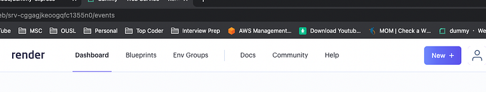

Hey guys, So if you have been following my tutorial series on the charity web app, you might know I was always searching for free hosting options to do this work. For the front end application we used Github pages and deployed the react app there using github actions.

Then for the backend I tries using AWS Lambda, DynamoDB, S3 and API Gateway using AWS SAM.

Now the AWS deployed backend was perfect. This is scalable, fast and everything is smooth. But still there will be a time when this start costing. So I searched for free hosting solutions out there and luckily came across **Render. **Now Render is not like other free services, they don’t ask for credit card information or anything. If you want a free server you can have it. System is not that fast but for our work it’s enough. We don’t have many users or a big data load. Therefore I decided to create a simple web service using Node JS to cater our needs. For the datastore, I’m using a postgres database hosted in the same platform (Render) without cost. Following is the link to the code.

Nothing fancy, just a simple express JS web server which is connected to a postgres database. First things first lets create a simple Hello world express server. Create a folder with any name you like go inside and enter the following command.

```bash
npm i express
```

Now, there will be package.json file created for you and also node_modules folder. Now create a file named server.js and add following code.

```javascript
const express = require('express');
const app = express();

const port = 3000;

app.get('/', (req, res) => {
  res.send('Hello World !!!');
});

app.listen(port, () => {
  console.log(`Example app listening on port ${port}`)
});
```

Now in the terminal enter the following command.

```
node server.js
```

You will have a working web app, which is listening in port 3000. Now we have to create end points for CRUD operation of students and sponsors (Charity web app requirements). Let’s do it properly, in a clean way.

Create 2 folders named “controllers” and “routes”. Inside routes create 2 files named, studentRouter.js and sponsorRouter.js. Now let’s add routes for student endpoint.

```javascript
const express = require("express");
const studentRouter = express.Router();
const StudentController = require('../controllers/studentController');

studentRouter.get('/', StudentController.getStudent);

studentRouter.post('/', StudentController.createStudent);

studentRouter.patch('/', StudentController.updateStudent);

studentRouter.delete('/', StudentController.deleteStudent);

module.exports = studentRouter;
```

I will continue explaining the work for students, then apply samthing to sponsors. For students create a file named studentController.js inside controllers folder. This file has the implementation for the end points we add on route file.

```javascript
const createStudent = async (req, res) => {
    res.send('success')
}

const getStudent = async (req, res) => {
    res.send('success')
}

const updateStudent = async (req, res) => {
    res.send('success')
}

const deleteStudent = async (req, res) => {
    res.send('success')
}

module.exports = {
    createStudent,
    getStudent,
    updateStudent,
    deleteStudent
}
```

All right, Now let’s try to connect this to postgres database. First let’s create a database in Render. Go to the following link and create a free account (Use your github account)



Click on the New button and you can select a postgres db from there. Now in our web app, install dotenv package to use environment variables and pg package for postgres connection ([https://node-postgres.com/](https://node-postgres.com/))

```bash
npm i dotenv
npm i pg
```

Now let’s create a controller for database connection. Add a new file called DatabaseController inside controllers folder.

```javascript
const { Pool } = require("pg");
const dotenv = require("dotenv");
dotenv.config();
 
const pool = new Pool({
    user: process.env.PGUSER,
    host: process.env.PGHOST,
    database: process.env.PGDATABASE,
    password: process.env.PGPASSWORD,
    port: process.env.PGPORT,
    ssl: true,
    max: 20,
    idleTimeoutMillis: 30000
});

const query = async (queryString, values) => {
    try {
        return await pool.query(queryString, values);
    } catch (error) {
        console.log(error)
    }
}

module.exports = {
    query
}
```

There are 2 ways to start a connection using pg, one is creating a Client and the other one is creating a pool. Main difference between Pool and Client is Pool can create multiple client connections. We have several ways of querying data using Pool but since we have just one query per function, we rae going to directly call pool.query. This will use whatever the client that is available and query. But if you are doing a transaction (One with many queries), you should first create a client using the Pool and then release it after the transaction. (This is done to ensure you are using same client for the whole transaction)

Now let’s change the createStudent method in StudentController.

```javascript
const DatabaseController = require('./databaseController');

const createStudent = async (req, res) => {
    const { name, contactNo, email, university, course, startDate, 
        endDate, sponsor, files} = req.body;

    let start = new Date();
    let end = new Date();

    try {
        const response = await DatabaseController.query(`INSERT INTO students (name, "contactNo", email, university, course, "startDate", 
            "endDate", sponsor, files) VALUES($1, $2, $3, $4, $5, $6, $7, $8, $9)`, [name, contactNo, email, university, course, start, 
                end, sponsor, files]);

        res.json({message: response});
    } catch (e) {
        res.json({error: e, message: e.message});
    }
}
```

First thing is to read the request body and get necessary details for the insert operation. The way I have done is called restructuring an object in js. It’s a pretty cool way to get values. Now when I’m running the query, you can see values like $1, $2 …, these can be used to add custom value to query.

Likewise we can do this to rest of the code. Now to deploy the app, we have to connect the github repo to the Render platform and create a web service using the New button. Since this is connected to the repo, when we do any change and push to the repo, new changes will be deployed using a hook. We don’t have to do anything. Following is the Postman documentation for requests.

Now when you run this obviously you will have CORS errors when connected the UI. For that use cors package.

```bash
npm i cors
```

When you send a JSON payload to the web service you will get an error when reading req.body. This is because we have to parse req through a JSON parser. For this express have an inbuilt parser middleware.

```
app.use(express.json());
```

Now the server.js would look like this

```javascript
const express = require('express');
const app = express();
const cors = require('cors');
const studentRouter = require('./routes/studentRoute');
const sponsorRouter = require('./routes/sponsorRoute');

const port = 3000;

app.use(cors());
app.use(express.json());

app.use('/student', studentRouter);
app.use('/sponsor', sponsorRouter);

app.get('/', (req, res) => {
  res.send('Serendib WS is active');
});

app.listen(port, () => {
  console.log(`Example app listening on port ${port}`)
});
```

StudentController.js would look like this,

```javascript
const DatabaseController = require('./databaseController');

const createStudent = async (req, res) => {
    const { name, contactNo, email, university, course, startDate, 
        endDate, sponsor, files} = req.body;

    let start = new Date();
    let end = new Date();

    try {
        const response = await DatabaseController.query(`INSERT INTO students (name, "contactNo", email, university, course, "startDate", 
            "endDate", sponsor, files) VALUES($1, $2, $3, $4, $5, $6, $7, $8, $9)`, [name, contactNo, email, university, course, start, 
                end, sponsor, files]);
    
        res.json({message: response});
    } catch (e) {
        res.json({error: e, message: e.message});
    }
}

const getStudent = async (req, res) => {
    const { id } = req.query;
    console.log(id)

    try {
        let response = null;

        if (id) {
            response = await DatabaseController.query(`select * from students where id=$1`, [id]);
        } else {
            response = await DatabaseController.query(`select * from students order by id ASC`);
        }
    
        res.json({message: response && response.rows ? response.rows : []});
    } catch (e) {
        res.json({error: e, message: e.message});
    }
}

const updateStudent = async (req, res) => {
    const { id } = req.query;
    const { name, contactNo, email, files} = req.body;

    try {
        const response = await DatabaseController.query(`UPDATE students SET name=$1, "contactNo"=$2, email=$3, files=$4
        WHERE id=$5`, [name, contactNo, email, files, id]);
    
        res.send({message: response});
    } catch (e) {
        res.json({error: e, message: e.message});
    }
}

const deleteStudent = async (req, res) => {
    const { id } = req.query;

    try {
        const response = await DatabaseController.query(`DELETE FROM students WHERE id=$1`, [id]);
    
        res.send({message: response});
    } catch (e) {
        res.json({error: e, message: e.message});
    }
}

module.exports = {
    createStudent,
    getStudent,
    updateStudent,
    deleteStudent
}
```

Simple and Free, Happy coding guys, pleae post comments if you have any issues.

;)
