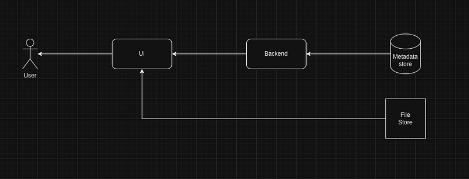
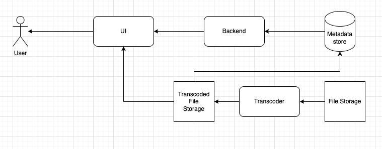
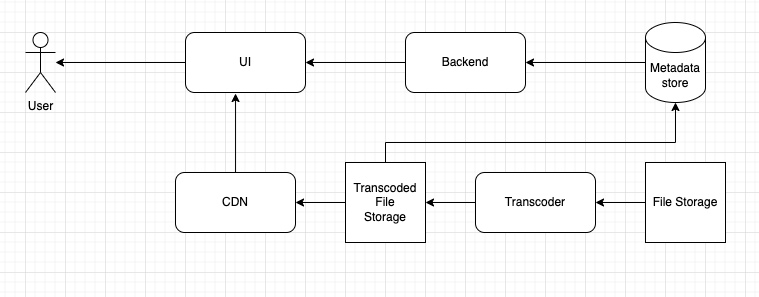
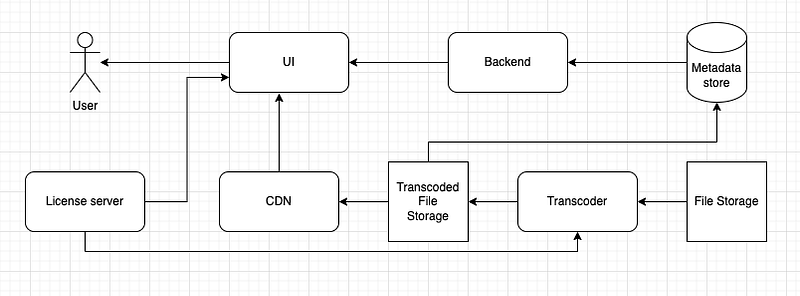
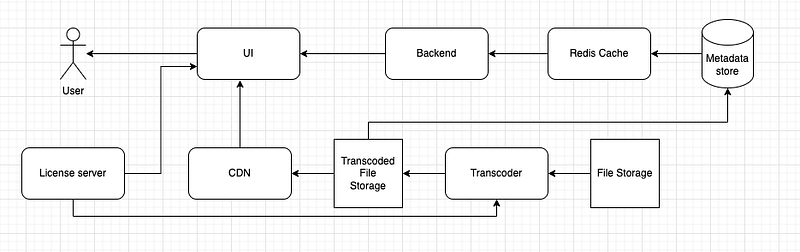

In this article I will be discussing about how to design a VOD platform. A VOD platform consists mainly of following components.

The above image is a very basic representation of a VOD platform.

- UI — To view the videos (Depend on the platform (mobile/web) you have various players to play videos)
- Backend — Send required metadata to play the video in UI player (Example: url, thumbnails…)
- Metadata store — Store metadata related to a media item
- File Store — A file store to store media files which will have a public source url. This public URL is the source URL we add to metadata store.

**Now the flow should be clear we store a media file with a public URL and then we store this URL in media metadata which is send by the backend to the UI to play in the UI player.**

Now let’s say I have a 1 hour long 50GB media file which need to be played from UI. When the UI player try to play this file, the whole 50GB should be downloaded. Moreover if the media file codec isn’t supported by the UI player then it won’t be played. So we should have a better way to handle this. That’s when HLS (HTTP Live Streaming) comes in to play.

> HLS is an [HTTP](https://en.wikipedia.org/wiki/HTTP)-based [adaptive bitrate streaming](https://en.wikipedia.org/wiki/Adaptive_bitrate_streaming) communications protocol developed by [Apple Inc.](https://en.wikipedia.org/wiki/Apple_Inc.) and released in 2009. Support for the protocol is widespread in media players, web browsers, mobile devices, and streaming media servers. As of 2022, an annual video industry survey has consistently found it to be the most popular streaming format

So now our task is to convert the raw media file to HLS format. This conversion is called **Transcoding**. One of the main advantages of transcoding is ability to add **ABR (Adaptive bitrate)**. UI player will automatically switch between different resolutions and bitrates according to the network conditions.

After HLS transcoding 50GB raw file would be reencoded **_according to our specifications_** in to small chunks and we will have a manifest file of `m3u8` extension as a guide for all these chunks. So the source URL will be the path to this manifest file.

Now our diagram will look something like this.

Now our system is able to handle a very long video and users will be able to watch this over normal network conditions. But let’s say these file are accessed by people all aorund the world and it’s stored in US. People from other countries will obviously have so many intemediate servers when requesting the content through the internet. Morever if we have stored the transcoded files in paid storage service where we pay for download bandwidth (S3, GCP buckets, etc) we will have to spend a fortune to manage these.

To fix this CDN comes in to play.

_A content delivery network (CDN) is a network of interconnected servers that speeds up webpage loading for data-heavy applications. CDN can stand for content delivery network or content distribution network. When a user visits a website, data from that website’s server has to travel across the internet to reach the user’s computer. If the user is located far from that server, it will take a long time to load a large file, such as a video or website image. Instead, the website content is stored on CDN servers geographically closer to the users and reaches their computers much faster._

In our scenario if we use a CDN, our chunk files along with the manifest file will be cached in various geographical locations of the CDN and give a smooth expierience for users.

Now HLS is pretty much OK with any UI player up until we have DRM requirements.

_Digital rights management (DRM) is the use of technology to control and manage access to copyrighted material. Another DRM meaning is taking control of digital content away from the person who possesses it and handing it to a computer program. DRM aims to protect the copyright holder’s rights and prevents content from unauthorized distribution and modification._

The way DRM apply to devices of apple eco system and the rest is very different. For apple devices we have Fairplay DRM and for the rest current most popular DRM is Widevine (From Google). Up until 2024 only Fairplay was supported in HLS. But now multiple DRM keys are supported with HLS. But still I would let you know how this was done previously.

So HLS was released in 2009 by Apple. In 2010 opensource community started working on a new standard called MPEG-DASH.

**_Dynamic Adaptive Streaming over HTTP_**_ (_**_DASH_**_), also known as _**_MPEG-DASH_**_, is an _[_adaptive bitrate streaming_](https://en.wikipedia.org/wiki/Adaptive_bitrate_streaming)_ technique that enables high quality _[_streaming_](https://en.wikipedia.org/wiki/Streaming_media)_ of media content over the Internet delivered from conventional _[_HTTP_](https://en.wikipedia.org/wiki/HTTP)_ web servers. Similar to Apple’s _[_HTTP Live Streaming_](https://en.wikipedia.org/wiki/HTTP_Live_Streaming)_ (HLS) solution, MPEG-DASH works by breaking the content into a sequence of small segments, which are served over _[_HTTP_](https://en.wikipedia.org/wiki/HTTP)_._

Now we can keep 2 set of transcoded files with 2 manifest files. `m3u8` for the HLS version and `mpd` for the DASH version. According to the deviceof the UI, correct URL should be selected to play the media. I won’t go deep in to how DRM works because I already have a article about it in my blog.

Now the final diagram would be something like this.

License server will handle releasing DRM certificates for UI players.

If we want to further improve this we can add a redis cache for metadata store to reduce the traffic for metadata store.

In a high level this is how you can implement a VOD solution. In my next tutorial I will be showing you guys how to achieve this using Tencent VOD solution and while doing it I will be comparing it with VOD related solutions provided by AWS and Google.

Happy Coding :P
