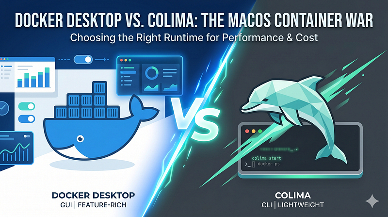

If you’ve been developing on macOS for a while, Docker Desktop has likely been a staple in your toolchain. For years, it was the unquestioned default. However, with Docker’s licensing changes for large enterprises and a growing desire among developers for lighter, more customizable workflows, alternative container runtimes have moved into the spotlight.

Chief among them is **Colima** (Container Runtimes on macOS, with Minimal Setup).

Both tools allow you to run Linux containers on macOS, but they approach the problem with entirely different philosophies. Here is a comprehensive breakdown to help you decide which one deserves a spot on your Mac.



## The Core Architectural Difference

Because macOS cannot run Linux containers natively, both Docker Desktop and Colima must spin up a lightweight Linux virtual machine (VM) behind the scenes to expose the Docker API to your Mac.

- **Docker Desktop** is a monolithic, full-featured application. It bundles a proprietary Linux VM, a graphical user interface (GUI), Docker Compose, native Kubernetes support, a volume-sharing architecture, and an entire extensions ecosystem into a single installer.
- **Colima** is a minimalist, command-line-driven alternative. It leverages **Lima** (Linux Machines) to run a stripped-down Linux VM (usually Alpine or Ubuntu) using open-source virtualization tech like QEMU or Apple’s native Virtualization framework (`vz`). It has no GUI—everything is managed via the terminal.

## Head-to-Head Comparison

## 1. User Interface & Ease of Use

- **Docker Desktop:** Features a polished, user-friendly GUI. It allows you to monitor running containers, view logs, inspect volumes, clean up disk space, and toggle settings with a simple click. It is ideal for developers who prefer visual feedback over terminal commands.
- **Colima:** Strictly CLI-based. There is no dashboard eating up resources in your menu bar. While you lose the visual charts, you gain speed. Commands like `colima start`, `colima status`, and `colima stop` are all you need to manage the environment.

## 2. Performance and Resource Consumption

This is where the divergence becomes obvious. Docker Desktop is often criticized for being a resource hog, occasionally causing Mac fans to spin up even when sitting idle.

- **Resource Footprint:** Colima is dramatically lighter. A fresh Docker Desktop installation can easily claim around 10GB of disk space and a massive baseline memory footprint. Colima starts with an initial installation footprint of roughly 2GB and uses significantly fewer idle background processes.
- **File System Performance:** Volume mounting performance (sharing files between macOS and the container) historically slowed down local development. Docker Desktop has closed this gap using **VirtioFS**. Colima also fully supports Apple’s native Virtualization framework and VirtioFS, often yielding faster read/write times in I/O-heavy applications (like Node.js or PHP projects with huge node_modules/vendor directories).

To get maximum performance out of Colima on an Apple Silicon Mac, you can start it with:

Bash

```
colima start --vm-type vz --mount-type virtiofs --button-rosetta
```

## 3. Architecture Emulation (Apple Silicon vs. Intel)

If you are on an M1/M2/M3 Mac, you frequently need to build or run x86 (Intel) images.

- **Docker Desktop** handles this out of the box using a seamless integration with Apple’s Rosetta 2 layer, allowing x86 images to run incredibly fast.
- **Colima** also leverages Rosetta 2 emulation via Apple’s `vz` framework. While it requires explicitly passing the `--button-rosetta` flag on startup, the emulation performance is virtually identical to Docker Desktop, fixing the sluggishness previously associated with older QEMU emulations.

## 4. Kubernetes Integration

- **Docker Desktop:** Includes a built-in single-node Kubernetes cluster. Enabling it is as simple as checking a box in the settings menu, though it demands a notable chunk of extra RAM.
- **Colima:** Integrates seamlessly with **k3s**, a highly optimized, lightweight Kubernetes distribution. Running `colima start --kubernetes` provisions a fast, responsive local cluster that consumes fewer resources than Docker Desktop’s offering.

## 5. Licensing and Cost

This is the deciding factor for many engineering organizations.

- **Docker Desktop:** Requires a paid subscription ($9 to $15+ per user/month) for companies with more than 250 employees or more than $10 million in annual revenue.
- **Colima:** 100% open-source and free to use under the MIT license, regardless of your company’s size or revenue.

## Feature Summary Table

**FeatureDocker DesktopColimaInterface**Full Graphical GUI + CLICLI Only**Licensing**Paid for large enterprisesOpen-source (Free)**Disk/RAM Footprint**HeavyExtremely Lightweight**Kubernetes**Native k8s cluster (Heavy)k3s cluster (Lightweight)**VM Backend**Custom HypervisorLima (QEMU / Apple VZ)**Multiple Profiles**No (Single environment)Yes (`colima start --profile dev`)

## The Verdict: Which One Should You Choose?

> **_Choose Docker Desktop if…_**

> _You heavily rely on a visual dashboard to inspect container logs, your organization already pays for Docker Business licenses, or you want a “just works” application with zero configuration files or terminal setups._

> **_Choose Colima if…_**

> _You are a terminal-centric developer, want to reclaim gigabytes of RAM and battery life, need to maintain multiple isolated container environments via profiles, or want to avoid enterprise software licensing costs entirely._

The beauty of the current container ecosystem is that **both options use the standard Docker CLI**. Your `docker-compose.yml` files, Dockerfiles, and custom scripts will function exactly the same way regardless of the backend engine. Because switching between them takes less than five minutes, there is no risk in spinning up Colima to see how much faster your local environment can feel.
