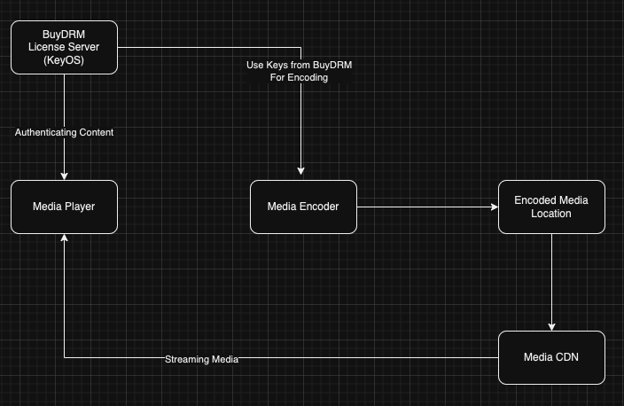

Hi Guys, This is a continuation of the encoder tutorial series I did a little while ago. So as a prerequisite I invite you to read following tutorials.

## What is DRM

DRM (Digital rights management) is the technique to control and manage access to copyrighted materials, in our case it’s videos. So you may have noticed if you try to take screenshots or if you share your screen while watching netflix, the shared screen or the screenshot will just be a black screen. It’s one of DRM’s capabilities. So the basic high level view of the DRM process is like this.



Mainly media played using devices of apple eco system (HLS streaming) use Fairplay as the DRM provider, for Google we have Widevine and for microsoft we have play ready. In this tutorial I will look in to Widevine as it’s the most popular DRM service.

There are lot of advantages provided by DRM but I will more focus on the implementation related to our project. In our project we will be using BuyDRM as the DRM license server provider. So this is a paid service. You have to have a contract with them. There are few free trial giving services available and more or less the implementation is pretty much same.

## Creating the Key ID, Key and Hash Header from BuyDRM

For this, you have to first create a private key and a public key using openSSL.

```
openssl req -x509 -newkey rsa:4096 -keyout private_key.pem -out public_cert.pem -nodes -days 1461 -subj "/C=<COUNTRY_CODE(Example: SG)>/O=YOURCOMPANYNAME/CN=COMMONNAME"
```

Now to obtain the Key ID, Key and Hash Header, you have to use the KeyOS CPIX API. Now the code for this is not publicly available. Sadly I can’t share their code related to the CPIX endpoint without their consent. But for someone who has it. Just add these private and public key along with the CPIX certificate given by buyDRM and run the javascript code given for CPIX.

Now you will get an error saying “Sending authority was not authorized”. Reason is you need to register your public key with buyDRM. So contact your sales rep or Support contact for buyDRM and give them that key to register. After that when you run the CPIX code. You will get something like this.

```yaml
[
  {
    cek: <KEY>,
    kid: <KEY_ID>,
    playready: {
      psshBase64: <HASH_HEADER>,
      psshHex: '<>'
    }
  },
  {
    cek: <KEY>,
    kid: <KEY_ID>,
    widevine: {
      psshBase64: <HASH_HEADER>,
      psshHex: <>
    }
  }
]
```

## Implementation

Now let’s add these values to our encoder code.

```javascript
const ffmpegStatic = require("ffmpeg-static");
const ffmpeg = require("fluent-ffmpeg");
const fs = require("fs");
const { exec } = require("child_process");

ffmpeg.setFfmpegPath(ffmpegStatic);

const bitrates = [
  {
    resolution: "1280x720",
    videoBitrate: "1500k",
    audioBitrate: "128k",
    outputName: "output_720p.mp4",
  },
  {
    resolution: "854x480",
    videoBitrate: "500k",
    audioBitrate: "96k",
    outputName: "output_480p.mp4",
  },
  {
    resolution: "640x360",
    videoBitrate: "250k",
    audioBitrate: "64k",
    outputName: "output_360p.mp4",
  },
];

const encodeVideo = (inputVideo, outputFolder, config) => {
  return new Promise((resolve, reject) => {
    ffmpeg(inputVideo)
      .videoCodec("libx264")
      .audioCodec("aac")
      .videoBitrate(config.videoBitrate)
      .audioBitrate(config.audioBitrate)
      .size(config.resolution)
      .output(`${outputFolder}/${config.outputName}`)
      .on("end", () => {
        console.log(`Finished encoding ${config.outputName}`);
        resolve(`${outputFolder}/${config.outputName}`);
      })
      .on("error", (err) => {
        console.error(`Error encoding ${config.outputName}: ${err}`);
        reject(err);
      })
      .run();
  });
};

const fragmentVideo = (inputVideo, outputFolder) => {
  return new Promise((resolve, reject) => {
    const strArr = inputVideo.split("/");
    const fragmentedVideoFile = `${outputFolder}/fragmented_${strArr[1]}`;
    const mp4fragmentCommand = `mp4fragment ${inputVideo} ${fragmentedVideoFile}`;
    exec(mp4fragmentCommand, (error, stdout, stderr) => {
      if (error) {
        console.error(`Error running mp4fragment: ${error.message}`);
        reject(stderr);
      }
      console.log(stdout);
      resolve(fragmentedVideoFile);
    });
  });
};

const dashEncodeVideo = (fragmentedFiles, outputDirectory) => {
  return new Promise((resolve, reject) => {
    const mpdOutputFile = `${outputDirectory}/stream.mpd`;
    let mp4dashCommand = `mp4dash --widevine-header "#<HASH_HEADER>" --encryption-key=<KEY_ID>:<KEY> --output-dir=${outputDirectory}`;

    for (const fragmentedFile of fragmentedFiles) {
      mp4dashCommand = mp4dashCommand + ` ${fragmentedFile}`;
    }

    exec(mp4dashCommand, (error, stdout, stderr) => {
      if (error) {
        console.error(`Error running mp4dash: ${error.message}`);
        reject(stderr);
      }

      const mpdContent = fs.readFileSync(mpdOutputFile, "utf8");
      const dashManifest = `<?xml version="1.0" encoding="utf-8"?>
      <MPD xmlns="urn:mpeg:dash:schema:mpd:2011" minBufferTime="PT1.500S" profiles="urn:mpeg:dash:profile:isoff-live:2011" type="dynamic" mediaPresentationDuration="PT0H3M17.13S" maxSegmentDuration="PT0H0M4.800S">
        ${mpdContent}
      </MPD>`;

      const dashManifestFile = `${outputDirectory}/manifest.mpd`;
      fs.writeFileSync(dashManifestFile, dashManifest);
      resolve(dashManifest);
    });
  });
};

const encoder = async () => {
  const inputVideo = "input.mp4";
  const outputDirectory = "output_folder";
  const outputDirectoryDash = "output_dash";
  const outputDirectoryFragment = "output_fragment";

  const permissions = 0o777;

  try {
    if (fs.existsSync(outputDirectory)) {
      fs.rmSync(outputDirectory, { recursive: true });
    }

    fs.mkdirSync(outputDirectory);
    fs.chmodSync(outputDirectory, permissions);

    const encodingQueue = [];

    for (const config of bitrates) {
      encodingQueue.push(encodeVideo(inputVideo, outputDirectory, config));
    }

    const outPutVideoFiles = await Promise.all(encodingQueue);
    console.log("All encoding tasks completed.");
    if (fs.existsSync(outputDirectoryFragment)) {
      fs.rmSync(outputDirectoryFragment, { recursive: true });
    }

    fs.mkdirSync(outputDirectoryFragment);
    fs.chmodSync(outputDirectoryFragment, permissions);

    const fragmentingQueue = [];

    for (const bitrateFile of outPutVideoFiles) {
      fragmentingQueue.push(
        fragmentVideo(bitrateFile, outputDirectoryFragment)
      );
    }

    const fragmentedFiles = await Promise.all(fragmentingQueue);
    console.log("All fragmenting tasks completed.");

    if (fs.existsSync(outputDirectoryDash)) {
      fs.rmSync(outputDirectoryDash, { recursive: true });
    }
    const dashManifest = await dashEncodeVideo(
      fragmentedFiles,
      outputDirectoryDash
    );
    console.log("Encoding successfully completed");
    console.log(dashManifest);
  } catch (err) {
    console.error("Error during encoding:", err);
  }
};

encoder();
```

Although the whole code is very long, we only changed the following line.

```bash
let mp4dashCommand = `mp4dash --widevine-header "#<HASH_HEADER>" --encryption-key=<KEY_ID>:<KEY> --output-dir=${outputDirectory}`;
```

Here we have added our widevine configurations taken from previous step. Please remember, Key ID will come in a format similar to UUID format with hypens. Remove the hypens when using the KeyID value.

Now when you run the encoder code. Input video will be enocoded with DRM enabled.

## Viewing DRM content

So our video player needs to be changed to view this content. Previously I had used a normal dash js plugin but in this tutorial I will be using videoJS library. VideoJS along with VideoJS-contrib-eme support DRM enabled content.

```
<!DOCTYPE html>
<html lang="en">
<head>
    <script src="https://cdnjs.cloudflare.com/ajax/libs/jquery/3.6.0/jquery.min.js"></script>
    <script src="https://cdnjs.cloudflare.com/ajax/libs/video.js/7.15.6/video.min.js"></script>
    <script src="https://cdn.jsdelivr.net/npm/videojs-contrib-eme@3.9.0/dist/videojs-contrib-eme.min.js"></script>
    <style>
        .video-js, video {
            width: 100%;
            min-height: 640px;
        }
    </style>

</head>
<body>
<div class="container">
    <div class="row">
    <video id="my-player" class="video-js" controls></video>
</div>
<script type="text/javascript">
  (function() {
    var player = videojs('my-player');

    player.eme({
      emeHeaders: {
        'customdata': <Authentication Key>
      }
    });

    player.on('ready', function() {
      var wvprDashSrc = {
        src: 'stream.mpd',
        type: 'application/dash+xml',
        keySystems: {
          'com.widevine.alpha': <KEY_OS_SERVER>
        }
      };

      player.src(wvprDashSrc);
    });
  })();
</script>
</body>
</html>
```

Here inside eme headers we have to send the auth key to the buyDRM provided license server. Contact the buyDRM team to create authentication xml signing key and then getting the auth key. After adding that now your DRM encrypted video is ready to be viewed.

As a final note, I personally believe this tutorial will be really useful for a engineer who is working with BuyDRM and actively working for a production level VOD system.

Happy Coding :P

## References

- [https://buydrm.com/buydrm-releases-cpix-specification-v1-1-to-clients-and-esp-partners/](https://buydrm.com/buydrm-releases-cpix-specification-v1-1-to-clients-and-esp-partners/)
- [https://go.buydrm.com/thedrmblog/deploying-drm-workflows-with-ffmpeg](https://go.buydrm.com/thedrmblog/deploying-drm-workflows-with-ffmpeg)
- [https://www.bento4.com/developers/dash/encryption_and_drm/](https://www.bento4.com/developers/dash/encryption_and_drm/)
