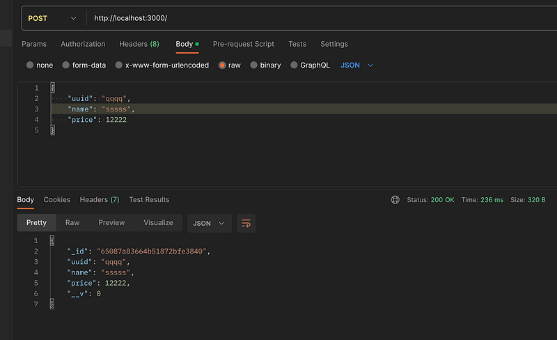
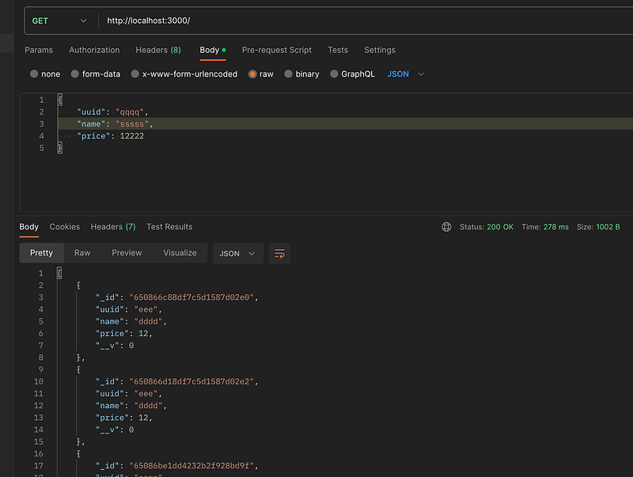
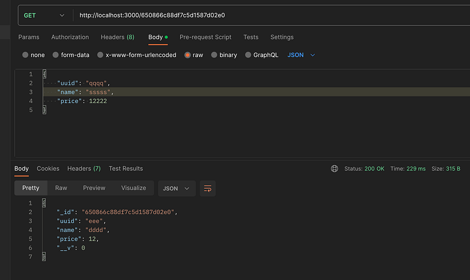

Hi Guys, This is the second tutorial of the e-com backend tutorial series.

In this tutorial we will be looking in to creating a functioning product service with Mongodb as the data store.

## Why Mongodb?

MongoDB let you organize your data in “BSON documents,” which you can think of as a “typed JSON” documents. Furthermore mongo has a rich set of query operators and update operators that let you access documents easily and also perform atomic updates on single fields, arrays or subdocuments of a document.

Don’t get me wrong here, There are good SQL solutions as well, but for the simplicity of the small micro-services we are planning to create, I considered using mongo. Btw each service will have a different mongodb instance and in this tutorial we are only looking at the product service.

## Prerequisite

Install mongoose in the project

```bash
npm install mongoose
```

create a free mongodb cluster and get the connection URL.

## Implementation

In our implementation I’m planning to use Repository Pattern to fetch data from database. This separates the logic that retrieves data from a data source (e.g., a database) from the rest of the application. It provides a way to abstract and centralize data access operations, making it easier to manage data and switch between different data sources without affecting the application’s core logic.

So as the first step let’s create the Product Modal.

```typescript
import { Schema, model } from "mongoose";
```

```bash
export interface IProduct {
  uuid: string;
  name: string;
  price: number;
}
```

```
const productSchema = new Schema<IProduct>({
  uuid: { type: String, required: true },
  name: { type: String, required: true },
  price: Number,
});
```

```
const Product = model<IProduct>("Product", productSchema);
```

```bash
export default Product;
```

So here what we have done is, we have created mongodb data model for Product data. IProduct is the data type or the interface for the Product data. Using the Model what we do is, we give a schema to the JSON object which is stored in the document.

Next step is to create the Product Repository.

```typescript
import { Types } from "mongoose";
import Product, { IProduct } from "../models/Product";
```

```bash
export class ProductRepository {
  constructor() {}
```

```
  save = async (newProduct: IProduct) => {
    const product = new Product(newProduct);
    console.log('saving user in the repository" ' + product);
    const saveResult = await product.save();
    return saveResult;
  };
```

```
  viewAll = async () => {
    return await Product.find();
  };
```

```
  viewById = async (id: Types.ObjectId) => {
    return await Product.findById(id);
  };
}
```

Here we have specify methods to save, viewAll and viewById. So what happen is, using this layer we remove the database operation dependancy in ProductController. Here the method implementation is done according to the mongoose implementation.

Next step is to create the ProductController.

```typescript
import { Types } from "mongoose";
import Product, { IProduct } from "../models/Product";
import { ProductRepository } from "../repositories/ProductRepository";
```

```bash
export class ProductController {
  repo: ProductRepository;
  constructor() {
    this.repo = new ProductRepository();
  }
  saveProduct = async (product: IProduct) => {
    return await this.repo.save(product);
  };
```

```
  viewAllProducts = async () => {
    return await this.repo.viewAll();
  };
```

```
  viewProductById = async (id: Types.ObjectId) => {
    return await this.repo.viewById(id);
  };
}
```

This will have controller layer methods for the Product and inside the constructor we create the Repository instance. Next one is the Route.

```typescript
import express, { Request, Response } from "express";
import { ProductController } from "../controllers/ProductController";
import { IProduct } from "../models/Product";
import { Types } from "mongoose";
```

```
const productRouter = express.Router();
const productController = new ProductController();
```

```
productRouter.post(
  "/",
  async (req: Request, res: Response): Promise<Response> => {
    try {
      const product: IProduct = req.body;
      console.log(req.body);
      const savedProduct = await productController.saveProduct(product);
      return res.status(201).json(savedProduct);
    } catch (error) {
      console.error(error);
      return res.status(500).json(error);
    }
  }
);
```

```
productRouter.get(
  "/:productId?",
  async (req: Request, res: Response): Promise<Response> => {
    try {
      const productId = req.params.productId;
      if (productId) {
        const id = new Types.ObjectId(productId);
        const product = await productController.viewProductById(id);
        return res.status(200).json(product);
      } else {
        const allProducts = await productController.viewAllProducts();
        return res.status(200).json(allProducts);
      }
    } catch (error) {
      console.error(error);
      return res.status(500).json(error);
    }
  }
);
```

```bash
export default productRouter;
```

Here we have a post and get method implemented with express router. So this can be used as a middleware in the main express app. For the get method we have put productId as a path variable and most importatntly we have added a ? symbol. This is to say this is optional. So if there is no path variable, this will call view all and if not view by ID.

Finally the app.ts file should be change like this.

```typescript
import express from "express";
import { ConnectOptions, connect } from "mongoose";
import bodyParser from "body-parser";
import { configDotenv } from "dotenv";
import productRouter from "./routes/ProductRoute";
configDotenv();
const app = express();
const port = process.env.PORT || 3000;
```

```
async function run() {
  app.use(bodyParser.json());
  app.use(productRouter);
```

```
  const connectionOptions: ConnectOptions = {};
  await connect(
    `mongodb+srv://${process.env.DB_USER}:${process.env.DB_PASSWORD}@${process.env.DB_URL}`,
    connectionOptions
  );
```

```
  app.listen(port, () => {
    console.log(`Server is running on port ${port}`);
  });
}
```

```
run();
```

Now you can see there are few extra packages we have used. dotenv is used to get env variables from .env file. body parser is used as a middleware to parse request to JSON.

```bash
npm install dotenv body-parser
```

Now create a file named .env in the product-service folder and add following values.

```
DB_PASSWORD=<PASSWORD>
DB_USER=<USERNAME>
DB_URL=<MONGOURL>
```

After these changes are done, run the application and test this.

```bash
npm run start
```

You can save and view data for products now.



_Create product using postman_



_View all using postman_



_View specific id by postman_

Using the knowledge from previous article this can be deployed to kubernetes cluster and access from there as well.

In the next tutorial we will plan the architecture for the process of creating an order using Message Queues (RabbitMQ will be used as the message queue).

Happy Coding !!! 🙏 :P
