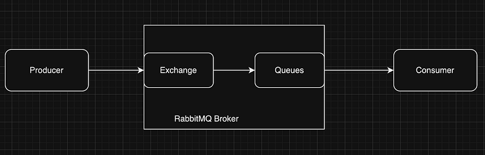
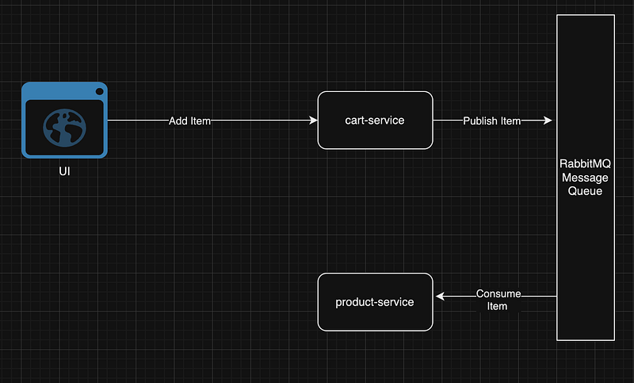
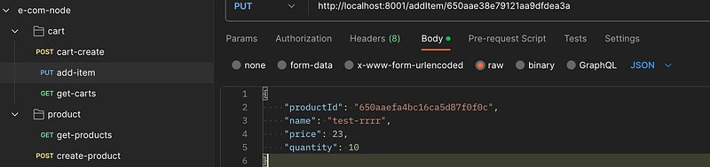

Hey guys, so in our last tutorials we looked at creating a simple service with Kubernetes support and then connecting it to MongoDB and we create the product service.

So now you might wonder if these services have separate databases, how something like product stock quantity data will be updated when we add products to cart. So for these we are using message queue called RabbitMQ.

RabbitMQ is mainly useful in our scenario because of following reasons.

- Asynchronous Communication
- Scalability
- Guaranteed Delivery

Following are the main features of RabbitMQ

- Originally created AMQP (Advanced Message Queuing Protocol) — Now they support for lot of protocols
- Main components are Producer, Exchange, Queue and Consumer



_diagram 1.1_

Now as the first step let’s install RabbitMQ in our local environment. If you have home brew installed, please enter the following command.

```bash
brew install rabbitmq
```

For others, please refer this.

After you install rabbitmq, you have to start the service. This for the home brew installed one. Others please refer the above link.

```bash
brew services start rabbitmq
```

Ok now let’s checkout the high level overview of what we are going to do.



_diagram 1.2_

We will create a route in cart-service to Add items to the Cart, An item will have a field called quantity along with the productId. Now we publish this item to the message queue. Product service will have listener for this and it will consume the message from the queue and update the stock quantity of the product using the item detail.

First will take a look at the cart service implementation. Using the [previous tutorials](https://billa-code.medium.com/list/ecommerce-node-js-typescript-express-rabbitmq-mongodb-0465c02b1621) create the cart-service as well with a connection to mongoDB. Now in the cart-service let’s install the AMQP client.

```bash
npm install amqplib
```

```bash
npm install --save-dev @types/amqplib
```

After that change the cartController.ts file as follows.

```typescript
import { Types } from "mongoose";
import { ICart, IItem } from "../models/Cart";
import { CartRepository } from "../repositories/CartRepository";
import * as amqp from "amqplib";
```

```bash
export class CartController {
  repo: CartRepository;
  constructor() {
    this.repo = new CartRepository();
  }
```

```
  saveCart = async (cart: ICart) => {
    const newCart = await this.repo.save(cart);
    return newCart;
  };
```

```
  addItemToCart = async (item: IItem, cartId: Types.ObjectId) => {
    const cart = this.viewCartById(cartId);
    await this.publishCartCreatedEvent(item);
    return cart;
  };
```

```
  viewAllcarts = async () => {
    return await this.repo.viewAll();
  };
```

```
  viewCartById = async (id: Types.ObjectId) => {
    return await this.repo.viewById(id);
  };
```

```
  publishCartCreatedEvent = async (item: IItem) => {
    try {
      const connection = await amqp.connect(
        `amqp://${process.env.rabbitMQHost}`
      );
      const channel = await connection.createChannel();
```

```
      const exchangeName = "cart_exchange";
      const message = JSON.stringify(item);
```

```
      await channel.assertExchange(exchangeName, "fanout", { durable: false });
      channel.publish(exchangeName, "", Buffer.from(message));
```

```
      console.log(`Sent: ${message}`);
      setTimeout(async () => {
        await connection.close();
      }, 500);
    } catch (e) {
      console.log(e);
    }
  };
}
```

So we have a exchange named “cart_exchange” and we publish messages to this exchange which then add this messages to a queue (Please refer the diagram 1.1).

The invoking of publish is happen by a new Route, So we have changes in the CartRoute.ts

```typescript
import express, { Request, Response } from "express";
import { CartController } from "../controllers/CartController";
import { ICart, IItem } from "../models/Cart";
import { Types } from "mongoose";
```

```
const cartRouter = express.Router();
const cartController = new CartController();
```

```
cartRouter.post(
  "/",
  async (req: Request, res: Response): Promise<Response> => {
    try {
      const cart: ICart = req.body;
      console.log(req.body);
      const savedCart = await cartController.saveCart(cart);
      return res.status(201).json(savedCart);
    } catch (error) {
      console.error(error);
      return res.status(500).json(error);
    }
  }
);
```

```
cartRouter.put(
  "/addItem/:cartId",
  async (req: Request, res: Response): Promise<Response> => {
    try {
      const item: IItem = req.body;
      const cartId = req.params.cartId;
      const id = new Types.ObjectId(cartId);
      console.log(req.body);
      const savedCart = await cartController.addItemToCart(item, id);
      return res.status(201).json(savedCart);
    } catch (error) {
      console.error(error);
      return res.status(500).json(error);
    }
  }
);
```

```
cartRouter.get(
  "/:cartId?",
  async (req: Request, res: Response): Promise<Response> => {
    try {
      const cartId = req.params.cartId;
```

```
      if (cartId) {
        const id = new Types.ObjectId(cartId);
        const product = await cartController.viewCartById(id);
        return res.status(200).json(product);
      } else {
        const allProducts = await cartController.viewAllcarts();
        return res.status(200).json(allProducts);
      }
    } catch (error) {
      console.error(error);
      return res.status(500).json(error);
    }
  }
);
```

```bash
export default cartRouter;
```

Here we are sending the cartId as a path variable and Item details inside the body.

Change the .env file as follows

```
PORT=3003
DB_PASSWORD=<MONGOPASSWORD>
DB_USER=<MONGOUSERNAME>
DB_URL=<MONGOURL>
rabbitMQHost=localhost
```

Next step is to create the consumer. Our consumer is product-service, for this let’s change the ProductController.ts file

```typescript
import { Types } from "mongoose";
import Product, { IItem, IProduct } from "../models/Product";
import { ProductRepository } from "../repositories/ProductRepository";
import * as amqp from "amqplib";
```

```bash
export class ProductController {
  repo: ProductRepository;
  constructor() {
    this.repo = new ProductRepository();
  }
  saveProduct = async (product: IProduct) => {
    return await this.repo.save(product);
  };
```

```
  viewAllProducts = async () => {
    return await this.repo.viewAll();
  };
```

```
  viewProductById = async (id: Types.ObjectId) => {
    return await this.repo.viewById(id);
  };
```

```
  consumeCartEvent = async () => {
    const connection = await amqp.connect(`amqp://${process.env.rabbitMQHost}`);
    const channel = await connection.createChannel();
```

```
    const exchangeName = "cart_exchange";
```

```
    await channel.assertExchange(exchangeName, "fanout", { durable: false });
```

```
    const queue = await channel.assertQueue("", { exclusive: true });
    await channel.bindQueue(queue.queue, exchangeName, "");
```

```
    channel.consume(
      queue.queue,
      (message: any) => {
        if (!message) return;
        const item: IItem = JSON.parse(message.content);
        try {
          this.processCartChange(item);
        } catch(e) {
          console.error(e);
        }
        
        console.log(
          `Received: ${message.content.toString()}`
        );
      },
      { noAck: true }
    );
  };
```

```
  private processCartChange = async (item: IItem) => {
    const id = new Types.ObjectId(item.productId);
    const product = await this.viewProductById(id);
    const stock = product?.stock;
```

```
    if (!stock) throw new Error('No product stock found !!!');
```

```
    const remainingStock = stock - item.quantity;
```

```
    if (remainingStock < 0) throw new Error('Stock is not sufficient !!!');
    await this.repo.updateProductStock(id, remainingStock);
```

```
    console.log('successfully updated the product !!!');
  }
}
```

So the consumer is connected to the RabbitMQ exchange and listening on that exchange, whenever something is added, that will be consumed by this. processCartChange method focuses on updating the product object based on the Cart Item object. Now this consumeCartEvent methos should be called at the start of this service, because this is a listner and not invoked by any REST call. So we have to change the app.ts file.

```typescript
import express from "express";
import { ConnectOptions, connect } from "mongoose";
import bodyParser from "body-parser";
import { configDotenv } from "dotenv";
import productRouter from "./routes/ProductRoute";
import { ProductController } from "./controllers/ProductController";
configDotenv();
const app = express();
const port = process.env.PORT || 3000;
```

```
async function run() {
  app.use(bodyParser.json());
  app.use(productRouter);
```

```
  const connectionOptions: ConnectOptions = {};
  await connect(
    `mongodb+srv://${process.env.DB_USER}:${process.env.DB_PASSWORD}@${process.env.DB_URL}`,
    connectionOptions
  );
```

```
  const productController = new ProductController();
  await productController
    .consumeCartEvent()
    .then(() => console.log("Listening for messages..."))
    .catch((error) => console.error("Error starting consumer:", error));
```

```
  app.listen(port, () => {
    console.log(`Server is running on port ${port}`);
  });
}
```

```
run();
```

And for updating and few things we have done changes to ProductRepository. So here the new file.

```typescript
import { Types } from "mongoose";
import Product, { IProduct } from "../models/Product";
```

```bash
export class ProductRepository {
  constructor() {}
```

```
  save = async (newProduct: IProduct) => {
    const product = new Product(newProduct);
    console.log('saving user in the repository" ' + product);
    const saveResult = await product.save();
    return saveResult;
  };
```

```
  viewAll = async () => {
    return await Product.find();
  };
```

```
  viewById = async (id: Types.ObjectId) => {
    return await Product.findById(id);
  };
```

```typescript
  updateProductStock = async (id: Types.ObjectId, stock: number) => {
    return await Product.findByIdAndUpdate(id, {stock: stock});
  }
}
```

Now change the env file here as well.

```
PORT=3006
DB_PASSWORD=<MONGOPASSWORD>
DB_USER=<MONGOUSERNAME>
DB_URL=<MONGOURL>
rabbitMQHost=localhost
```

So now when you run the applications in cart-service and product-service. Node apps will be up on 3003 and 3006 ports. Now if you call addItem in Cart using postman.



_figure 1.3_

If you check the application console logs, you will see message is published by cart-service and it’s consumed and updated by product-service.

## Bonus Section — Docker compose

So whent the number of services in this monorepo increases, it’s hard to deploy each and everything. Our final goal is to deploy all these things in Kubernetes, but for now as we already have the Dockerfiles for each service, we can use Docker compose to automate building and connections of the app. Create a file named docker-compose.yaml in the root directory.

```bash
version: '3.8'
services:
  rabbitmq:
    image: rabbitmq:3-management
    hostname: my-rabbit
    volumes:
        - ./rabbitmq/etc/definitions.json:/etc/rabbitmq/defu.json
        - ./rabbitmq/etc/rabbitmq.conf:/etc/rabbitmq/rabbitmq.conf
        - ./rabbitmq/data:/var/lib/rabbitmq/mnesia/rabbit@my-rabbit
        - ./rabbitmq/logs:/var/log/rabbitmq/log
    ports:
        - 5672:5672
        - 15672:15672
    networks:
      - monorepo_network
    healthcheck:
      test: ["CMD", "rabbitmqctl", "status"]
      interval: 5s
      timeout: 30s
      retries: 5
```

```
  cart-service:
    build:
      context: ./cart-service
    ports:
      - "8001:3003"
    networks:
      - monorepo_network
    depends_on:
      rabbitmq:
        condition: service_healthy
```

```
  customer-service:
    build:
      context: ./customer-service
    ports:
      - "8002:3004"
    networks:
      - monorepo_network
```

```
  order-service:
    build:
      context: ./order-service
    ports:
      - "8003:3005"
    networks:
      - monorepo_network
```

```
  product-service:
    build:
      context: ./product-service
    ports:
      - "8004:3006"
    networks:
      - monorepo_network
    depends_on:
      rabbitmq:
        condition: service_healthy
```

```
networks:
  monorepo_network:
```

Here the network is monorepo_network and all the services in this network will act like they are in a VPC or something like that. For each service build.context access the Dockerfile from the directory. For the rabbitmq service we use a rabitmq official image from dockerhub and you can see I have put product-service and cart-service to depend on rabbitmq health check, so these applications will start after rabbitmq is up and running.

For a better understanding of the code, please refer o the following Github link

Happy coding guys !!! :P
