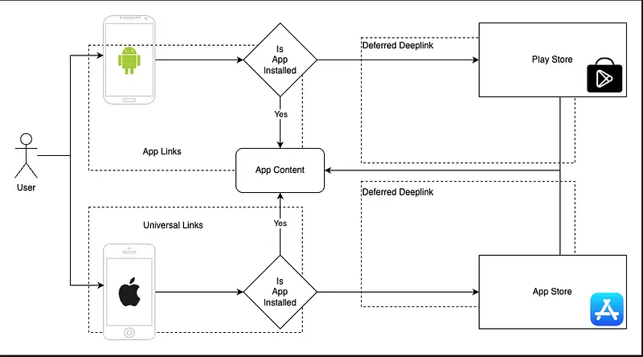
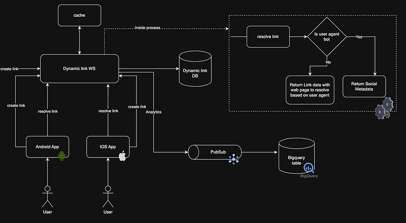

With Firebase Dynamic Links being deprecated, building your own dynamic-link system isn’t just an exercise — it’s something many teams now need to do. At first glance it looks trivial: shorten a long URL, map the short code to the real URL, and redirect when someone clicks. Easy, right?

Not really.

In a mobile-first world a “dynamic link” must smooth the entire user journey across devices and installs. A production-ready solution should handle all of the following:

- Shorten long URLs — make links shareable and easy to type.
- Open inside the app — take users directly to the exact resource (not just the app home).
- Handle “app not installed” — send users to the App Store / Play Store and, after install, deep-link them to the intended content (deferred deep link).
- Provide social previews — return Open Graph / Twitter Card metadata so links look right when shared.
- Capture analytics — record how links are used and attribute installs/conversions.

Shortening URLs is trivial. Opening the correct screen when the app is installed is standard deep-linking. But the moment you add app-install flows, reliable deferred deep links, social preview handling, and analytics, the engineering effort and edge cases multiply.

Next up: deep links — what they look like per platform and why deferred deep links are the real headache.

## Deeplinks

Deeplinks are created when the dynamic links are resolved, it looks something like this

```
spotify:track:4iV5W9uYEdYUVa79CpIqlb
```

This would open the specified track in the Spotify app. Now this representation would be different based on the platform (ios or android)

Now a days Deeplinks are mostly handled by **Universal links (ios) and App links (android)**. This is very straight forward. Let’s say my universal link looks something like this.

```
www.test-dl.com/app/blog/123
```

In the web server where [www.test-dl.com](http://www.test-dl.com) is hosted, inside a folder named .wellknown ypu must create 2 configuration files, for Android and ios.

- Android — [www.test-dl.com/](http://www.test-dl.com/).well-known/assetlinks.json
- Ios — [www.test-dl.com](http://www.test-dl.com)/.well-known/apple-app-site-association

After configuring these files and after creating a fallback web page in [www.test-dl.com/](http://www.test-dl.com/)app path, we can handle Deeplinks without going through the creation of Deeplinks while link resolving.

Now the complex scenario is the point number 3. Here we need to handle a scneario where deeplink should be opened when the app isn’t installed. We call this a deferred deep link.



## Deferred Deep links

The intended way to resolve a deferred deeplink is as I said in the point number 3, Redirect to app store then install the app and take the user to the path in the deeplink.

So when the app isn’t installed there is very less native support to handle a deeplink. We can redirect the users to app store but later when the app is installed fetching the deeplink info is complex. Generally there are mainly 2 ways to handle this.

- Server side — Fetch device unique information and create a temporary record in a cache with device identifier as the primary key and link information as the value.
- Client side — Use native support for storing the link context and access when the app is installed.

First method would be great if we could get a device identifier when the link is resolved. We can get some device specific data like IP Address, OS-version, Platform. But if there are a few users in the same WIFI network and has same device models, we wouldn’t be able to create a unique identifier for the device. You would argue, we have unique device ID for each mobile device, but when the link is resolved in the temp browser these data aren’t accesible. Therefore it’s risky to go with the first method. (But companies like Branch IO do use this and they have their own ways when creating that unique ID based on device info)

Second method would be to use a native feature to store the link data. In Android we have referrer API, which can keep data when redirecting to the appstore and access after install. In IOS we have Clipboard, where we can store link data when redirected to appstore and access after the installation completed. Now the Android way of handling this is very straight forward and clean, but IOS would require permission which could disturb the user experience and if the user doesn’t allow, then continuation of the deferred deeplink would be obstructed.

But when weighing on pros and cons, and to reduce the complexity of our work, we will choose the second approach.

## Social metadata

Social metadata is needed when we need to preview our link in social media. Open Graph (OG) and Twitter Card meta tags are used to enhance how your web pages are displayed when shared on social media. In our case we need to create a simple HTML template with these data when we identify the requesting user agent. If it’s a bot we send this template otherwise we redirect to universal/app link.

## Implementation

Implementation should be pretty clear by now. We will map universal/app link to a short code. Deeplink scenario will be automatically handled and for deferred deeplink scenario we need to do few client side changes.



- Store the link information in a database
- Configure universal/app links for your domain
- If request agent is a bot, send social metadata template
- Send link resolve request data to a pubsub which is connected to a bigquery table for analytics
- In IOS, add data to clipboard when the link is resolved to fallback webpage and redirect the user to appstore.
- In Android, create the appstore redirection link with referrer data where we will add URL encoded string of link information.
- Once the app is installed take the user to the indeded location in the app.

I guess this would give you a clear roadmap for what you need to do to implement a dynamic link solution in house. If you have any questions let me know in the comments. Thanks and Happy Coding :P
