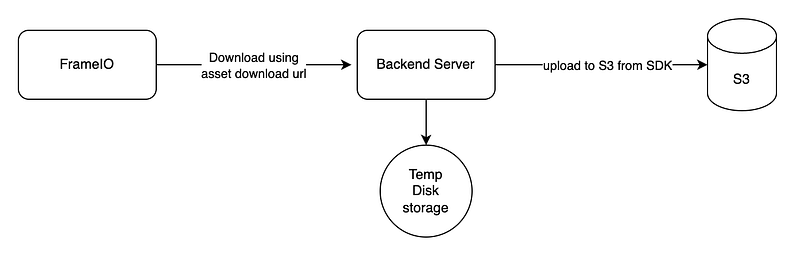
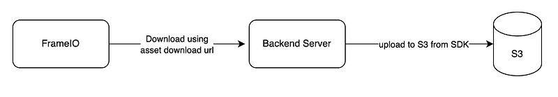

Hi guys, Recently I was in this situation where I had to automate backup from FrameIO to AWS S3 for some very large files (Some of them as large as 100GB). If you were to do this in a normal flow following will be the high level architecture for that.



_Basic flow_

So this would be the implementation using NodeJS.

```typescript
import axios from "axios";
import { S3Client } from "@aws-sdk/client-s3";
import { Upload } from "@aws-sdk/lib-storage";
import dotenv from "dotenv";
import fs from 'fs';

dotenv.config();

const FRAMEIO_API_URL = "https://api.frame.io/v2";
const FRAMEIO_TOKEN = process.env.FRAMEIO_TOKEN || "";

const s3Client = new S3Client({region: "us-east-1"});
const bucketName = process.env.S3_BUCKET || "";

/**
 * Get a sepcific asset
 */
async function getAsset(id: string) {
  try {
    const response = await axios.get(`${FRAMEIO_API_URL}/assets/${id}`, {
      headers: {
        Authorization: `Bearer ${FRAMEIO_TOKEN}`,
      },
    });
    return response.data;
  } catch (error) {
    console.error("Error fetching assets:", error);
    return [];
  }
}

const download = async (url: string, path: string) => {
  try {
    const writer = fs.createWriteStream(path);
    const response = await axios.get(url, {
      responseType: "stream",
    });

    response.data.pipe(writer);

    return new Promise((resolve, reject) => {
      writer.on('finish', resolve);
      writer.on('error', reject);
    });
  } catch (error) {
    console.error("Download failed.", error);
  }
};

const upload = async (filePath: string, key: string) => {
    const fileStream = fs.createReadStream(filePath);

    try {
        const upload = new Upload({
          client: s3Client,
          params: {
            Bucket: bucketName,
            Key: key,
            Body: fileStream,
          },
          leavePartsOnError: false, // Cleanup parts on error
        });

        await upload.done();
        console.log(`Successfully uploaded ${key} to S3`);
    } catch (error) {
        console.error('Error uploading to S3:', error);
    }
}

async function main() {
  const assetId = "your asset id";
  const asset = await getAsset(assetId);
  const downloadUrl = asset.original;
  await download(downloadUrl, '/home/xx/ssss/file.mov');
  await upload('/home/xx/ssss/file.mov', bucketName);
}

main().catch((error) => {
  console.error("Error in main function:", error);
});
```

When you set `responseType: "stream"` in an Axios request, Axios returns a stream of data. This stream can be piped to a writable stream, such as a file stream, to save the downloaded file locally. This approach is particularly useful for handling large files because it allows you to download and save the file in chunks, reducing memory usage and improving efficiency. After downloading we have used S3 Upload util to upload the file, main advantage of using this is, behind the scenes this method does multi part upload, so the upload speed is great.

Now the problem here is, our backend server should have a temporary storage to support large file. (In our example 100GB) which can be quite expensive. Therefore instead of using fs util to write the incoming byte stream to a file, we will connect it to S3 upload method.



As for the implementation, let’s remove separate download and upload methods and create one method like this.

```typescript
const downloadAndUploadToS3 = async (url: string, key: string) => {
  try {
    const response = await axios.get(url, {
      responseType: "stream",
    });

    const upload = new Upload({
      client: s3Client,
      params: {
        Bucket: bucketName,
        Key: key,
        Body: response.data,
      },
      leavePartsOnError: false,
    });

    await upload.done();
    console.log("Upload completed successfully.");
  } catch (error) {
    console.error("Upload failed.", error);
  }
};
```

Here what we do is have added the byte stream coming from axios response to Upload method. But as our file is very large, there is a limitation when using Upload method out of the box. Reason is by default multi part upload is configured to take partSize as 5mb. So when the file is very large number of parts will be increased. And AWS S3 has this number of part limitation to be 10000. Luckily part size can be configured.

```typescript
const calculatePartSize = (fileSize: number) => {
  const maxParts = 10000;
  const minPartSize = 5 * 1024 * 1024; // 5MB
  return Math.max(Math.ceil(fileSize / maxParts), minPartSize);
};

const downloadAndUploadToS3 = async (url: string, key: string) => {
  try {
    const response = await axios.get(url, {
      responseType: "stream",
    });

    const upload = new Upload({
      client: s3Client,
      params: {
        Bucket: bucketName,
        Key: key,
        Body: response.data,
      },
      partSize,
      leavePartsOnError: false,
    });

    await upload.done();
    console.log("Upload completed successfully.");
  } catch (error) {
    console.error("Upload failed.", error);
  }
};
```

Still there is a way we can speed up the upload process, It’s to use transfer acceleration of S3 bucket. We do have to do enable this configuration from S3. Read the following article to get a good idea about it.


_s3 bucket configuration in properties tab_

Now we have to do a little change in the code when configuring S3 client to use this accelerated URL.

```
const s3Client = new S3Client({
  region: "us-east-1",
  endpoint: "https://s3-accelerate.amazonaws.com",
});
```

Finally to see the progress of our operation, I would use a package called progress from npm. And change the code with these.

```typescript
import ProgressBar from "progress";

const downloadAndUploadToS3 = async (url: string, key: string) => {
  try {
    const response = await axios.get(url, {
      responseType: "stream",
    });

    const totalLength = parseInt(response.headers["content-length"], 10);
    const partSize = calculatePartSize(totalLength);
    const progressBar = new ProgressBar(
      "-> downloading [:bar] :percent :etas",
      {
        width: 40,
        complete: "=",
        incomplete: " ",
        renderThrottle: 1,
        total: totalLength,
      }
    );

    const upload = new Upload({
      client: s3Client,
      params: {
        Bucket: bucketName,
        Key: key,
        Body: response.data,
      },
      partSize,
      leavePartsOnError: false, // Cleanup parts on error
    });

    response.data.on("data", (chunk: any) => progressBar.tick(chunk.length));

    await upload.done();
    console.log("Upload completed successfully.");
  } catch (error) {
    console.error("Upload failed.", error);
  }
};
```

As a final remark I would suggest you to run this from a EC2 instance as the upload speed quite good if both server and S3 in same network. When creating the EC2, attach an IAM role with full access to S3.

That’s it guys, Happy Coding !!! until the next article… :P
