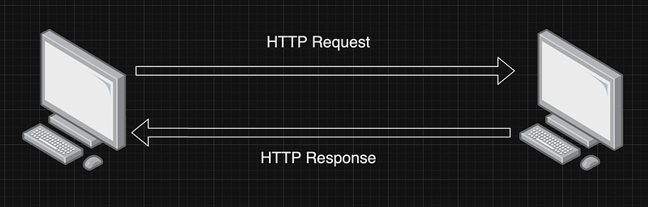

Hi Guys, If you have followed me for a while, you must know almost all of my articles are based on a real world project and I cover steps to create and deploy that project. I have created several Full stack projects and I have been working in the industry for almost 4 years now. There are lot of things I have learnt along the way and I’m trying to use this article to share those experiences with you.

In software engineering, most of the time there are no right or wrongs, what we usually do is we think about the trade offs between different approaches and go with the one that make sense. As the first part of the backend engineering fundamentals, I will discuss about HTTP.

## HTTP Requests

Let’s take a practical example where you send a letter to a friend who is living in another country. Letter first fetched by the mail man living in your area, then taken to a one distribution centre near your area, from there it will be taken from a different mail man and all these details are abstracted to you. In a similar way when we send a request from our web browser, we don’t see the underlying network implementations, but it goes from client to a server and then respond. And similar to mail delivery, we send our address and recipient address and data with the request. In networking we have different models like TCP/IP and OSI. So only the Application layer which is the top most layer visible to everyday users.

**HTTP versions**

HTTP was introduced mainly as a protocol to support communication between browsers and web servers. This used TCP as the transport protocol. It has evolved over the period of time from it’s version 0.9 (1991) to 3 (2022 released).

- 0.9 (First release) — Only allowed getting information from a server. GET method was the only method supported. Released as a plain text protocol.
- 1 — Introduced Header, Versioning, Status code, Content-type, New methods (POST, HEAD).
- 1.1 — Introduced Host header, Persistent connections, Continue status, New methods (PUT, PATCH, DELETE, CONNECT, TRACE, and OPTIONS)
- 2— Request multiplexing, Request prioritization, Automatic compressing, Connection reset, Server push, More importantly this release made HTTP a binary protocol.
- 3 — Major change is transport protocol used is QUIC (On top of UDP)

**Three basic features that make HTTP simple and powerful**

- Connectionless protocol — which means the browser submits the request and the client then disconnects from the server. The client waits for a response after disconnecting.
- HTTP is media independent and it can transport any data type if both the client and server are able to handle the data content.
- Stateless — Because HTTP is connectionless. Client and server are aware of each other only during the connected period and once the connection ends, data is not retained by either party.

**Analogy of a HTTP request**

- Request line — Its starts with method token followed by the Request URI, protocol version, and ending with <CR><LF> (a carriage return by a line feed). Elements are separated by SP characters (Request-Line = Method SP Request-URI SP HTTP-Version CRLF)
- The resource identified by a request
- Request header fields

**HTTP request Methods**

- GET — _The _`_GET_`_ method requests a representation of the specified resource. Requests using _`_GET_`_ should only retrieve data._
- HEAD — _The _`_HEAD_`_ method asks for a response identical to a _`_GET_`_ request, but without the response body._
- POST — _The _`_POST_`_ method submits an entity to the specified resource, often causing a change in state or side effects on the server._
- PUT — _The _`_PUT_`_ method replaces all current representations of the target resource with the request payload._
- DELETE — _The _`_DELETE_`_ method deletes the specified resource._
- CONNECT — _The _`_CONNECT_`_ method establishes a tunnel to the server identified by the target resource._
- OPTIONS — _The _`_OPTIONS_`_ method describes the communication options for the target resource._
- TRACE — _The _`_TRACE_`_ method performs a message loop-back test along the path to the target resource._
- PATCH — _The _`_PATCH_`_ method applies partial modifications to a resource._

**Safe methods**

So over the years with new releases, HTTP has introduced sevaral methods. Some of the request methods are known as safe methods. The purpose of these methods are just to retrive information and do not change the state of origin server.

Ex: HEAD, GET, OPTION and TRACE

**Idempotent methods**

An HTTP method is idempotent if the intended effect on the server of making a single request is the same as the effect of making several identical requests. Simple meaning is repeating the operation multiple times produces the same result as executing it once

Ex: GET, HEAD, PUT, DELETE, OPTIONS and TRACE

**HTTP authentication**

The general HTTP authentication framework is the base for a number of authentication schemes.

- Basic — base64-encoded credentials
- Bearer — bearer tokens to access OAuth 2.0-protected resources
- Digest
- HOBA
- Mutual
- Negotiate/NTLM
- VAPID
- SCRAM
- AWS4-HMAC-SHA256

**HTTP cookies**

_An HTTP cookie (web cookie, browser cookie) is a small piece of data that a server sends to a user’s web browser. The browser may store the cookie and send it back to the same server with later requests. Typically, an HTTP cookie is used to tell if two requests come from the same browser — keeping a user logged in, for example. It remembers stateful information for the stateless HTTP protocol._

- Session management
- Personalisation
- Tracking

**HTTP conditional requests**

_HTTP has a concept of conditional requests, where the result, and even the success of a request, can be changed by comparing the affected resources with the value of a validator. Such requests can be useful to validate the content of a cache, and sparing a useless control, to verify the integrity of a document, like when resuming a download, or when preventing lost updates when uploading or modifying a document on the server._

**HTTP Compression**

- File format compression (_loss less and lossy are 2 types_)
- End-to-end compression
- Hop-by-hop compression

**HTTP Caches**

_The HTTP cache stores a response associated with a request and reuses the stored response for subsequent requests._

- Private caches — _A private cache is a cache tied to a specific client — typically a browser cache. Since the stored response is not shared with other clients, a private cache can store a personalized response for that user._
- Shared caches — _The shared cache is located between the client and the server and can store responses that can be shared among users. And shared caches can be further sub-classified into proxy caches and managed caches._
- Proxy caches — _In addition to the function of access control, some proxies implement caching to reduce traffic out of the network. This is usually not managed by the service developer, so it must be controlled by appropriate HTTP headers and so on._
- Managed caches — _Managed caches are explicitly deployed by service developers to offload the origin server and to deliver content efficiently. Examples include reverse proxies, CDNs, and service workers in combination with the Cache API._

**HTTPS**

HTTP is not a secured protocol as the request is sent in plain text. So for someone monitoring the session can read what’s in the request.

The SSL (Secure Sockets Layer) protocol was added to HTTP to provide a layer of encryption between browsers and servers. You have to add certificates when creating the HTTPS server.

**Content negotiation**

_In _[_HTTP_](https://developer.mozilla.org/en-US/docs/Glossary/HTTP)_, content negotiation is the mechanism that is used for serving different _[_representations_](https://developer.mozilla.org/en-US/docs/Glossary/Representation_header)_ of a resource to the same URI to help the user agent specify which representation is best suited for the user (for example, which document language, which image format, or which content encoding)._

- Server-driven Negotiation — Best representation is made by an algorithm which is located at the server
- Agent-driven Negotiation — The user agent performs the selection of the best representation for a response after receiving an initial response from the origin server
- Transparent Negotiation — It is a combination of both server-driven negotiation and agent-driven negotiation

**HTTP response status codes**

- [Informational responses](https://developer.mozilla.org/en-US/docs/Web/HTTP/Status#information_responses) (`100` – `199`)
- [Successful responses](https://developer.mozilla.org/en-US/docs/Web/HTTP/Status#successful_responses) (`200` – `299`)
- [Redirection messages](https://developer.mozilla.org/en-US/docs/Web/HTTP/Status#redirection_messages) (`300` – `399`)
- [Client error responses](https://developer.mozilla.org/en-US/docs/Web/HTTP/Status#client_error_responses) (`400` – `499`)
- [Server error responses](https://developer.mozilla.org/en-US/docs/Web/HTTP/Status#server_error_responses) (`500` – `599`)

Information responses

- 100 — Continue (_This interim response indicates that the client should continue the request or ignore the response if the request is already finished._)
- 101 — Switching Protocols (_This code is sent in response to an _`[_Upgrade_](https://developer.mozilla.org/en-US/docs/Web/HTTP/Headers/Upgrade)`_ request header from the client and indicates the protocol the server is switching to._)
- 102 — Processing (_This code indicates that the server has received and is processing the request, but no response is available yet._)
- 103 — Early hints (_This status code is primarily intended to be used with the _`[_Link_](https://developer.mozilla.org/en-US/docs/Web/HTTP/Headers/Link)`_ header, letting the user agent start _[_preloading_](https://developer.mozilla.org/en-US/docs/Web/HTML/Attributes/rel/preload)_ resources while the server prepares a response._)

Successful responses

- 200 — OK (_The request succeeded._)
- 201 — Created (_The request succeeded, and a new resource was created as a result. This is typically the response sent after _`_POST_`_ requests, or some _`_PUT_`_ requests._)
- 202 — Accepted (_The request has been received but not yet acted upon. It is noncommittal, since there is no way in HTTP to later send an asynchronous response indicating the outcome of the request. It is intended for cases where another process or server handles the request, or for batch processing._)
- 203 — Non Authoritative Information ( _This response code means the returned metadata is not exactly the same as is available from the origin server, but is collected from a local or a third-party copy. This is mostly used for mirrors or backups of another resource. Except for that specific case, the _`_200 OK_`_ response is preferred to this status._)
- 204 — No content (_There is no content to send for this request, but the headers may be useful. The user agent may update its cached headers for this resource with the new ones._)
- 205 — Reset content (_Tells the user agent to reset the document which sent this request._)
- 206 — Partial Content (_This response code is used when the _`[_Range_](https://developer.mozilla.org/en-US/docs/Web/HTTP/Headers/Range)`_ header is sent from the client to request only part of a resource._)
- 207 — Multi status (_Conveys information about multiple resources, for situations where multiple status codes might be appropriate._)
- 208 — Already reported (_Used inside a _`_<dav:propstat>_`_ response element to avoid repeatedly enumerating the internal members of multiple bindings to the same collection._)
- 226 — IM used (_The server has fulfilled a _`_GET_`_ request for the resource, and the response is a representation of the result of one or more instance-manipulations applied to the current instance._)

Redirection messages

- 300 — Multiple choices (_The request has more than one possible response. The user agent or user should choose one of them. (There is no standardized way of choosing one of the responses, but HTML links to the possibilities are recommended so the user can pick.)_)
- 301 — Moved Permanently (_The URL of the requested resource has been changed permanently. The new URL is given in the response._)
- 302 — Found (_This response code means that the URI of requested resource has been changed temporarily. Further changes in the URI might be made in the future. Therefore, this same URI should be used by the client in future requests._)
- 303 — See other (_The server sent this response to direct the client to get the requested resource at another URI with a GET request._)
- 304 — Not modified (_This is used for caching purposes. It tells the client that the response has not been modified, so the client can continue to use the same cached version of the response._)
- 307 — Temporary redirect (_The server sends this response to direct the client to get the requested resource at another URI with the same method that was used in the prior request. This has the same semantics as the _`_302 Found_`_ HTTP response code, with the exception that the user agent must not change the HTTP method used: if a _`_POST_`_ was used in the first request, a _`_POST_`_ must be used in the second request._)
- 308 — Permanent redirect (_This means that the resource is now permanently located at another URI, specified by the _`_Location:_`_ HTTP Response header. This has the same semantics as the _`_301 Moved Permanently_`_ HTTP response code, with the exception that the user agent must not change the HTTP method used: if a _`_POST_`_ was used in the first request, a _`_POST_`_ must be used in the second request._)

Client error responses

- 400 — Bad request (_The server cannot or will not process the request due to something that is perceived to be a client error (e.g., malformed request syntax, invalid request message framing, or deceptive request routing)._)
- 401 — Unauthorized (_Although the HTTP standard specifies “unauthorized”, semantically this response means “unauthenticated”. That is, the client must authenticate itself to get the requested response._)
- 402 — Payment required (_This response code is reserved for future use. The initial aim for creating this code was using it for digital payment systems, however this status code is used very rarely and no standard convention exists._)
- 403 — Forbidden (_The client does not have access rights to the content; that is, it is unauthorized, so the server is refusing to give the requested resource. Unlike _`_401 Unauthorized_`_, the client's identity is known to the server._)
- 404 — Not found (_The server cannot find the requested resource. In the browser, this means the URL is not recognized. In an API, this can also mean that the endpoint is valid but the resource itself does not exist. Servers may also send this response instead of _`_403 Forbidden_`_ to hide the existence of a resource from an unauthorized client. This response code is probably the most well known due to its frequent occurrence on the web._)
- 405 — Method not allowed (_The request method is known by the server but is not supported by the target resource. For example, an API may not allow calling _`_DELETE_`_ to remove a resource._)
- 406 — Not Acceptable (_This response is sent when the web server, after performing _[_server-driven content negotiation_](https://developer.mozilla.org/en-US/docs/Web/HTTP/Content_negotiation#server-driven_negotiation)_, doesn’t find any content that conforms to the criteria given by the user agent._)
- 407 — Proxy authentication required (_This is similar to _`_401 Unauthorized_`_ but authentication is needed to be done by a proxy._)
- 408 — Request timeout (_This response is sent on an idle connection by some servers, even without any previous request by the client. It means that the server would like to shut down this unused connection. This response is used much more since some browsers, like Chrome, Firefox 27+, or IE9, use HTTP pre-connection mechanisms to speed up surfing. Also note that some servers merely shut down the connection without sending this message._)
- 409 — Conflict (_This response is sent when a request conflicts with the current state of the server._)
- 410 — Gone (_This response is sent when the requested content has been permanently deleted from server, with no forwarding address. Clients are expected to remove their caches and links to the resource. The HTTP specification intends this status code to be used for “limited-time, promotional services”. APIs should not feel compelled to indicate resources that have been deleted with this status code._)
- 411 — Length required (_Server rejected the request because the _`_Content-Length_`_ header field is not defined and the server requires it._)
- 412 — Preconditioned failed (_The client has indicated preconditions in its headers which the server does not meet._)
- 413 — Payload too large (_Request entity is larger than limits defined by server. The server might close the connection or return an _`_Retry-After_`_ header field._)
- 414 — URI too long (_The URI requested by the client is longer than the server is willing to interpret._)
- 415 — Unsupported media type (_The media format of the requested data is not supported by the server, so the server is rejecting the request._)
- 416 — Range not satisfiable (_The range specified by the _`_Range_`_ header field in the request cannot be fulfilled. It's possible that the range is outside the size of the target URI's data._)
- 417 — Expectation failed (_This response code means the expectation indicated by the _`_Expect_`_ request header field cannot be met by the server._)
- 418 — I’m a teapot (_The server refuses the attempt to brew coffee with a teapot._)
- 421 — Misdirected request (_The request was directed at a server that is not able to produce a response. This can be sent by a server that is not configured to produce responses for the combination of scheme and authority that are included in the request URI._)
- 422 — Unprocessable content (_The request was well-formed but was unable to be followed due to semantic errors._)
- 423 — Locked (_The resource that is being accessed is locked._)
- 424 — Failed depenedancy (_The request failed due to failure of a previous request._)
- 425 — Too Ealry (_Indicates that the server is unwilling to risk processing a request that might be replayed._)
- 426 — Upgrade required (_The server refuses to perform the request using the current protocol but might be willing to do so after the client upgrades to a different protocol. The server sends an _`[_Upgrade_](https://developer.mozilla.org/en-US/docs/Web/HTTP/Headers/Upgrade)`_ header in a 426 response to indicate the required protocol(s)._)
- 428 — Precondition required (_The origin server requires the request to be conditional. This response is intended to prevent the ‘lost update’ problem, where a client _`_GET_`_s a resource's state, modifies it and _`_PUT_`_s it back to the server, when meanwhile a third party has modified the state on the server, leading to a conflict._)
- 429 — Too many requests (_The user has sent too many requests in a given amount of time (“rate limiting”)._)
- 431 — Request header fields too large (_The server is unwilling to process the request because its header fields are too large. The request may be resubmitted after reducing the size of the request header fields._)
- 451 — Unavailable for legal reasons (_The user agent requested a resource that cannot legally be provided, such as a web page censored by a government._)

Server error responses

- 500 — Internal server error (_The server has encountered a situation it does not know how to handle._)
- 501 — Not implemented (_The request method is not supported by the server and cannot be handled. The only methods that servers are required to support (and therefore that must not return this code) are _`_GET_`_ and _`_HEAD_`_._)
- 502 — Bad gateway (_This error response means that the server, while working as a gateway to get a response needed to handle the request, got an invalid response._)
- 503 — Service unavailable (_The server is not ready to handle the request. Common causes are a server that is down for maintenance or that is overloaded. Note that together with this response, a user-friendly page explaining the problem should be sent. This response should be used for temporary conditions and the _`_Retry-After_`_ HTTP header should, if possible, contain the estimated time before the recovery of the service. The webmaster must also take care about the caching-related headers that are sent along with this response, as these temporary condition responses should usually not be cached._)
- 504 — Gateway timeout (_This error response is given when the server is acting as a gateway and cannot get a response in time._)
- 505 — HTTP version not supported (_The HTTP version used in the request is not supported by the server._)
- 506 — Varaint also negotiates (_The server has an internal configuration error: the chosen variant resource is configured to engage in transparent content negotiation itself, and is therefore not a proper end point in the negotiation process._)
- 507 — Insufficient storage (_The method could not be performed on the resource because the server is unable to store the representation needed to successfully complete the request._)
- 508 — Loop detected (_The server detected an infinite loop while processing the request._)
- 510 — Not extended (_Further extensions to the request are required for the server to fulfill it._)
- 511 — Network authentication required (_Indicates that the client needs to authenticate to gain network access._)

This is a long list of responses and you don't need all to know. Btw please note that most of these informations are from

So this is the end of the HTTP note :P see you with another tutorial.

Happy Coding :D
