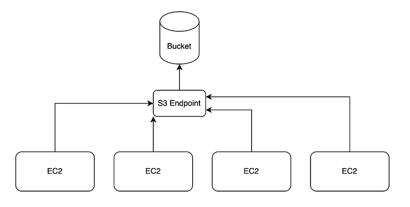
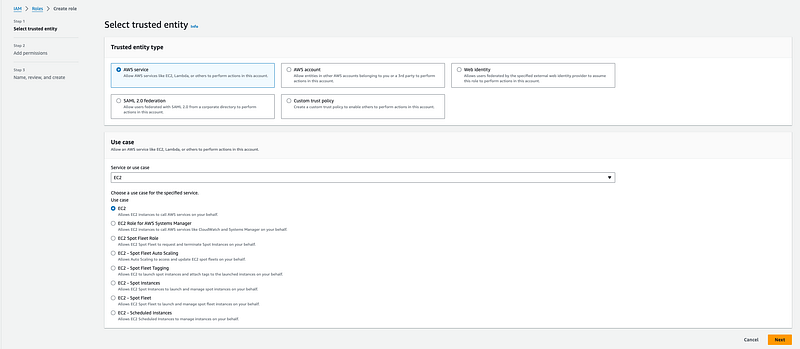
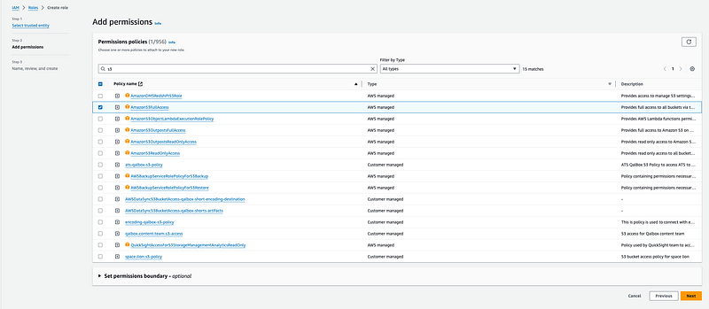

Hi Guys, So in the last article of mine I discussed about creating a node js script to download files more than 100GB. You can find the article here.

Now when doing a migration like this, it involves several steps other than the download script prepared in the previous tutorial. Along the way we have to face so many challenges because in this particular scenario I came across files which are more than 700GB in size. So as first step let’s identify what sort of a plan we should have before doing a migration like this.

- Get the script we wrote from last article
- Obtain FrameIO asset IDs to get download URLs
- Provisioning VMs to run the script
- Validating upload success or not

## So how to obtain asset IDs

In frameIO assets are stored in a hierarchical file system. Now if you look close enough you can see this is a Tree data structure kind of implementation. So we can identify following components to map this to an array.

- Root Node — Team
- Nodes — Root asset ID
- Leave Nodes — Files (Assets)

So to find all the files in a project would require us to do a Tree traversal which means recursive search. By doing the search our goal should be to create a map, where the key is full path for a file and Asset ID as the value. Following code would do that.

```typescript
import axios from 'axios';
import fs from 'fs';
import path from 'path';
import dotenv from 'dotenv';
import ProgressBar from 'progress';
import axiosRetry from 'axios-retry';

// Configure axios to retry requests
axiosRetry(axios, { retries: 3, retryDelay: axiosRetry.exponentialDelay });

dotenv.config();

const FRAMEIO_API_URL = 'https://api.frame.io/v2';
const FRAMEIO_TOKEN = process.env.FRAMEIO_TOKEN || '';

/**
 * Get all the asset IDs
 */
async function getProjects(teamId: string) {
  try {
      const response = await axios.get(`${FRAMEIO_API_URL}/teams/${teamId}/projects?filter[archived]=all`, {
          headers: {
              'Authorization': `Bearer ${FRAMEIO_TOKEN}`
          }
      });
      return response.data;
  } catch (error) {
      console.error('Error fetching assets:', error);
      return [];
  }
}

/**
 * Get all the asset IDs
 */
async function getProject(projectId: string) {
  try {
      const response = await axios.get(`${FRAMEIO_API_URL}/projects/${projectId}`, {
          headers: {
              'Authorization': `Bearer ${FRAMEIO_TOKEN}`
          }
      });
      return response.data;
  } catch (error) {
      console.error('Error fetching assets:', error);
      return [];
  }
}

/**
 * Get all the asset IDs
 */
async function getAllAssets(rootAssetId: string) {
  try {
      const response = await axios.get(`${FRAMEIO_API_URL}/assets/${rootAssetId}/children?include_deleted=false`, {
          headers: {
              'Authorization': `Bearer ${FRAMEIO_TOKEN}`
          }
      });
      return response.data;
  } catch (error) {
      console.error('Error fetching assets:', error);
      return [];
  }
}

async function findAndFetchNestedAssets(assets: any[], getAllAssets: (id: string) => Promise<any[]>, 
projectName: string, folderPath: string, map: Map<string, string>): Promise<void> {
  for (const asset of assets) {
    const currentPath = `${folderPath}/${asset.name}`;
    if (asset.type === 'folder') {
        // Add folder to the map
        // Asset is a folder, fetch nested assets
        const nestedAssets = await getAllAssets(asset.id);

        // Process nested assets
        await findAndFetchNestedAssets(nestedAssets, getAllAssets, projectName, currentPath, map);
    } else {
        // Process non-folder asset or other logic
        map.set(`${projectName}${currentPath}`, asset.id);
    }
}
}

async function main() {
  const map = new Map<string, string>();
  const teamName = "<TEAM_NAME>";
  const projects = await getProjects('<TEAM_UUID>');

  for (const project of projects) {
      const projectName = project.name;
      const rootAssetId = project.root_asset_id;

      const assets = await getAllAssets(rootAssetId);

      // Use the findAndFetchNestedAssets method
      await findAndFetchNestedAssets(assets, getAllAssets, `${teamName}/${projectName}`, '', map);
  }

  console.log(JSON.stringify(Array.from(map, ([key, value]) => ({ key, value }))));
}

main().catch(error => {
    console.error('Error in main function:', error);
});
```

So in the above code we get all the projects for a team using UUID of the team and then inside a loop for each root asset IDs we do a recursive call to find all the files. At last I’m printing the map as a JSON object array which can be saved in to a JSON file like this.

```bash
npx tsc && node dist/main.js -> result.json
```

Now the next step is to use this map with previous download script to download assets one by one.

## How to parallely distribute the workload

For this what I used is EC2 machines parallely running as VMs to handle the workload in separate environments with separate network interfaces.



Now configuring multiple EC2 will be a nightmare if we do this manually. Therefore we need to automate this whole infrastructure creation. For this I have used Terraform. Create a folder called terraform in your project and add a file called `variables.tf` This file will be the place where we add our project secrets.

```
variable "region" {
  default = "us-east-1"
}

variable "instance_type" {
  default = "m5n.xlarge"
}

variable "key_name" {
  description = "SSH Key Name"
  type        = string
}

variable "repository_url" {
  description = "Enter the Github repo name which we need to download inside each EC2?"
  type        = string
}

variable "iam_role_name" {
  description = "IAM Role for EC2 S3 Name"
  type        = string
}
```

Here I have hardcoded region and instance type. So the reason to select `m5n.xlarge` is, it has a good network capabilities which is useful for us to download files from FrameIO. Next step is to add the `main.tf` file.

```
provider "aws" {
  region = var.region
}

# Define the EC2 Instance
resource "aws_instance" "example" {
  ami           = "<YOUR AMI>" # Amazon Linux 2 AMI (adjust based on your region)
  instance_type = var.instance_type
  key_name      = var.key_name
  iam_instance_profile = aws_iam_instance_profile.ec2_s3_instance_profile.name
  security_groups = ["<YOUR SECURITY GROUP>"]

  user_data = <<-EOF
              #!/bin/bash
              sudo yum update -y
              sudo yum install git -y
              curl -o- https://raw.githubusercontent.com/nvm-sh/nvm/v0.39.3/install.sh | bash

              echo 'export NVM_DIR="$HOME/.nvm"' >> /home/ec2-user/.bashrc
              echo '[ -s "$NVM_DIR/nvm.sh" ] && \. "$NVM_DIR/nvm.sh"' >> /home/ec2-user/.bashrc
              source /home/ec2-user/.bashrc

              su - ec2-user -c 'nvm install node'
              su - ec2-user -c 'git clone ${var.repository_url}'
              EOF

  tags = {
    Name = "Terraform-EC2-1"
  }
}

# Define the IAM Instance Profile
resource "aws_iam_instance_profile" "ec2_s3_instance_profile" {
  name = "ec2-s3-instance-profile"
  role = var.iam_role_name
}

# Define Outputs
output "instance_id" {
  value = aws_instance.example.id
}

output "public_ip" {
  value = aws_instance.example.public_ip
}

# Define the EC2 2nd Instance
resource "aws_instance" "example2" {
  ami           = "<YOUR AMI>" # Amazon Linux 2 AMI (adjust based on your region)
  instance_type = var.instance_type
  key_name      = var.key_name
  iam_instance_profile = aws_iam_instance_profile.ec2_s3_instance_profile.name
  security_groups = ["<YOUR SECURITY GROUP>"]

  user_data = <<-EOF
              #!/bin/bash
              sudo yum update -y
              sudo yum install git -y
              curl -o- https://raw.githubusercontent.com/nvm-sh/nvm/v0.39.3/install.sh | bash

              echo 'export NVM_DIR="$HOME/.nvm"' >> /home/ec2-user/.bashrc
              echo '[ -s "$NVM_DIR/nvm.sh" ] && \. "$NVM_DIR/nvm.sh"' >> /home/ec2-user/.bashrc
              source /home/ec2-user/.bashrc

              su - ec2-user -c 'nvm install node'
              su - ec2-user -c 'git clone ${var.repository_url}'
              EOF

  tags = {
    Name = "Terraform-EC2-2"
  }
}

# Define Outputs
output "instance_id_2" {
  value = aws_instance.example2.id
}

output "public_ip_2" {
  value = aws_instance.example2.public_ip
}
```

In this script I have added configurations for 2 EC2s you can increase it with how many you need. We need the AMI (Machine Image ID for EC2 — I used one of linux) and just create a security group with SSH access and add that name here. Furthermore create a role in IAM for EC2 to access S3 resources where the file will be uploaded. In the console go to IAM roles and create a role as this.





Remember the name you just gave to this role.

Next step is to apply this infrastructure. Add AWS access ID and secret access key to the path and then run the following command inside terraform folder.

```
terraform apply 
```

This will show the changes which will happen to AWS and once you proceed EC2 servers will be up and running. In this code I haven’t automated EC2 to run the download script but you can do that.

Now the last thing is validating everything is uploaded or not. For this I created a script to check whether each key of the map is in S3 already or not and then create a csv based on that to find missing assets. Create ile called `csv-util.ts` and add the following code.

```typescript
import { writeFileSync } from 'fs';

export class CSVUtil {
  public createCSVFromMap(map: Map<string, any>, filePath: string): void {
    // Define CSV headers
    const headers = 'MediaKey,AssetID,Exists';
    const rows = Array.from(map, ([key, value]) => `${key},${value.assetId},${value.exists}`).join('\n');
    const csvContent = `${headers}\n${rows}`;
    writeFileSync(filePath, csvContent);
  }
}
```

Now let’s use this to create the csv file.

```typescript
const map = new Map<string, any>();
for (const media of JSON_MAP) {
  await processAssetManager(media['key'], media['value']);
  const check = await doesFileExist(media['key']);
  map.set(media['key'], {assetId: media['value'], exists: check});
}

const csvUtil = new CSVUtil();
csvUtil.createCSVFromMap(map, <FILEPATH>);
```

`doesFileExist` method can be implemented like this.

```bash
export const doesFileExist = async (key: string): Promise<boolean> => {
  try {
    const command = new HeadObjectCommand({ Bucket: bucketName, Key: key });
    await s3Client.send(command);
    return true;
  } catch (error: any) {
    if (error.name === "NotFound") {
      return false;
    }
    throw error;
  }
}
```

Now this is it guys, Hope you will be able to migrate all of your files without any issues. Please let me know in comments if you come across any issues.

Happy Coding :P
