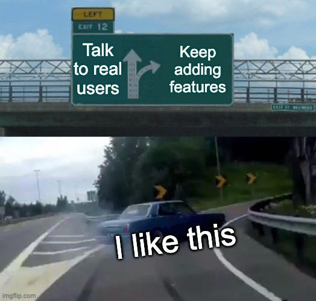

I was gonna save the planet. With code.

Yeah, I know. Every developer has that one grand, world-changing idea they sketch out at 2 AM, fueled by cold pizza and delusion. Mine was `zylobin`. The name was cool, the mission was noble: solve recycling.

The plan was brilliant. A full-stack, multi-platform, cloud-native, blockchain-ready (okay, maybe not blockchain) ecosystem to connect people who have trash with places that want trash.

**The **`**v0.1**`** Master Plan 🚀:**

- **A sleek mobile app for the People™:** Users would religiously scan every plastic bottle and cardboard box, track their recycling stats like a high score, and feel smug about their carbon footprint. When it was time to drop off, they’d find a collection point on the map, scan a QR code on the bin, drop their stuff, and get rewarded with glorious, gamified points.
- **A powerful dashboard for the Industry™:** Recycling collection companies would log into their web portal, manage their fleet of bins across the city, update waste types, and see real-time analytics.

It was a perfect two-sided marketplace. A beautiful, symbiotic relationship. The Uber for your garbage. What could possibly go wrong?

Well, step one of a two-sided marketplace is talking to… you know… _both sides_. And talking to actual collection companies sounded like phone calls. And meetings. And spreadsheets. It sounded a lot like _work_.

My developer brain found a much more elegant solution.

## The First Pivot: `git commit -m "feat: make users do all the work"`

Why bother with businesses when you can just crowdsource it?

I yeeted the entire dashboard web app into the digital void. The new plan was simple: let users add the recycling bins to the map themselves. They could pin a location, add a photo, and report what kind of waste it accepts.

Brilliant, right? I just cut my workload in half. `zylobin` was no longer a complex B2B2C platform. It was now a Waze for trash cans. A bin finder.

The app went live. I waited for the downloads to pour in. And they… didn’t.

A few friends downloaded it, added the bin outside their apartment, and never opened the app again. I had built a solution to a problem that didn’t exist. People who are motivated enough to recycle _already know where the bins are_. People who aren’t motivated aren’t going to download an app to find one.

The app had exactly one use case: you’ve just moved to a new city, you’re holding a single empty bottle, and you’re irrationally passionate about not throwing it in a regular trash can. The total addressable market was maybe… 7 people.

## The Second Pivot: `npm install more-features`

My app was failing. My user count was flatlining. My motivation was draining.

So I did what any good developer does when their product has zero market fit: I added more features.

If people don’t want a bin finder, maybe they want… a marketplace for their trash?

Yes. A “Waste Sharing Marketplace” was born. Users could now list their “gently used cardboard” or “artisanal glass bottles” for other users to claim. Maybe someone needed boxes for moving? Maybe a crafter needed bottle caps?

I went all in. I added a bidding system. User profiles. A rating system. A direct messaging feature. The codebase became a beautiful, tangled mess of spaghetti that would make an Italian chef weep.

`zylobin` was now a bin finder, a social network, and a Craigslist for garbage, all rolled into one confusing, bloated app that solved precisely zero problems for zero people.

## The Inevitable End: The `rm -rf /` of Motivation

After months of coding features nobody asked for, for an app nobody needed, I finally burned out.

The project was dead. I stopped working on it. `zylobin` now sits in a private GitHub repo, a digital monument to my own hubris. It never processed a single piece of recycled waste.

## So, What Was the Actual Problem?

Looking back, the failure was obvious. I was so in love with my _solution_ that I never truly understood the _problem_. I coded for months without having a single real conversation with a user or a collection company.

If I were to start over, here’s what I would have done:

**GET OUT OF THE EDITOR.** Forget the code. The first step is to go talk to the actual players.

- **Talk to Collection Companies:** What sucks about their job? I’d bet my bottom dollar their problem isn’t “not enough people know where our bins are.” It’s probably something like:
- “Our trucks waste fuel checking on empty bins.”
- “Our bins are constantly overflowing before we can get to them.”
- “People contaminate the recycling with actual garbage, costing us a fortune.”
- **Talk to People:** Why don’t they recycle more?
- “I have no idea what’s actually recyclable.”
- “It’s inconvenient.”
- “Does it even make a difference?”

**SOLVE ONE, TINY, PAINFUL THING.** Instead of building an “ecosystem,” I could have built a single, razor-focused tool.

- **For companies:** What if I built a simple system with cheap IoT sensors that just pings them when a bin is 80% full? That’s it. No user app. Just a dashboard that optimizes their truck routes, saving them thousands on fuel and time. **That’s a product you can sell.**
- **For people:** What if the app did only one thing: you take a picture of an item, and it tells you “YES, RECYCLE” or “NO, TRASH.” Use a simple ML model. It solves the problem of confusion and contamination. **That’s an app people might actually use.**

The lesson is brutal and simple. Don’t build features. Build solutions. And you can’t build a solution until you leave your ergonomic chair, walk outside, and ask people what their problems are.

Otherwise, you’ll just end up like me, with a perfectly engineered, feature-rich app in a digital landfill.
