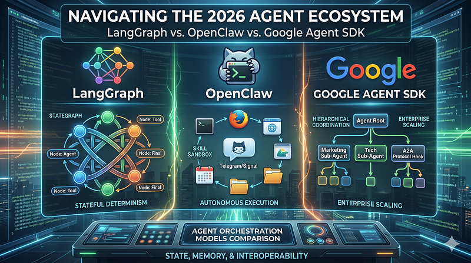

The landscape of AI development has undergone a fundamental shift. We have moved past simple prompt engineering and basic Retrieval-Augmented Generation (RAG) pipelines. Today, the conversation is dominated by **autonomous AI agents** — systems capable of maintaining state, choosing their own execution paths, and interacting with real-world tooling.

However, as agentic design patterns have matured, the tooling has fractured into distinct philosophical camps. If you are architecting an enterprise agent system or a personal automation pipeline today, you are likely looking at three major contenders: **LangGraph**, **OpenClaw** (frequently referred to by developers as “Claw agents”), and the **Google Agent SDK** (officially known as the Agent Development Kit, or ADK).

Each of these frameworks represents an entirely different mental model for how an AI agent should be built, managed, and deployed. Let’s look past the marketing hype and break down how they stack up under the hood.



## The Contenders at a Glance

- **LangGraph (by LangChain):** The deterministic mastermind. It treats agent workflows as stateful, directed graphs where you explicitly define every node, edge, and conditional loop.
- **OpenClaw (“Claw”):** The autonomous hacker. Born as an open-source, chat-native personal assistant, it is designed to run locally or on a VPS, executing shell commands and managing workflows directly through messaging apps like WhatsApp and Telegram.
- **Google Agent SDK (ADK):** The enterprise coordinator. Optimized for the Google Cloud/Vertex AI ecosystem, it structures agents into hierarchical tree networks and introduces native cross-framework interoperability.

## 1. Orchestration Models: Graph vs. Sandbox vs. Tree

The most critical architectural decision you face when selecting a framework is its **orchestration model** — how the framework maps an agent’s reasoning steps into actual execution.

## LangGraph: The Stateful State Machine

LangGraph models everything as a cyclic graph (`StateGraph`). You construct **Nodes** (which represent LLM calls, tool executions, or custom Python code) and connect them via **Edges** (which can be deterministic or conditional based on LLM routing).

```
[User Input] ──> [Node: Agent Reasoner] ──> (Conditional Edge)
                                                 │
                        ┌────────────────────────┴────────────────────────┐
                        ▼                                                 ▼
               [Node: Execute Tool]                              [Node: Final Answer]
                        │                                                 │
                        └──────────> (Loop Back) ─────────────────────────┘
```

The defining characteristic of LangGraph is **absolute control**. The agent doesn’t just wander freely; it navigates a track you laid down, using LLM reasoning to decide _which_ pre-defined path to take.

## OpenClaw: The Autonomous Explorer

OpenClaw throws out the rigid graph structures entirely. Developed as an open-source autonomous agent that lives inside your messaging apps, OpenClaw operates on a **skills-based, sandbox model**.

You give the agent access to an environment (like a directory or a server runtime) and define capabilities using a file-based skill system (configured via simple `SKILL.md` markdown files). When a user pings OpenClaw via Telegram or Signal, the agent assesses the available skills, inspects its environment, and autonomously executes commands—such as running shell scripts, modifying files, or browsing the web—without requiring you to map out its exact branching logic beforehand.

## Google Agent SDK (ADK): The Hierarchical Tree

Google’s ADK adopts an organizational corporate structure: **Hierarchical Agent Trees**. You define a “Root Agent” that acts as a manager, which then delegates highly specialized tasks to sub-agents.

Delegation can happen dynamically (where the parent LLM evaluates sub-agent descriptions to route the task) or explicitly (where a sub-agent is wrapped directly inside an `AgentTool`). It provides a highly intuitive framework for building multi-agent "departments" without writing the extensive boilerplate code that a similar multi-agent supervisor setup would require in LangGraph.

## 2. State Management & Memory

An agent is only as good as its memory. How these frameworks preserve context across multi-step executions is a major differentiator.

> **_LangGraph_**_ has a significant technical edge for complex, high-stakes environments. It features built-in _**_checkpointing_**_, meaning the entire state of the graph is persisted at every single node. This allows for native _**_time-travel debugging_**_ (rewinding an agent run to a previous state) and seamless _**_human-in-the-loop gates_**_, where an agent can pause mid-flight, wait for a human approval hook, and resume right where it left off._

**Google ADK** manages state through scoped **Session objects**. It is exceptionally clean for multi-session conversational history and features pluggable backends for long-term memory, though it lacks LangGraph’s granular “time-travel” replay out of the box.

**OpenClaw** relies primarily on **local, file-based memory** (storing logs, session files, and markdown notes on disk). While brilliant for a personal assistant keeping track of your calendar or local files, it introduces a unique challenge: context bleed. Security audits have shown that without strict environment isolation, details from one chat thread can occasionally leak into the global context summary of another.

## 3. Ecosystem and the Interoperability Game-Changer

When choosing a framework, you are also choosing an ecosystem.

- **LangGraph** inherits the massive, battle-tested LangChain ecosystem. It is completely cloud-agnostic and model-agnostic. You can deploy it as a container anywhere or use LangGraph Cloud for managed scaling.
- **OpenClaw** is deeply loved by developers and power users because it bypasses conventional SaaS walls. It is highly extensible and lets you write your own extensions in a few hours. However, it requires you to manage your own security infrastructure; because it executes code with host privileges, it demands a fully sandboxed virtual machine in enterprise settings.
- **Google ADK** brings a massive superpower to the table: the **Agent-to-Agent (A2A) Protocol**. Recognizing that the development landscape is fragmented, Google designed ADK to be highly interoperable. An ADK agent can natively discover and call agents built in _other_ frameworks, meaning a Google ADK root agent can trigger a legacy LangGraph workflow or a CrewAI crew as if it were a standard tool. While heavily optimized for Gemini and Google Cloud infrastructure (BigQuery, AlloyDB), its support for over 200+ models via LiteLLM ensures you aren’t strictly vendor-locked.

## Architectural Breakdown

**FeatureLangGraphOpenClawGoogle Agent SDK (ADK)Primary Philosophy**Predictable, stateful automationAutonomous personal operatorHierarchical enterprise teams**Orchestration Model**Directed Cyclic Graphs (Nodes/Edges)Open-ended Skills Sandbox (`SKILL.md`)Hierarchical Agent Trees**State Persistence**Advanced Checkpointing (Time-Travel)File-based (Markdown & Logs on disk)Session objects with pluggable backends**Model Dependency**Fully Model-AgnosticModel-Agnostic (Claude/DeepSeek/GPT)Optimized for Gemini (Supports others)**Target Interface**Code-driven APIs / ApplicationsChat-Native (WhatsApp, Telegram, Discord)Cloud APIs / Microservices**Killer Feature**Human-in-the-loop approval gatesZero-friction local tool/shell executionAgent-to-Agent (A2A) Protocol

## The Verdict: When to Deploy What

No single framework owns every use case. Your choice should come down to the balance between **predictability** and **autonomy**.

## Choose LangGraph if:

You are building **enterprise-grade, compliance-heavy workflows** (such as in finance, legal, or healthcare). If your system needs rigorous auditing, deterministic branching, and mandatory human approval steps before executing a transaction, LangGraph’s state machine model is non-negotiable.

## Choose OpenClaw if:

You want to build a **highly autonomous, action-oriented personal assistant or local operator**. If you need an agent that can live in a corporate Slack channel or a personal Telegram chat, read incoming signals, independently navigate a changing workspace, and manage tasks like system monitoring, calendar management, or file parsing, OpenClaw is unparalleled in deployment speed.

## Choose Google Agent SDK (ADK) if:

Your organization is already embedded in the **Google Cloud/Vertex AI ecosystem** or you are building an extensive multi-agent application that needs to leverage existing codebases. The ability to structure agents hierarchically makes large projects highly readable, and the A2A protocol makes it the perfect “glue framework” if you need to orchestrate disparate agent teams built by different departments.
