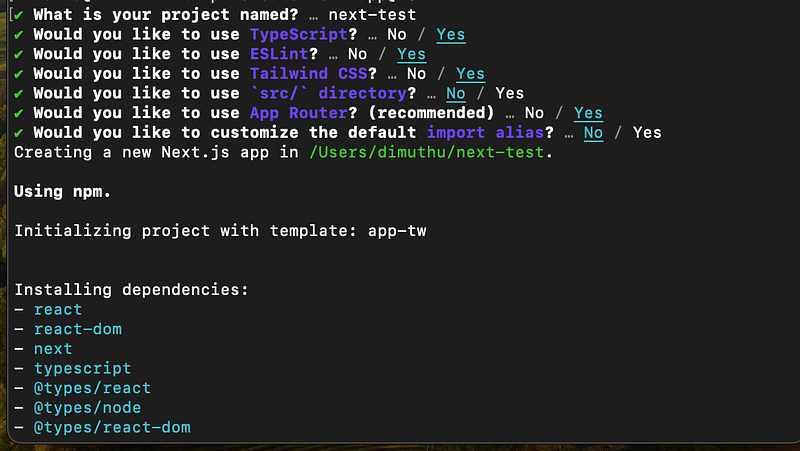
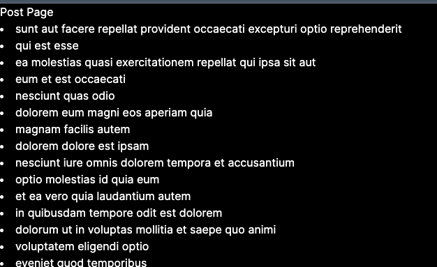

Hi Guys, I have written fair amount of React articles in my medium blog. My transition from Ember JS to React back in the day was so smooth and I enjoyed every sweet feature came with React.

> However, client-side rendering (CSR) presents challenges such as large bundle sizes, resource-intensive operations, SEO issues, and security risks. Server-side rendering (SSR) addresses these challenges by executing React bundles on the server, resulting in faster load times, improved SEO, and enhanced security. SSR also enables the use of content delivery networks (CDNs) to cache pre-rendered pages, further boosting performance and scalability. Overall, SSR complements React by resolving critical performance, SEO, and security concerns in web development.

Now as usual let’s dive in to a basic project. The reason for me to write this tutorial is lot of us lack certain basic knowledge about basic functionalities in a SSR app. Go to a terminal and enter the following command to get started.

```bash
npx create-next-app@13.4
```

Now you will be asked few questions and you will get something like this



Now there will be few configuration files and a folder named app. So this is where we do our code changes. If you go inside this folder, there will be 2 files, `layout.tsx` and `page.tsx` At this point I will be only looking at `page.tsx` Let’s just delete everything in the `page.tsx` and create a very simple component.

```bash
export default function Home() {
  return (
    <main>
      <h1>Hello World</h1>
    </main>
  )
}
```

Now to run the app just run the following command.

```bash
npm run dev
```

Now if I open, [http://localhost:3000](http://localhost:3000) in browser, you would see Hello world.

## Are rendered components always static on client side

Now the main challenge with SSR is, and what you should always remember is, the react components we write here are always generated in server side and we get a static view here. That means no more client side event handling could be done. How `NextJS` overcome this is by `'use client';` keyword (There are other ways as well, but this is the simplest way). Now to check this let’s first add a button in our Home page.

```bash
export default function Home() {
  return (
    <main>
      <h1>Hello World</h1>
      <button onClick={() => alert('You clicked !!!')}>Click Me</button>
    </main>
  )
}
```

Just after you save, you would see both in terminal and browser saying “Error: Event handlers cannot be passed to Client Component props.” Now let’s apply the fix we discuss before.

```typescript
'use client';
export default function Home() {
  return (
    <main>
      <h1>Hello World</h1>
      <button onClick={() => alert('You clicked !!!')}>Click Me</button>
    </main>
  )
}
```

Now you should see app will run without any issues. But you see the whole point of using SSR was to avoid CSR but here we have explicitly tell the app to CSR our Home page. So the best thing is to create a component for the button. Create a folder named components inside app folder and create a folder named ButtonComponent and let’s create a file named Button.tsx

```typescript
'use client';
import React from 'react'

const Button = () => {
  return (
    <button onClick={() => alert('You clicked !!!')}>Click Me</button>
  )
}

export default Button;
```

No we can remove `'use client';` from Home page.

## App Routing

In NextJS, one of the main advantage it use a next js router instead of react-router. So like we usually do in React apps we don’t need to explicitly define the path and config the routing in NextJS. You just create a folder for the page and then create a file named page.tsx there. In our project let’s create a folder named posts and add a file named page.tsx inside.

```typescript
import React from 'react'

const PostPage = () => {
  return (
    <div>
      <h1>Post Page</h1>
    </div>
  )
}

export default PostPage;
```

Now go to the following url and check [http://localhost:3000/posts](http://localhost:3000/posts)


Pretty easy right. Now let’s see how we can access a web api and get some data to show here. (For practical usage testing)

So for this kind of work where we need to test a GET request, we have a website to get dummy data. [https://jsonplaceholder.typicode.com/](https://jsonplaceholder.typicode.com/). So I’m going to use this as the backend endpoint in our scenario.

```typescript
import React from 'react'

export type Post = {
  userId: number,
  id: number,
  title: string,
  body: string
}

const PostPage = async () => {
  const res = await fetch('https://jsonplaceholder.typicode.com/posts');
  const posts: Post[] = await res.json();
  return (
    <div>
      <h1>Post Page</h1>
      {
        posts.map((post) => {
          return <li key={post.id}>{post.title}</li>
        })
      }
    </div>
  )
}

export default PostPage;
```

So basically what I have done is using JS fetch I have called the dummy data and then show it as a list.



Now let’s test something. Let’s show the current time in the Post page.

```typescript
import React from 'react'

export type Post = {
  userId: number,
  id: number,
  title: string,
  body: string
}

const PostPage = async () => {
  const res = await fetch('https://jsonplaceholder.typicode.com/posts');
  const posts: Post[] = await res.json();
  return (
    <div>
      <h1>Post Page</h1>
      <h2>{new Date().toLocaleTimeString()}</h2>
      {
        posts.map((post) => {
          return <li key={post.id}>{post.title}</li>
        })
      }
    </div>
  )
}

export default PostPage;
```

Now if you check the app, you can see for every refresh, time would update.

Now let’s build this and do production deployment.

```bash
npm run build
npm start
```

Now if you access the same Post page, you would see, when you refresh time is not changing. So the reason behind this is when NextJS is run in production mode, it would cache all these data in the page.

Now let’s change the caching policy of the fetch (so that page doesn’t get cached), we can remove caching data in the page.

```typescript
import React from 'react'

export type Post = {
  userId: number,
  id: number,
  title: string,
  body: string
}

const PostPage = async () => {
  const res = await fetch('https://jsonplaceholder.typicode.com/posts', {cache: 'no-cache'});
  const posts: Post[] = await res.json();
  return (
    <div>
      <h1>Post Page</h1>
      <h2>{new Date().toLocaleTimeString()}</h2>
      {
        posts.map((post) => {
          return <li key={post.id}>{post.title}</li>
        })
      }
    </div>
  )
}

export default PostPage;
```

Now you do the same production deployment and if you check you would see time string is changing when refreshing.

So these are few interesting basic thing you can try out in NextJS and understand the whole SSR thing. Hope this would help.

Thanks and Happy Coding :P

## **References**
