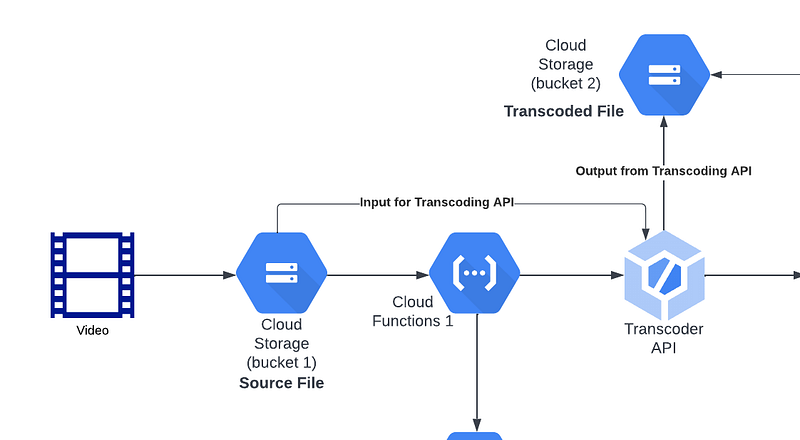

First of all, this article **is not for criticising what Google has done with their encoding platform** but to express **concerns** about a **major issue** I faced while using the product.



To get an understanding about **basics about media encoding**, I invite you guys to read my tutorials on creating a basic encoder.

Now implementing a video encoding pipeline with Google transcoder API is pretty straight forward. Their documentation is pretty good with resources to do this. Still I will show you guys how to encode a video using their product.

First of all there’s no visual aid to view or get an understanding about the Google transcoder. You can use their API manager to send requests and get responses related to encoding. But no dashboard kind of thing provided for more details about encoding jobs, you will have to create your own.

So I created few nodeJS endpoints using google transcoder library and using postman we can do a encoding. One good thing about Google transcoder API when compared to other players in the market is they provide you with a way to create a encoding job template first and then use that for all your videos when encoding. To create the template using nodeJS, I have use this code.

```typescript
async createEncodingJobTemplate(jobTemplateId: string, jobTemplate: any): Promise<any> {
  const request = {
      parent: this.transcoderConfigurations.requestParent,
      jobTemplate,
      jobTemplateId,
    };

    const response = await this.transcoderServiceClient.createJobTemplate(request);
    console.log(response);
    return response;
}
```

For this method you provide job template name as id and the job template as a JSON object. And you need 2 google buckets, one for input and one for output.

Following is a sample JSON.

```json
{
    "templateId": "test-encode-drm-1",
    "jobTemplate": {
        "config": {
            "elementaryStreams": [
                {
                    "key": "video-stream0",
                    "videoStream": {
                        "h264": {
                            "heightPixels": 640,
                            "widthPixels": 360,
                            "bitrateBps": 400000,
                            "frameRate": 15,
                            "pixelFormat": "yuv420p",
                            "crfLevel": 10,
                            "bFrameCount": 3,
                            "profile": "high",
                            "enableTwoPass": true,
                            "preset": "medium"
                        }
                    }
                },
                {
                    "key": "video-stream1",
                    "videoStream": {
                        "h264": {
                            "heightPixels": 720,
                            "widthPixels": 480,
                            "bitrateBps": 400000,
                            "frameRate": 30,
                            "pixelFormat": "yuv420p",
                            "crfLevel": 10,
                            "bFrameCount": 3,
                            "profile": "high",
                            "enableTwoPass": true,
                            "preset": "medium"
                        }
                    }
                },
                {
                    "key": "video-stream2",
                    "videoStream": {
                        "h264": {
                            "heightPixels": 1280,
                            "widthPixels": 720,
                            "bitrateBps": 400000,
                            "frameRate": 30,
                            "pixelFormat": "yuv420p",
                            "crfLevel": 10,
                            "bFrameCount": 3,
                            "profile": "high",
                            "enableTwoPass": true,
                            "preset": "medium"
                        }
                    }
                },
                {
                    "key": "video-stream3",
                    "videoStream": {
                        "h264": {
                            "heightPixels": 1920,
                            "widthPixels": 1080,
                            "bitrateBps": 400000,
                            "frameRate": 30,
                            "pixelFormat": "yuv420p",
                            "crfLevel": 10,
                            "bFrameCount": 3,
                            "profile": "high",
                            "enableTwoPass": true,
                            "preset": "medium"
                        }
                    }
                },
                {
                    "key": "audio-stream0",
                    "audioStream": {
                        "codec": "aac",
                        "bitrateBps": 32000
                    }
                },
                {
                    "key": "audio-stream1",
                    "audioStream": {
                        "codec": "aac",
                        "bitrateBps": 64000
                    }
                }
            ],
            "muxStreams": [
                {
                    "key": "1",
                    "container": "ts",
                    "elementaryStreams": [
                        "video-stream0",
                        "audio-stream0"
                    ],
                    "encryptionId": "fairplay"
                },
                {
                    "key": "2",
                    "container": "ts",
                    "elementaryStreams": [
                        "video-stream1",
                        "audio-stream0"
                    ],
                    "encryptionId": "fairplay"
                },
                {
                    "key": "3",
                    "container": "ts",
                    "elementaryStreams": [
                        "video-stream2",
                        "audio-stream1"
                    ],
                    "encryptionId": "fairplay"
                },
                {
                    "key": "4",
                    "container": "ts",
                    "elementaryStreams": [
                        "video-stream3",
                        "audio-stream1"
                    ],
                    "encryptionId": "fairplay"
                },
                {
                    "key": "video-1",
                    "container": "fmp4",
                    "elementaryStreams": [
                        "video-stream0"
                    ],
                    "encryptionId": "widevine-cenc"
                },
                {
                    "key": "video-2",
                    "container": "fmp4",
                    "elementaryStreams": [
                        "video-stream1"
                    ],
                    "encryptionId": "widevine-cenc"
                },
                {
                    "key": "video-3",
                    "container": "fmp4",
                    "elementaryStreams": [
                        "video-stream2"
                    ],
                    "encryptionId": "widevine-cenc"
                },
                {
                    "key": "video-4",
                    "container": "fmp4",
                    "elementaryStreams": [
                        "video-stream3"
                    ],
                    "encryptionId": "widevine-cenc"
                },
                {
                    "key": "audio-1",
                    "container": "fmp4",
                    "elementaryStreams": [
                        "audio-stream0"
                    ],
                    "encryptionId": "widevine-cenc"
                },
                {
                    "key": "audio-2",
                    "container": "fmp4",
                    "elementaryStreams": [
                        "audio-stream1"
                    ],
                    "encryptionId": "widevine-cenc"
                }
            ],
            "manifests": [
                {
                    "fileName": "manifest.m3u8",
                    "type": "HLS",
                    "muxStreams": [
                        "4",
                        "3",
                        "2",
                        "1"
                    ]
                },
                {
                    "fileName": "manifest.mpd",
                    "type": "DASH",
                    "muxStreams": [
                        "video-4",
                        "video-3",
                        "video-2",
                        "video-1",
                        "audio-2",
                        "audio-1"
                    ]
                }
            ],
            "encryptions": [
              {
                "id": "fairplay",
                "secretManagerKeySource": {
                  "secretVersion": <YOUR_SECRET>
                },
                "drmSystems": {"fairplay": {}},
                "sampleAes": {}
              },
              {
                "id": "widevine-cenc",
                "secretManagerKeySource": {
                  "secretVersion": <YOUR_SECRET>
                },
                "drmSystems": {"widevine": {}},
                "mpegCenc": {
                  "scheme": "cenc"
                }
              }
            ]
        }
    }
}
```

Here inside configs we have to define how our video should be encoded. Using elementaryStreams config we define how the different streams with different resolutions and bitrates should be encoded and then muxStreams are the containers which goes in to different manifests. If you read my tutorials before on encoders, you should know there are 2 main types of encoding for devices HLS for apple eco system and DASH for everything else. Now there is extra config called encryptions which is used to add DRM (Digital right management) information.

Now let’s encode this using nodeJS code

```typescript
private getEncodingJobTemplate(
  inputFile: string, // <OUTPUT BUCKET LOCATION>
  outputFolder: string, // <OUTPUT BUCKET LOCATION>
  jobTemplate: string // JOB TEMPLATE ID
): any {
  return {
    inputUri: <INPUT FILE IN INPUT BUCKET>,
    outputUri: <OUTPUT BUCKET LOCATION>,
    templateId: jobTemplate,
  };
}

async createEncodingJob(inputFile: string, outputFolder: string, jobTemplate: string): Promise<any> {
  try {
    const request = {
      parent: this.transcoderConfigurations.requestParent,
      job: this.getEncodingJobTemplate(inputFile, outputFolder, jobTemplate),
    };

    // Run request
    const [response] = await this.transcoderServiceClient.createJob(request);
    console.log(`Job: ${response.name}`);
    const jobString = response.name;
    const strArr = jobString.split("/");

    if (strArr.length < 6) throw new Error("Response is not correct !!!");

    return {
      jobId: strArr[5],
    };
  } catch (e) {
    console.error(e);
    return "error";
  }
}
```

So Kudos to Google team, everything work perfectly when we configure everything properly.

## **Subtitle support for DASH format isn’t available**

So following is a nodeJS method which can be used for encoding media with subtitles.

```yaml
async createEncodingJobCaption(): Promise<any> {
    console.log(jobTemplate);

    const newTemplate = {
      outputUri: <PATH IN GS BUCKET>,
      config: {
        inputs: [
          {
            key: 'input0',
            uri: <PATH IN GS BUCKET>,
          },
          {
            key: 'subtitle_input_en',
            uri: <PATH IN GS BUCKET>,
          },
          {
            key: 'subtitle_input_fr',
            uri: <PATH IN GS BUCKET>,
          },
        ],
        editList: [
          {
            key: 'atom0',
            inputs: ['input0', 'subtitle_input_en', 'subtitle_input_fr'],
          },
        ],
        elementaryStreams: [
          {
            key: "video-stream0",
            videoStream: {
              h264: {
                heightPixels: 640,
                widthPixels: 360,
                bitrateBps: 400000,
                frameRate: 15,
                pixelFormat: "yuv420p",
                crfLevel: 10,
                bFrameCount: 3,
                profile: "high",
                enableTwoPass: true,
                preset: "medium"
              }
            }
          },
          {
            key: "video-stream1",
            videoStream: {
              h264: {
                heightPixels: 720,
                widthPixels: 480,
                bitrateBps: 400000,
                frameRate: 30,
                pixelFormat: "yuv420p",
                crfLevel: 10,
                bFrameCount: 3,
                profile: "high",
                enableTwoPass: true,
                preset: "medium"
              }
            }
          },
          {
            key: "video-stream2",
            videoStream: {
              h264: {
                heightPixels: 1280,
                widthPixels: 720,
                bitrateBps: 400000,
                frameRate: 30,
                pixelFormat: "yuv420p",
                crfLevel: 10,
                bFrameCount: 3,
                profile: "high",
                enableTwoPass: true,
                preset: "medium"
              }
            }
          },
          {
            key: "video-stream3",
            videoStream: {
              h264: {
                heightPixels: 1920,
                widthPixels: 1080,
                bitrateBps: 400000,
                frameRate: 30,
                pixelFormat: "yuv420p",
                crfLevel: 10,
                bFrameCount: 3,
                profile: "high",
                enableTwoPass: true,
                preset: "medium"
              }
            }
          },
          {
            key: "audio-stream0",
            audioStream: {
              codec: "aac",
              bitrateBps: 32000
            }
          },
          {
            key: "audio-stream1",
            audioStream: {
              codec: "aac",
              bitrateBps: 64000
            }
          },
          {
            key: 'vtt-stream-en',
            textStream: {
              codec: 'webvtt',
              languageCode: 'en-US',
              displayName: 'English',
              mapping: [
                {
                  atomKey: 'atom0',
                  inputKey: 'subtitle_input_en',
                },
              ],
            },
          },
          {
            key: 'vtt-stream-fr',
            textStream: {
              codec: 'webvtt',
              languageCode: 'fr',
              displayName: 'French',
              mapping: [
                {
                  atomKey: 'atom0',
                  inputKey: 'subtitle_input_fr',
                },
              ],
            },
          },
        ],
        muxStreams: [
          {
            key: "1",
            container: "ts",
            elementaryStreams: [
              "video-stream0",
              "audio-stream0"
            ],
          },
          {
            key: "2",
            container: "ts",
            elementaryStreams: [
              "video-stream1",
              "audio-stream0"
            ],
          },
          {
            key: "3",
            container: "ts",
            elementaryStreams: [
              "video-stream2",
              "audio-stream1"
            ],
          },
          {
            key: "4",
            container: "ts",
            elementaryStreams: [
              "video-stream3",
              "audio-stream1"
            ],
          },
          {
            key: "video-1",
            container: "fmp4",
            elementaryStreams: [
              "video-stream0"
            ],
          },
          {
            key: "video-2",
            container: "fmp4",
            elementaryStreams: [
              "video-stream1"
            ],
          },
          {
            key: "video-3",
            container: "fmp4",
            elementaryStreams: [
              "video-stream2"
            ],
          },
          {
            key: "video-4",
            container: "fmp4",
            elementaryStreams: [
              "video-stream3"
            ],
          },
          {
            key: "audio-1",
            container: "fmp4",
            elementaryStreams: [
              "audio-stream0"
            ],
          },
          {
            key: "audio-2",
            container: "fmp4",
            elementaryStreams: [
              "audio-stream1"
            ],
          },
          {
            key: 'text-vtt-en',
            container: 'vtt',
            elementaryStreams: ['vtt-stream-en'],
            segmentSettings: {
              segmentDuration: {
                seconds: 6,
              },
              individualSegments: true,
            },
          },
          {
            key: 'text-vtt-fr',
            container: 'vtt',
            elementaryStreams: ['vtt-stream-fr'],
            segmentSettings: {
              segmentDuration: {
                seconds: 6,
              },
              individualSegments: true,
            },
          },
        ],
        manifests: [
          {
            fileName: "manifest.m3u8",
            type: "HLS",
            muxStreams: [
              "4",
              "3",
              "2",
              "1",
              'text-vtt-en',
              'text-vtt-fr',
            ]
          },
          {
            fileName: "manifest.mpd",
            type: "DASH",
            muxStreams: [
              "video-4",
              "video-3",
              "video-2",
              "video-1",
              "audio-2",
              "audio-1",
            ]
          }
        ]
    }

    try {
      const request = {
        parent: this.transcoderConfigurations.requestParent,
        job: newTemplate,
      };

      // Run request
      const [response] = await this.transcoderServiceClient.createJob(request);
      console.log(`Job: ${response.name}`);
      const jobString = response.name;
      const strArr = jobString.split("/");

      if (strArr.length < 6) throw new Error("Response is not correct !!!");

      return {
        jobId: strArr[5],
      };
    } catch (e) {
      console.error(e);
      return "error";
    }
  }
```

Now here when compared to the previous configuration we have added 2 new elementary streams which are **text streams** and we have 2 new MUX containers called **vtt containers**. The problem is we can add vtt containers inside **HLS manifest** but we can’t add vtt containers inside **DASH manifests**.

So after searching through out the internet, i found nothing on this. Then reached out to Google team and found out they haven’t implemented it yet. So the question is why haven’t they added it to DASH but implemented for HLS (Support for devices in Apple Eco system).

Basically Google chrome support DASH video streams, so did they forget about adding it or was it a technical impossible thing to add it, I don’t understand. Multiple subtitles are not working on their own platform but works in Apple. This is quite frustrating as a user of the product.

Adding multiple subtitles to DASH manifest is not that hard. Infact if FFMPEG is used following is the implementation for multiple subtitles and multiple audio versions. ([https://stackoverflow.com/questions/59494814/adding-multiple-audio-tracks-and-subtitles-to-dash-manifest-mpd-with-ffmpeg](https://stackoverflow.com/questions/59494814/adding-multiple-audio-tracks-and-subtitles-to-dash-manifest-mpd-with-ffmpeg))

```bash
ffmpeg -i video.mkv -an -sn -c:0 libx264 -x264opts 'keyint=24:min-keyint=24:no-scenecut' -b:v 5300k -maxrate 5300k -bufsize 2650k -vf 'scale=-1:1080' tmp/video/video-1080.mp4
ffmpeg -i video.mkv -an -sn -c:0 libx264 -x264opts 'keyint=24:min-keyint=24:no-scenecut' -b:v 2400k -maxrate 2400k -bufsize 1200k -vf 'scale=-1:720' tmp/video/video-720.mp4
ffmpeg -i video.mkv -an -sn -c:0 libx264 -x264opts 'keyint=24:min-keyint=24:no-scenecut' -b:v 600k -maxrate 600k -bufsize 300k -vf 'scale=-1:360' tmp/video/video-360.mp4
ffmpeg -i video.mkv -map 0:1 -ac 2 -ab 192k -vn -sn tmp/audio/audio-it.mp4
ffmpeg -i video.mkv -map 0:2 -ac 2 -ab 192k -vn -sn tmp/audio/audio-en.mp4
ffmpeg -i video.mkv -map 0:3 -vn -an tmp/subtitle/subtitle-it.vtt
ffmpeg -i video.mkv -map 0:4 -vn -an tmp/subtitle/subtitle-en.vtt
```

```css
mp4fragment tmp/video/video-1080.mp4 tmp/video/f-video-1080.mp4
mp4fragment tmp/video/video-720.mp4 tmp/video/f-video-720.mp4
mp4fragment tmp/video/video-360.mp4 tmp/video/f-video-360.mp4
mp4fragment tmp/audio/audio-it.mp4 tmp/audio/f-audio-it.mp4
mp4fragment tmp/audio/audio-en.mp4 tmp/audio/f-audio-en.mp4
```

```bash
mp4dash --mpd-name=manifest.mpd tmp/video/f-video-1080.mp4 tmp/video/f-video-720.mp4 tmp/video/f-video-360.mp4 tmp/audio/f-audio-it.mp4 tmp/audio/f-audio-en.mp4 \[+format=webvtt,+language=it\]tmp/subtitle/subtitle-it.vtt \[+format=webvtt,+language=en\]tmp/subtitle/subtitle-en.vtt
```

So I’m currently waiting for Google team to address this issue as the product is useless unless these critical basic features are implemented from their side.

Thanks Guys !!! Happy coding :P
