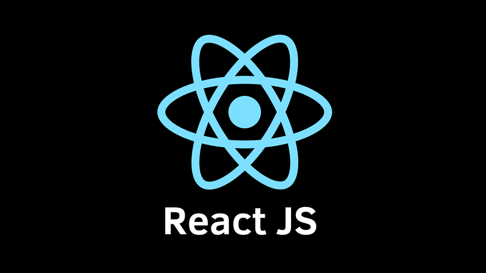

Hi Guys, I recently started a simple project to create a web app for an charity organization. What they does is, They take application from University students who need financial support and then select students to provide scholarships. As the first phase of this application I will be creating a dashboard kind of application for the administrator and the sponsors for this charity organization to see the updates and details about students. For this I will be creating a React Application for the UI and a Node JS application as the back-end. About the database and other back-end related details will be covered in a next tutorial after we started the back-end app.

In my development environment I’m using Node v15.3.0. When working with JS related technologies I advice you guys to use [nvm](https://npm.github.io/installation-setup-docs/installing/using-a-node-version-manager.html) to install Node JS. In this way you an install multiple Node versions in your development environment. So the first step in our React project is to install Node. Using the above nvm link please install Node JS and if there are any issues please leave a comment so I can help you guys.



After installing Node, open a terminal(in windows a command prompt) and run this command.

```bash
npx create-react-app serendib-scholarship-ui --template typescript
```

If you had previous Node versions or previous React applications, there is a possibility that there will be an error telling you to remove global create-react-app installations first. Even after uninstalling if this error still exists please run the following command and then run the above command.

```bash
npx clear-npx-cache
```

Now we have successfully created a basic React App with typescript. Now run the following command to check the application.

```bash
npm start
```

Now you will see the application in your [localhost port 3000](http://localhost:3000/). Now let’s see what we have as files in this initial application.

As the IDE for this application I would recommend VS code. To enable debugging there is an extension in VS code. For chrome browser it’s Debugger for Chrome. [Please install it first](https://create-react-app.dev/docs/setting-up-your-editor). Now create a folder called .vscode and then create a file named launch.json insde of .vscode. Now add the following code to the json file.

```json
{
    "version": "0.2.0",
    "configurations": [
        {
            "name": "Chrome",
            "type": "chrome",
            "request": "launch",
            "url": "http://localhost:3000",
            "webRoot": "${workspaceFolder}/src",
            "sourceMapPathOverrides": {
                "webpack:///src/*": "${webRoot}/*"
            }
        }
    ]
}
```

Now again run the application using npm start and then go to the vscode and press f5. Now you will get a debug option enabled VS code for React.

So I think you got a good idea about creating an React App with Typescript. In the next tutorial we will be discussing creating components and containers related to the app. Happy Coding :)

[Github Link for the App](https://github.com/deBilla/serendib-scholarship-ui).
