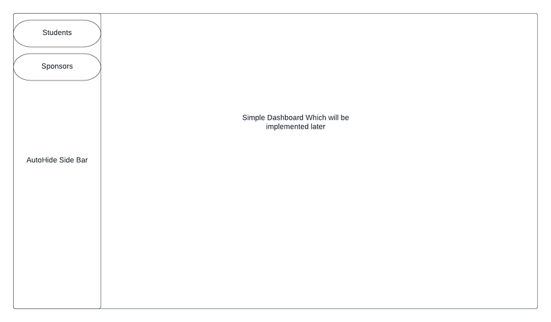
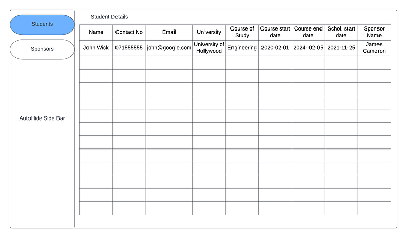
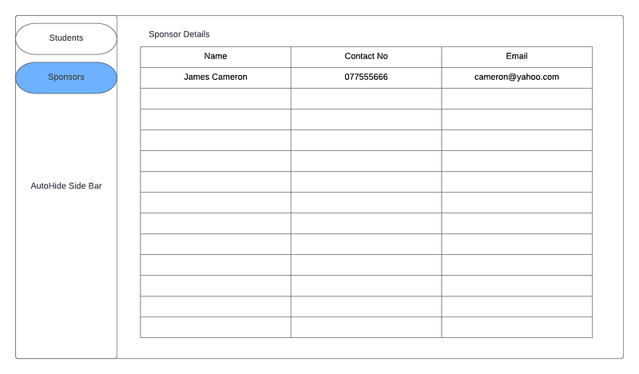
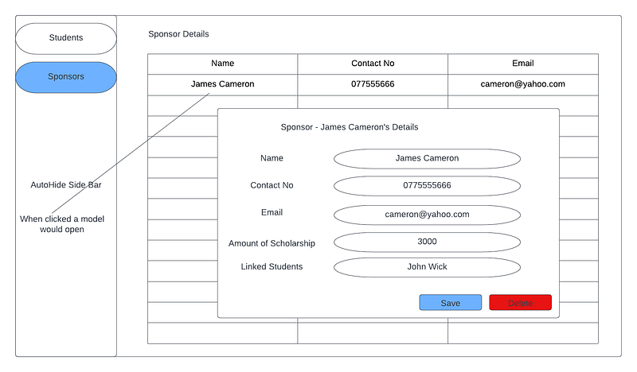

Hi Guys, In the previous tutorial we got to know about how to create a fresh React project with typescript. In this tutorial we are going to implement our requirement in this project.

When creating an UI application with React, one of the main advantage is that we don’t need to use same code in different places. Using components we can reuse code. These components are very much similar to a class we see in OOP. To create a component in React we have to extend React.Component.

Now as the first step let’s go through our requirement again. What we have to do is create an application to manage data of scholarships given to university students. In our requirement stakeholders are Students, Donors and Admin. So each of these users should have 3 different view of the application. This can be done by introducing user roles. Then we have to create UI to handle CRUD operations for Students and Donors. Now we can have two tabs in our Admin dashboard for Students and Donors. Each of these tabs will redirect to a page where we can do CRUD operations.

So now we have several components in our app. We should have a table like component to list Student and Donor data. Then we should have a modal like component to add new Student or Donor. In the table we can have a link to each item to open a popup showing individual data. This could also have edit options. Now we have 6 main components for Students and Donors.

The main purpose of having components was to reuse classes as much as possible. So in this project I will use just 2 components to handle all these above mentioned 6 components. For rendering the UI related to each of those 6 instances we will use another set of classes called containers. All these containers will be then included to the App.tsx file to get the full layout of the application.

Usually in software development companies this UI planning phase is done by mainly business analysts. What they do is, by using the requirements from customer side, they will design wire-frames. These wire-frames are then showed to customers and development team and they come in to a agreement for which extent development team will deliver. For our applications following will be the wire frames. To design these wireframes I’m using a tool called [LucidCharts](https://www.lucidchart.com/pages/).

_Landing Page WireFrame_

_Student Page View_

_Sponsor Page view_

_Modal popup for details_

So looking at these designs we can see for our data-related components we will have to use only 2 components. One for the data table and the other for Modal Popup. Will have to dynamically pass fields to these 2 components. There will be 2 containers for students and sponsors. Then Auto Hide sidebar component and a landing container to include these all.

Now we have an idea about what to do in the next step. Will meet in the next tutorial. Happy Coding !!! :)
