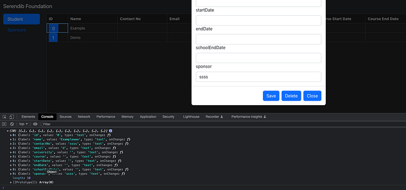

Hi Guys, In our previous tutorial we learnt how to create a form using higher order components.

I was able to create a dynamic form using higher order components. But there was a big issue with what we had done there. If you have tried using it, you would have seen you can’t type anything in the input boxes. The main reason is we haven’t implemented onChange method for input boxes, with proper state management. To be honest I also struggled to come up with a solution ;).

After trying several solutions I came up with a fix for this. If you can remember I had added a state called config in last tutorial. We used this state to set input data coming from table component to modal component. Here when we were initialising configs we never handled the onChange method. So what I did was simply added the index to the onChange method along with event object. So whenever there is a change in one of the input boxes we can detect which box and assign the changed value. Following code would show the changed StudentModalButton.tsx file.

```typescript
import React, { Component } from 'react';
import { Button } from 'react-bootstrap';
import StudentModalComponent from '../StudentModalComponent/StudentModalComponent';

interface StudentModalButtonComponentProps {
    studentId: string,
    detail: any
}

export default class StudentModalButton extends Component<StudentModalButtonComponentProps, { show: boolean, config: any }> {
    constructor(props: StudentModalButtonComponentProps) {
        super(props);

        let config = [];
        let arr = [...Object.entries(this.props.detail)];

        for (let i = 0; i < arr.length; i++ ) {
            let str = arr[i] + '';
            let valArr = str.split(",");

            let obj = {
                label: valArr[0],
                value: valArr[1],
                type: 'text',
                onChange: (e: any) => {
                    this.setConfigState(e.target.value, i);
                }
            }

            config.push(obj);
        }

        this.state = {
            show: false,
            config: config
        };
    }

    setConfigState(value: any, i: any) {
        let arr = [...this.state.config];
        arr[i].value = value;
        this.setState({ config: arr });
    }

    setModalShow(showState: boolean) {
        this.setState({ show: showState });
    }

    saveData() {
        console.log(this.state.config);
    }

    render(): React.ReactNode {
        return <>
            <Button onClick={() => this.setModalShow(true)}>{this.props.studentId}</Button>
            <StudentModalComponent config={this.state.config} show={this.state.show} onHide={() => this.setModalShow(false)} onSave={() => this.saveData()} studentid = {this.props.studentId} />
        </>
    }
}
```

Now we have to update the unit test file StudentModalButton.test.tsx

```typescript
import { render } from "@testing-library/react";
import React from "react";
import { describe, it, expect } from "@jest/globals";
import StudentModalButton from "./StudentModalButton";

const details = [
  { id: 0, name: 'Example', contactNo: '', email: '', university: '', course: '', startDate: '', endDate: '', schoolEndDate: '', sponsor: '' },
  { id: 1, name: 'Demo', contactNo: '', email: '', university: '', course: '', startDate: '', endDate: '', schoolEndDate: '', sponsor: '' }
]

describe("Card", () => {
  it("renders", () => {
    const wrapper = render(<StudentModalButton detail={details} studentId={"1"} />);
    expect(wrapper.container).toMatchSnapshot();
  });
});
```

Now handling the new input values is easy, What more is to save the data in the form. We have a save button but we haven’t implemented anything. So in the above code you can see I have added a new method to handle it (Just console log state of the form).



_Console log form data_

With this I have changed then StudentModalComponent.tsx file.

```typescript
import React, { Component } from 'react';
import { Modal, Button } from 'react-bootstrap';
import { withForm } from "../hoc/withForm";

export type StudentPropType = {
    show: boolean,
    form: any,
    studentid: string,
    config: any,
    onHide(): void,
    onSave(): void
}

class StudentModalComponent extends Component<StudentPropType> {
    constructor(props: StudentPropType) {
        super(props);
    }

    render(): React.ReactNode {
        return <Modal show={this.props.show}>
            <Modal.Header closeButton onClick={this.props.onHide}>
                <Modal.Title id="contained-modal-title-vcenter">
                    Details of Student {this.props.config[1].value}
                </Modal.Title>
            </Modal.Header>
            <Modal.Body>
                {this.props.form}
            </Modal.Body>
            <Modal.Footer>
                <Button onClick={this.props.onSave}>Save</Button>
                <Button onClick={this.props.onHide}>Delete</Button>
                <Button onClick={this.props.onHide}>Close</Button>
            </Modal.Footer>
        </Modal>
    }
}

export default withForm(StudentModalComponent);
```

Now we have to update the unit test file StudentModalComponent.test.tsx

```typescript
import { render } from "@testing-library/react";
import React from "react";
import { describe, it, expect } from "@jest/globals";
import StudentModalComponent from "./StudentModalComponent";

const config = [
  {
    "label": "id",
    "value": "0",
    "type": "text"
  }, 
  {
      "label": "name",
      "value": "Examplewww",
      "type": "text"
  }
]

describe("StudentModalComponent", () => {
  it("renders", () => {
    const wrapper = render(<StudentModalComponent config={config} show={true} studentid={"1"} onHide={jest.fn()} />);
    expect(wrapper.container).toMatchSnapshot();
  });

  it("not renders", () => {
    const wrapper = render(<StudentModalComponent config={config} show={false} studentid={"1"} onHide={jest.fn()} />);
    expect(wrapper.container).toMatchSnapshot();
  });
});
```

As usual everything is in the [Github Link](https://github.com/deBilla/serendib-scholarship-ui). Feel free to ask any question. Happy coding. See you guys in the next tutorial. (Connecting this to a backend). Happy Coding :P
