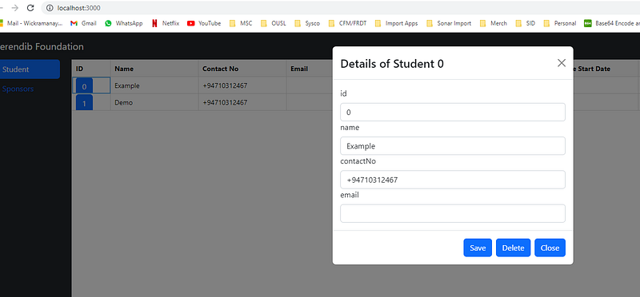

Hi Guys, In our last tutorial we created few components and finally got a working app. But we never implemented details in the popup. To implement this I’m trying a design pattern called higher order component. Here what I’m going to do is I’m creating the Form for the Student details and Sponsor details using a Higher order component and builder class.

## **Higher Order Components**

Before going to the implementations first will try to understand what a higher order component is. HOC is an advanced technique in React for reusing component logic. Basically a higher-order component transforms a component into another component with added functionality or UI features.

In our code base let’s create a folder name hoc to store the withForm higher order component. withForm higher order component will add a form to our passing component. Now before creating the HOC let’s think of a dynamic way to create the Form. For that I will create a function called FormBuilder in the path /src/utils/.

```typescript
import React, { Component } from 'react';
import { Form, Card } from 'react-bootstrap';
type FormBuilderConfigType = "text" | "date";

export type FormBuilderConfig = {
    type: FormBuilderConfigType;
    label: string;
    value: string;
    placeholder: string;
    onChange: (e: any) => VoidFunction;
}

export const FormBuilder = (config: FormBuilderConfig[]) => {
    const form = [];
    for (let val in config) {
        if (config[val].type === "text") {
            form.push(
                React.cloneElement(
                    <Form.Label >{config[val].label}</Form.Label>
                )
            );
            form.push(
                React.cloneElement(
                    <Form.Control />,
                    config[val]
                )
            );
        }
        if (config[val].type === "date") {
            form.push(
                React.cloneElement(
                    <Form.Label >{config[val].label}</Form.Label>
                )
            );
            form.push(
                React.cloneElement(
                    <Form.Control id="passwordHelpBlock" type='date' />,
                    config[val]
                )
            );
        }
    }

    return form;
}
```

Here what we do is we will pass list of fields to be in the form in an array called config and display those details. Editing and state management will be discussed in a future tutorial. Now using this we can create a form in our HOC and pass this newly created elements as a prop in to the StudentModalComponent (Where form is needed). withForm code will be like this.

```typescript
import React from 'react';
import {FormBuilder} from '../utils/FormBuilder';

export const withForm = (ComposedComponent) => class extends React.Component {
    constructor(props) {
        super(props);
    }

    render() {
        return <ComposedComponent {...this.props} form={FormBuilder(this.props.config)} />;
    }
}
```

Now the form prop should be included in the StudentModalComponent. And also we have to change the export class to include HOC. So our code for that will be changed as this.

```typescript
import React, { Component } from 'react';
import { Modal, Button } from 'react-bootstrap';
import { withForm } from "../hoc/withForm";

export type StudentPropType = {
    show: boolean,
    form: any,
    studentid: string,
    config: any,
    onHide(): void
}

class StudentModalComponent extends Component<StudentPropType> {
    constructor(props: StudentPropType) {
        super(props);
    }

    render(): React.ReactNode {
        return <Modal show={this.props.show}>
            <Modal.Header closeButton onClick={this.props.onHide}>
                <Modal.Title id="contained-modal-title-vcenter">
                    Details of Student {this.props.studentid}
                </Modal.Title>
            </Modal.Header>
            <Modal.Body>
                {this.props.form}
            </Modal.Body>
            <Modal.Footer>
                <Button onClick={this.props.onHide}>Save</Button>
                <Button onClick={this.props.onHide}>Delete</Button>
                <Button onClick={this.props.onHide}>Close</Button>
            </Modal.Footer>
        </Modal>
    }
}

export default withForm(StudentModalComponent);
```

Now we should create the cofig needed and send it as a prop to the component. For that I will have to change the StudentModalButton file.

```typescript
import React, { Component } from 'react';
import { Button } from 'react-bootstrap';
import StudentModalComponent from '../StudentModalComponent/StudentModalComponent';

interface StudentModalButtonComponentProps {
    studentId: string,
    detail: any
}

export default class StudentModalButton extends Component<StudentModalButtonComponentProps, { show: boolean, config: any }> {
    constructor(props: StudentModalButtonComponentProps) {
        super(props);

        let config = [];
        let arr = [...Object.entries(this.props.detail)];

        for (let i = 0; i < arr.length; i++ ) {
            let str = arr[i] + '';
            let valArr = str.split(",");

            let obj = {
                label: valArr[0],
                value: valArr[1],
                type: 'text'
            }

            config.push(obj);
        }

        this.state = {
            show: false,
            config: config
        };
    }

    setModalShow(showState: boolean) {
        this.setState({ show: showState });
    }

    render(): React.ReactNode {
        return <>
            <Button onClick={() => this.setModalShow(true)}>{this.props.studentId}</Button>
            <StudentModalComponent config={this.state.config} show={this.state.show} onHide={() => this.setModalShow(false)} studentid = {this.props.studentId} />
        </>
    }
}
```

Now when we run the application and click on a button in a row we will get something like this.



We have successfully used HOC in our code. If you have any questions related to this please comment. Happy coding see you in the next tutorial :)
