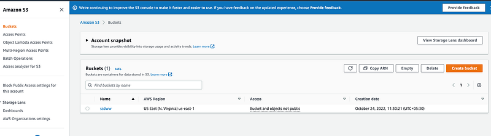
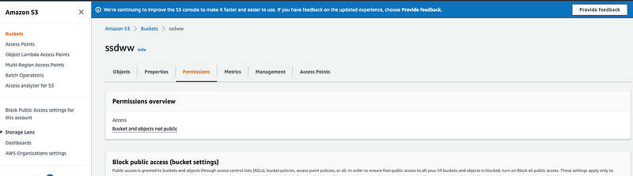
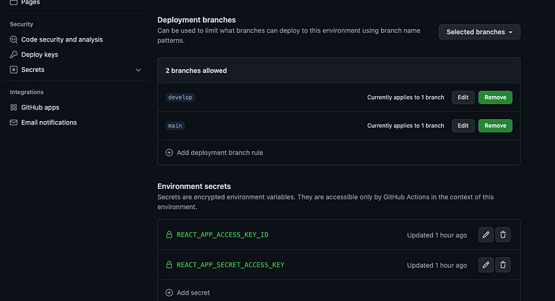

Hey Guys, Before moving further in our charity project, I thought of implementing s3 file upload directly from front end. What we have done up to now can be referred from here.

**Front end React series**

**Backend AWS Lambda NodeJS series**

As the first step let’s add an input to upload files. I will add it to the Footer of the modal component. My StudentModalComponent.tsx file will change like this.

```typescript
import React, { Component } from 'react';
import { Modal, Button, Form } from 'react-bootstrap';
import { withForm } from "../hoc/withForm";

export type StudentPropType = {
    show: boolean,
    form: any,
    studentid: string,
    config: any,
    onHide(): void,
    onSave(): void,
    handleFileUpload(file: any): void
}

class StudentModalComponent extends Component<StudentPropType> {
    constructor(props: StudentPropType) {
        super(props);
    }

    handleFileUpload(e: any) {
        this.props.handleFileUpload(e.target.files[0])
    }

    render(): React.ReactNode {
        return <Modal show={this.props.show}>
            <Modal.Header closeButton onClick={this.props.onHide}>
                <Modal.Title id="contained-modal-title-vcenter">
                    Details of Student {this.props.config[1].value}
                </Modal.Title>
            </Modal.Header>
            <Modal.Body>
                {this.props.form}
            </Modal.Body>
            <Modal.Footer>
                <div style={{display: 'flex', width: '100%', justifyContent: 'center'}}>
                    <Form.Group controlId="formFile" className="mb-3" onChange={(e) => this.handleFileUpload(e)}>
                        <Form.Control type="file" />
                    </Form.Group>
                </div>
                <div style={{display: 'flex', width: '45%', justifyContent: 'space-between'}}>
                    <Button onClick={this.props.onSave}>Save</Button>
                    <Button onClick={this.props.onHide}>Delete</Button>
                    <Button onClick={this.props.onHide}>Close</Button>
                </div>
            </Modal.Footer>
        </Modal>
    }
}

export default withForm(StudentModalComponent);
```

Here when dividing Footer section in to different sections I have used CSS flex. It’s way easy than using bootstrap rows and columns. For the onChange event of the file upload input section, I’m calling **handleFileUpload **method. It call another method which is passed from the props. Now I will go to the StudentModalButton.tsx file to do the rest of the implementation. If you can remember I have used higher order components and made the form fully dynamic. Now to show the files which are added to the Student I should change the input box for that. After that I will call the handleFileUpload method as a prop to the StudentModalComponent and I will implement that method here. When implementing the file uploading functionality, we have to have the @aws-sdk/client-s3 and to take a pre signed URL in downloading handler we need @aws-sdk/s3-request-presigner. Following is the updated package.json.

```json
{
  "name": "serendib-ui",
  "version": "0.1.0",
  "private": true,
  "homepage": "https://debilla.github.io/serendib-scholarship-ui",
  "dependencies": {
    "@testing-library/jest-dom": "^5.16.4",
    "@testing-library/react": "^13.1.1",
    "@testing-library/user-event": "^13.5.0",
    "@types/jest": "^27.4.1",
    "@types/node": "^16.11.31",
    "@types/react": "^18.0.8",
    "@types/react-dom": "^18.0.0",
    "bootstrap": "^5.1.3",
    "react": "^18.1.0",
    "react-bootstrap": "^2.3.1",
    "react-data-grid": "7.0.0-beta.15",
    "react-dom": "^18.1.0",
    "react-scripts": "5.0.1",
    "typescript": "^4.6.3",
    "web-vitals": "^2.1.4",
    "@aws-sdk/client-s3": "3.194.0",
    "@aws-sdk/s3-request-presigner": "3.194.0"
  },
  "scripts": {
    "start": "react-scripts start",
    "build": "react-scripts build",
    "test": "react-scripts test",
    "eject": "react-scripts eject"
  },
  "eslintConfig": {
    "extends": [
      "react-app",
      "react-app/jest"
    ]
  },
  "browserslist": {
    "production": [
      ">0.2%",
      "not dead",
      "not op_mini all"
    ],
    "development": [
      "last 1 chrome version",
      "last 1 firefox version",
      "last 1 safari version"
    ]
  }
}
```

Now we have to connect to the AWS account from our react app. For this when we create the S3 client, we have to pass the login tokens for the AWS account. If you don’t know how to get these values refer the following article. I have bold out the steps.

Now before doing any code changes let’s create a bucket in S3. For this go to your AWS console and search for S3 and go there. There is a button called create bucker. Click on that and just create it with default configs.



_S3 Buckets_

But this bucket will not be accessible from your local environment therefore, Go to the created bucket and there is a section called permissions.



_S3 bucket permission_

Go to permissions and when you scroll down you will see a section Cross-origin resource sharing (CORS). Click on the edit button there and paste the following.

```json
[
    {
        "AllowedHeaders": [
            "*"
        ],
        "AllowedMethods": [
            "PUT",
            "POST",
            "DELETE"
        ],
        "AllowedOrigins": [
            "*"
        ],
        "ExposeHeaders": [
            "x-amz-server-side-encryption",
            "x-amz-request-id",
            "x-amz-id-2"
        ],
        "MaxAgeSeconds": 3000
    }
]
```

Ok 👌 Now our S3 bucket is ready to receive files. Let’s just go to the React code and implement it.

```
const REGION = "us-east-1";
const s3Client = new S3Client({ region: REGION, credentials: {accessKeyId: '<YOUR KEY>', secretAccessKey: '<YOUR SECRET>'} });
```

In Handle upload method what we do is, Inside the try catch block I’m uploading the file and after uploading I’m setting the state with updated file.

```
async handleFileUpload(file: any) {
    const bucketParams = {
        Bucket: "<YOUR BUCKET NAME>",
        Key: file['name'],
        Body: file,
    };

    try {
        const data = await s3Client.send(new PutObjectCommand(bucketParams));
        console.log(data);
        
        let fileArr = this.state.config[this.state.config.length - 1].array;
        fileArr.push(file['name']);
        this.setConfigState(fileArr, this.state.config.length - 1);
    } catch(e) {
        throw e;
    }
}
```

Now or file is uploaded to the S3 bucket, you can view this by going to the S3 in AWS console. Next thing is downloading the uploaded file. For this I’m going to pass the name of the file and then create pre signed URL for the file. Then I’m opening this link in another tab which will download it. Pre designed URLs are nothing magical, It’s an URL with public access for a defined time.

```
async downloadFile(fileName: any) {
    const bucketParams = {
        Bucket: "ssdww",
        Key: fileName,
        Body: "BODY"
    };

    try {
        const command = new GetObjectCommand(bucketParams);
        const signedUrl = await getSignedUrl(s3Client, command, {
            expiresIn: 3600,
        });

        window.open(signedUrl)
    } catch(e) {
        throw e;
    }
}
```

Now let’s look at the full code. There are numerous changes done to this StudentModalButton.txs file to accomodate new S3 integration.

```typescript
import React, { Component } from 'react';
import { Button } from 'react-bootstrap';
import StudentModalComponent from '../StudentModalComponent/StudentModalComponent';
import { S3Client, PutObjectCommand, GetObjectCommand } from "@aws-sdk/client-s3";
import { getSignedUrl } from "@aws-sdk/s3-request-presigner";

const REGION = "us-east-1";
const s3Client = new S3Client({ region: REGION, credentials: {accessKeyId: '', secretAccessKey: ''} });

interface StudentModalButtonComponentProps {
    studentId: string,
    detail: any
}

export default class StudentModalButton extends Component<StudentModalButtonComponentProps, { show: boolean, config: any }> {
    constructor(props: StudentModalButtonComponentProps) {
        super(props);

        let config = [];
        let arr = [...Object.keys(this.props.detail)];

        for (let i = 0; i < arr.length; i++ ) {
            let label = arr[i];
            let value = this.props.detail[arr[i]];
            let obj;

            if (label === 'files') {
                obj = {
                    label: label,
                    array: value,
                    type: 'file',
                    onChange: (e: any) => {
                        this.downloadFile(e.target.innerText);
                    }
                }
            } else {
                obj = {
                    label: label,
                    value: value,
                    type: 'text',
                    onChange: (e: any) => {
                        this.setConfigState(e.target.value, i);
                    }
                }
            }

            config.push(obj);
        }

        this.state = {
            show: false,
            config: config
        };
    }

    async downloadFile(fileName: any) {
        const bucketParams = {
            Bucket: "ssdww",
            Key: fileName,
            Body: "BODY"
        };

        try {
            const command = new GetObjectCommand(bucketParams);
            const signedUrl = await getSignedUrl(s3Client, command, {
                expiresIn: 3600,
            });

            window.open(signedUrl)
        } catch(e) {
            throw e;
        }
    }

    setConfigState(value: any, i: any) {
        let arr = [...this.state.config];
        arr[i].value = value;
        this.setState({ config: arr });
    }

    setModalShow(showState: boolean) {
        this.setState({ show: showState });
    }

    saveData() {
        console.log(this.state.config);
    }

    async handleFileUpload(file: any) {
        const bucketParams = {
            Bucket: "ssdww",
            Key: file['name'],
            Body: file,
        };

        try {
            const data = await s3Client.send(new PutObjectCommand(bucketParams));
            console.log(data);

            let fileArr = this.state.config[this.state.config.length - 1].array;
            fileArr.push(file['name']);
            this.setConfigState(fileArr, this.state.config.length - 1);
        } catch(e) {
            throw e;
        }
    }

    render(): React.ReactNode {
        return <>
            <Button onClick={() => this.setModalShow(true)}>{this.props.studentId}</Button>
            <StudentModalComponent config={this.state.config} show={this.state.show} handleFileUpload={(file: any) => this.handleFileUpload(file)} onHide={() => this.setModalShow(false)} onSave={() => this.saveData()} studentid = {this.props.studentId} />
        </>
    }
}
```

With this I had to change the StudentTableComponent which is the primary source of data right now (We haven’t integrated with the backend yet).

```typescript
import { render } from '@testing-library/react';
import React from 'react';
import DataTableComponent from '../../components/DataTableComponent/DataTableComponent';
import StudentModalButton from '../../components/StudentModalButton/StudentModalButton';

const columns = [
    {
        key: 'id', name: 'ID', width: 10,
        formatter(props: any) {
            return (
                <>
                    <StudentModalButton detail={props.row} studentId={props.row.id} />
                </>
            );
        },
    },
    { key: 'name', name: 'Name' },
    { key: 'contactNo', name: 'Contact No' },
    { key: 'email', name: 'Email' },
    { key: 'university', name: 'Univeristy' },
    { key: 'course', name: 'Course of Study' },
    { key: 'startDate', name: 'Course Start Date' },
    { key: 'endDate', name: 'Course End Date' },
    { key: 'schoolEndDate', name: 'Schol. start Date' },
    { key: 'sponsor', name: 'Sponsor Name' }
];

const rows = [
    { id: 0, name: 'Example', contactNo: '', email: '', university: '', course: '', startDate: '', endDate: '', schoolEndDate: '', sponsor: '', files: [] },
    { id: 1, name: 'Demo', contactNo: '', email: '', university: '', course: '', startDate: '', endDate: '', schoolEndDate: '', sponsor: '', files: [] }
];

export default function StudentTableContainer() {
    return (<DataTableComponent columns={columns} rows={rows} />);
}
```

That’s all for the S3 upload and download. Next step is handling this file uploading event from the backend. What my plan is, to capture the S3 file uploaded event from Lambda function and update the DynamoDB accordingly. Till we implement that Happy Coding !!!

UI Repo: [https://github.com/deBilla/serendib-scholarship-ui](https://github.com/deBilla/serendib-scholarship-ui)

Backend Repo: [https://github.com/deBilla/serendib-scholarship-ws](https://github.com/deBilla/serendib-scholarship-ws)

## **Bonus Section**

So guys, this is the Github deployment Guide. If you guys go back and look at our previous tutorials, you might get a more understanding about what we have done so far. In this section I’m going to teach you how to retrieve secrets from Github Environments when doing the deployment from Github actions. We have to do few code changes to support this.

```
const REGION = "us-east-1";
const s3Client = new S3Client({ region: REGION, credentials: {accessKeyId: process.env.REACT_APP_ACCESS_KEY_ID as string, secretAccessKey: process.env.REACT_APP_SECRET_ACCESS_KEY as string} });
```

Now let’s add the secret keys in Github. Go to the Github settings and you will find a section called environments there. Go to environments and add secrets like this.



Then we have to change the our build pipeline file, page_build.yml.

```
name: React Build

on:
  pull_request:
    branches: [ "main" ]
    
env:
  CI: false

jobs:
  build:
    runs-on: ubuntu-latest
    environment:
      name: github-pages
      url: ${{ steps.deployment.outputs.page_url }}
    permissions:
      contents: 'read'
      id-token: 'write'
      pages: 'write'
      actions: 'write'
      checks: 'write'
      deployments: 'write'
    strategy:
      matrix:
        node-version: [18.x]
    env:
      REACT_APP_ACCESS_KEY_ID: ${{ secrets.REACT_APP_ACCESS_KEY_ID }}
      REACT_APP_SECRET_ACCESS_KEY: ${{ secrets.REACT_APP_SECRET_ACCESS_KEY }}
    
    steps:
    - uses: actions/checkout@v3

    - name: Use Node.js ${{ matrix.node-version }}
      uses: actions/setup-node@v3
      with:
        node-version: ${{ matrix.node-version }}

    - name: Build
      run: |
        npm install
        npm run build
        
    - name: Setup Pages
      uses: actions/configure-pages@v2
    - name: Upload artifact
      uses: actions/upload-pages-artifact@v1
      with:
        # Upload entire repository
        path: 'build/'
    - name: Deploy to GitHub Pages
      id: deployment
      uses: actions/deploy-pages@v1
      env:  
        GITHUB_TOKEN: ${{ secrets.GITHUB_TOKEN }}
```

Now when you create a pull request from an another branch to main branch this will trigger and you will get a working application which save files to your S3 bucket.
