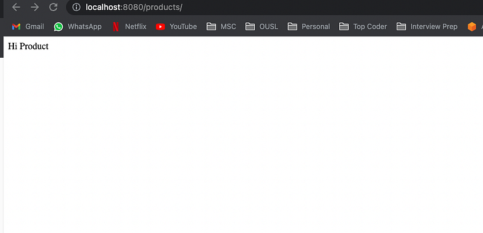

Hi Guys, before moving to this section go see what we did in the last tutorial.

In this tutorial let’s look at the API Gateway service implementation. So as you might recall, our micro-services run on different ports (May be different IPs in real world scenarios). So routing requests to the correct service is an important task. Here in our app we are using **Spring Cloud Gateway.** **Spring Cloud Gateway** is a popular choice for **micro-services** based architectures as it provides a single entry point for external clients to access the various **micro-services** in your system. Following are some key features of this.

- Dynamic routing
- Service discovery integration (e.g. with Eureka)
- Load balancing
- Circuit breaker integration
- Request rate limiting
- Path rewriting and filtering

So let’s start changing the code in API Gateway service. First thing is to add the dependency. For this we will have to change the build.gradle file.

```bash
plugins {
    id 'java'
    id 'org.springframework.boot' version '2.6.3'
    id 'io.spring.dependency-management' version '1.0.11.RELEASE'
}

group 'org.code.billa'
version '1.0-SNAPSHOT'

repositories {
    mavenCentral()
}

dependencies {
    implementation 'org.springframework.cloud:spring-cloud-starter-gateway:3.1.5'
    implementation 'org.springframework.cloud:spring-cloud-starter-netflix-eureka-client:3.1.5'
    testImplementation 'org.junit.jupiter:junit-jupiter-api:5.8.1'
    testRuntimeOnly 'org.junit.jupiter:junit-jupiter-engine:5.8.1'
}

test {
    useJUnitPlatform()
}
```

Now you should see we have remove following 2 lines from previous version.

```bash
implementation 'org.springframework.boot:spring-boot-starter:2.6.3'
implementation 'org.springframework.boot:spring-boot-starter-web:2.6.3'
```

We did this because spring-cloud-starter-gateway and boot-starter have overlapping dependencies. So keep in mind about that.

Now the code for the Application file, APIGatewayApp.java

```typescript
package org.code.billa;

import org.springframework.boot.SpringApplication;
import org.springframework.boot.autoconfigure.SpringBootApplication;
import org.springframework.cloud.client.discovery.EnableDiscoveryClient;
import org.springframework.cloud.gateway.route.RouteLocator;
import org.springframework.cloud.gateway.route.builder.RouteLocatorBuilder;
import org.springframework.context.annotation.Bean;

@SpringBootApplication
@EnableDiscoveryClient
public class APIGatewayApp {
    public static void main(String[] args) {
        SpringApplication.run(APIGatewayApp.class, args);
    }

    @Bean
    public RouteLocator gatewayRoutes(RouteLocatorBuilder builder) {
        return builder.routes()
                .route(r -> r.path("/products/**")
                        .uri("lb://product-service"))
                .route(r -> r.path("/carts/**")
                        .uri("lb://cart-service"))
                .route(r -> r.path("/orders/**")
                        .uri("lb://order-service"))
                .build();
    }
}
```

Ok, as the first thing we removed previous controllers from here. Then have a look at the code in APIGatewayApp class. In gatewayRoutes function what we do is we get the request and map it with the respective micro-service and create the internal API call. For this to happen we have to add following lines to application.properties file.

```bash
# Spring Cloud Gateway Configuration
spring.cloud.gateway.discovery.locator.enabled=true
spring.cloud.gateway.routes[0].id=product-service
spring.cloud.gateway.routes[0].uri=lb://product-service
spring.cloud.gateway.routes[0].predicates[0]=Path=/products/**
spring.cloud.gateway.routes[1].id=cart-service
spring.cloud.gateway.routes[1].uri=lb://cart-service
spring.cloud.gateway.routes[1].predicates[0]=Path=/carts/**
spring.cloud.gateway.routes[2].id=order-service
spring.cloud.gateway.routes[2].uri=lb://order-service
spring.cloud.gateway.routes[2].predicates[0]=Path=/orders/**
```

Now let’s test this with product-service. Before testing this let’s add a controller to product-service micro service. Create a folder named controllers in src/java/org/billa. Add a file called ProductController

```
package org.billa.controllers;

import org.springframework.web.bind.annotation.GetMapping;
import org.springframework.web.bind.annotation.RequestMapping;
import org.springframework.web.bind.annotation.RestController;

@RestController
@RequestMapping("/products")
public class ProductController {
    @GetMapping("/")
    public String getAllProducts() {
        return "Hi Product";
    }
}
```

Now run this service and check Eureka whether its running or not. This is taught in previous article. Now let’s click on the following link

[http://localhost:8080/products/](http://localhost:8080/products/)

So if everything is working correctly you should see a response like this.



So what happen is although product service is running in port 8083, Using Eureka client and Cloud gateway we route the request from port 8080 to these different ports according to the service required. Pretty cool right. Try to do this to the rest of the services too.

Github Link: [https://github.com/deBilla/e-commerce-ws](https://github.com/deBilla/e-commerce-ws)

Happy Coding ;)

We have a lot to do in this series, STAY TUNED !!!!!!!!!!!!!!!!!!
