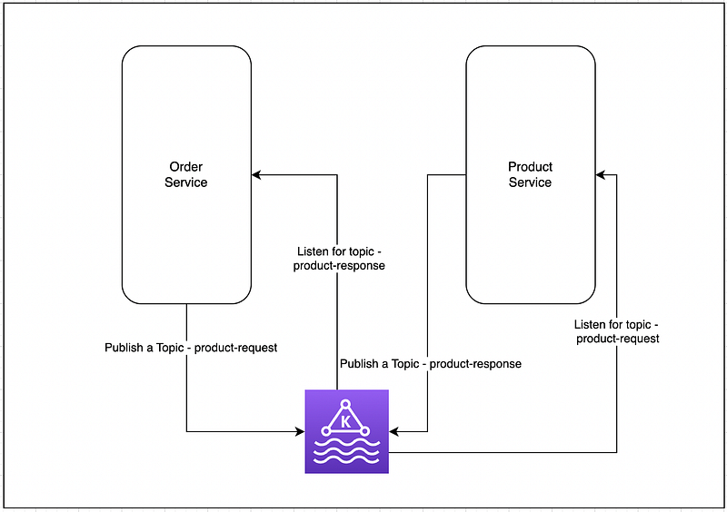

Hi Guys, If you go to the following link you would see what we have been doing up to now in this project.

Whenever we decouple things, there is the problem of communication. As we have used micro-service architecture for our project, I like to things decoupled as much as possible. We used different database instances for each of the micro-services and now when we query data we need to join data in some scenarios.

So in this tutorial I will use Apache Kafka to get product data for my order service. I will keep this simple as possible. Recently I did a project with spring boot, if you need more details go and check.

Let’s start with a little diagram of what we are going to do.



So what we are going to do is we run a Kafka server and whenever order service is called from the front end applications, we are going to get order details and product details related to this. For the learning simplicity I will just get the JSON and attached it with the response object.

First step is to add Apache Kafka dependencies for both of the services. Now after the change build.gradle file would look like this. This will be same for both applications.

```bash
plugins {
    id 'java'
    id 'org.springframework.boot' version '2.6.3'
    id 'io.spring.dependency-management' version '1.0.11.RELEASE'
}

group 'org.code.billa'
version '1.0-SNAPSHOT'

repositories {
    mavenCentral()
}

dependencies {
    implementation 'org.springframework.boot:spring-boot-starter:2.6.3'
    implementation 'org.springframework.boot:spring-boot-starter-web:2.6.3'
    implementation 'org.springframework.cloud:spring-cloud-starter-netflix-eureka-client:3.1.5'
    implementation 'org.springframework.boot:spring-boot-starter-data-jpa:2.1.5.RELEASE'
    implementation 'org.postgresql:postgresql:42.5.4'
    implementation 'org.springframework.kafka:spring-kafka:2.8.0'
    testImplementation 'org.junit.jupiter:junit-jupiter-api:5.8.1'
    testRuntimeOnly 'org.junit.jupiter:junit-jupiter-engine:5.8.1'
}

test {
    useJUnitPlatform()
}
```

Next thing is creating the product request. So I will change the OrderService.java file for this. What we are doing here is using `kafkaTemplate.send("product-details-request", "1")` we send product id to the kafka topic `product-details-request` and this will be consumed by product service and after its consumed it will take this id and get the data for this id from product database and send back the result to `product-detail-response` and this will be consumed from order-service.

Now there is a problem when we use this. Whenever a request come there will be a publish to product service and back. So the process is not synchronous. Fortunately in java we have this CompletableFuture class. `CompletableFuture` is a class in Java that represents a future result of an asynchronous computation. It is part of the `java.util.concurrent` package, which provides a framework for concurrent and parallel programming in Java.

Here we send the message to Kafka topic and then waits for the `future` object to be completed with a `String` value using the `get()` method with a timeout of 10 seconds. Kafka consumer, when receive the result, it mark future as completed. If the `future` object is not completed within the timeout period, a `TimeoutException` will be thrown.

```typescript
package org.billa.services;

import org.billa.components.OrderDetails;
import org.billa.entities.Order;
import org.billa.repositories.OrderRepository;
import org.springframework.beans.factory.annotation.Autowired;
import org.springframework.kafka.annotation.KafkaListener;
import org.springframework.kafka.core.KafkaTemplate;
import org.springframework.stereotype.Service;

import java.util.List;
import java.util.concurrent.CompletableFuture;
import java.util.concurrent.TimeUnit;

@Service
public class OrderService {
    @Autowired
    private OrderRepository orderRepository;

    @Autowired
    private KafkaTemplate<String, String> kafkaTemplate;

    CompletableFuture<String> future = new CompletableFuture<>();

    public List<OrderDetails> getAllOrders() {
        try {
            kafkaTemplate.send("product-details-request", "1");
            String js = future.get(10, TimeUnit.SECONDS);
            return orderRepository.findAll().stream().map(s -> new OrderDetails(s, js)).toList();
        } catch (Exception e) {
            return null;
        }
    }

    public Order getOrderById(Long id) {
        return orderRepository.findById(id).orElse(null);
    }

    public Order createOrder(Order order) {
        return orderRepository.save(order);
    }

    public Order updateOrder(Long id, Order order) {
        Order existingOrder = getOrderById(id);
        if (existingOrder == null) {
            return null;
        }
        existingOrder.setOrderDate(order.getOrderDate());
        existingOrder.setOrderStatus(order.getOrderStatus());
        existingOrder.setItems(order.getItems());
        return orderRepository.save(existingOrder);
    }

    public void deleteOrder(Long id) {
        orderRepository.deleteById(id);
    }

    @KafkaListener(topics = "product-details-response", groupId = "group-3")
    public void receiveProductDetailsResponse(String json) {
        future.complete(json);
        System.out.println("json = " + json);
    }
}
```

Code for price-service is as follows, I’m not going to describe this as it’s pretty straight forward. Let me know in comments if you have doubts.

```
package org.billa.services;

import com.fasterxml.jackson.core.JsonProcessingException;
import com.fasterxml.jackson.databind.ObjectMapper;
import org.billa.entities.Product;
import org.billa.repositories.ProductRepository;
import org.springframework.beans.factory.annotation.Autowired;
import org.springframework.kafka.annotation.KafkaListener;
import org.springframework.kafka.core.KafkaTemplate;
import org.springframework.stereotype.Service;

import java.util.List;

@Service
public class ProductService {
    @Autowired
    private ProductRepository productRepository;

    @Autowired
    private KafkaTemplate<String, String> kafkaTemplate;

    public List<Product> getAllProducts() {
        return productRepository.findAll();
    }

    public Product getProductById(Long id) {
        return productRepository.findById(id).orElse(null);
    }

    public Product createProduct(Product product) {
        return productRepository.save(product);
    }

    public Product updateProduct(Long id, Product product) {
        Product existingProduct = getProductById(id);
        if (existingProduct == null) {
            return null;
        }
        existingProduct.setName(product.getName());
        existingProduct.setDescription(product.getDescription());
        existingProduct.setPrice(product.getPrice());
        existingProduct.setCategory(product.getCategory());
        existingProduct.setUpdatedAt(product.getUpdatedAt());
        existingProduct.setCreatedAt(product.getCreatedAt());
        existingProduct.setImageUrl(product.getImageUrl());
        existingProduct.setStockQuantity(product.getStockQuantity());
        return productRepository.save(existingProduct);
    }

    public void deleteProduct(Long id) {
        productRepository.deleteById(id);
    }

    @KafkaListener(topics = "product-details-request", groupId = "group-3")
    public void receiveProductDetailsRequest(Long productId) throws JsonProcessingException {
        // Retrieve the product details from the database using JPA or Hibernate
        Product product = this.getProductById(productId);
        ObjectMapper objectMapper = new ObjectMapper();
        String json = objectMapper.writeValueAsString(product);

        // Send the product details back to the order service using Kafka
        kafkaTemplate.send("product-details-response", json);
    }
}
```

In our last tutorial I told you to create CRUD for each service similar to one we did. So accordingly we have an entity called Order for this. But concatenating product details require to create a new class. So I’ve created a class called OrderDetails for this.

```
package org.billa.components;

import org.billa.entities.Order;

public record OrderDetails (Order order, String productName){}
```

So here you can see I’m not using “class” to identify this. This is one of the new features in Java 17. You can just create a class with a constructor and getters setters with this.

Great !!!, now if you run these services and make a request to [http://localhost:8080/orders](http://localhost:8080/orders) you should get Order object with another JSON string named productName.

That’s all for this tutorial, In the next tutorail let’s check how we can scale this application further. What are the best practices and all.

Happy Coding ;)

Github Link: [https://github.com/deBilla/e-commerce-ws](https://github.com/deBilla/e-commerce-ws)
