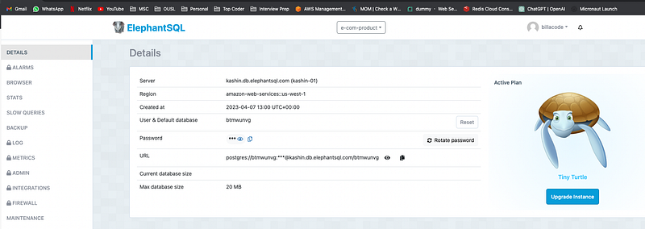
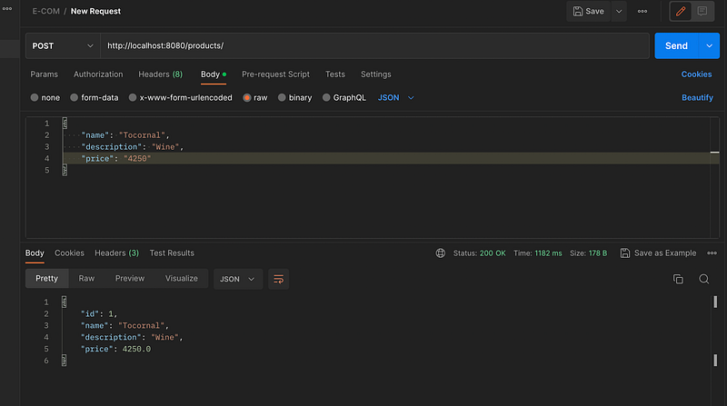

Hi Guys, This is the third article related to the scalable E-Commerce web service we are creating. In the previous article we successfully used Spring Cloud Gateway to handle incoming request and map them to other services.

In this tutorial we will implement Product service by connecting it to a PostgreSQL database and implement all the CRUD operations. As the first step I’m going to create a free PostgreSQL database instance in a free server (You don’t need to enter your credit card details to get the free one here). For this I’m using [ElephantSQL](https://api.elephantsql.com/console/).



Here you have the database URL which is going to be useful for our future implementation. Now remember database size is 20mb. So this will not enough for you for production purposes.

Let’s start working on the implementation as usual by adding dependencies. New build.gradle file would look like this.

```bash
plugins {
    id 'java'
    id 'org.springframework.boot' version '2.6.3'
    id 'io.spring.dependency-management' version '1.0.11.RELEASE'
}

group 'org.code.billa'
version '1.0-SNAPSHOT'

repositories {
    mavenCentral()
}

dependencies {
    implementation 'org.springframework.boot:spring-boot-starter:2.6.3'
    implementation 'org.springframework.boot:spring-boot-starter-web:2.6.3'
    implementation 'org.springframework.cloud:spring-cloud-starter-netflix-eureka-client:3.1.5'
    implementation 'org.springframework.boot:spring-boot-starter-data-jpa:2.1.5.RELEASE'
    implementation 'org.postgresql:postgresql:42.5.4'
    testImplementation 'org.junit.jupiter:junit-jupiter-api:5.8.1'
    testRuntimeOnly 'org.junit.jupiter:junit-jupiter-engine:5.8.1'
}

test {
    useJUnitPlatform()
}
```

Keep in mind if you include the `spring-boot-starter-data-jpa` dependency in your project, it will include Hibernate as the default JPA implementation and provide auto-configuration support for Hibernate and JPA. We have to edit the application.properties file to include details about data source.

```
server.port=8083
spring.application.name=product-service
eureka.client.service-url.default-zone=http://localhost:8761/eureka/

spring.datasource.driver-class-name=org.postgresql.Driver
spring.datasource.url=jdbc:postgresql://kashin.db.elephantsql.com/<database>?user=<user>&password=<password>
spring.jpa.hibernate.ddl-auto=update
spring.jpa.properties.hibernate.dialect=org.hibernate.dialect.PostgreSQLDialect
```

All right, let’s create the Entity file for Product. In JPA (Java Persistence API), an entity represents a persistent data object that can be stored and retrieved from a relational database. When you define an entity class in JPA, it will be mapped to a database table through annotations or XML configuration.

To map an entity class to a database table using annotations, you can use the `@Entity` annotation to mark the class as an entity and the `@Table` annotation to specify the table name and other details.

```typescript
package org.billa.entities;

import javax.persistence.*;

@Entity
@Table(name = "products")
public class Product {
    @Id
    @GeneratedValue(strategy = GenerationType.IDENTITY)
    private Long id;

    private String name;

    private String description;

    private double price;

    public String getName() {
        return name;
    }

    public void setName(String name) {
        this.name = name;
    }

    public String getDescription() {
        return description;
    }

    public void setDescription(String description) {
        this.description = description;
    }

    public double getPrice() {
        return price;
    }

    public void setPrice(double price) {
        this.price = price;
    }

    public Long getId() {
        return id;
    }
}
```

Next we have to create the repository for Product which will have methods to query data. A JPA Repository is an interface provided by Spring Data JPA that allows you to perform common database operations, such as create, read, update, and delete (CRUD) operations, on entities without writing any boilerplate code.

```typescript
package org.billa.repositories;

import org.billa.entities.Product;
import org.springframework.data.jpa.repository.JpaRepository;
import org.springframework.stereotype.Repository;

@Repository
public interface ProductRepository extends JpaRepository<Product, Long> {
}
```

As the next step let’s create the ProductService file, which has implementations for all the CRUD operations related to Product.

```
package org.billa.services;

import org.billa.entities.Product;
import org.billa.repositories.ProductRepository;
import org.springframework.beans.factory.annotation.Autowired;
import org.springframework.stereotype.Service;

import java.util.List;

@Service
public class ProductService {
    @Autowired
    private ProductRepository productRepository;

    public List<Product> getAllProducts() {
        return productRepository.findAll();
    }

    public Product getProductById(Long id) {
        return productRepository.findById(id).orElse(null);
    }

    public Product createProduct(Product product) {
        return productRepository.save(product);
    }

    public Product updateProduct(Long id, Product product) {
        Product existingProduct = getProductById(id);
        if (existingProduct == null) {
            return null;
        }
        existingProduct.setName(product.getName());
        existingProduct.setDescription(product.getDescription());
        existingProduct.setPrice(product.getPrice());
        return productRepository.save(existingProduct);
    }

    public void deleteProduct(Long id) {
        productRepository.deleteById(id);
    }
}
```

Great !!!, now let’s create the ProductController and wrap this up.

```
package org.billa.controllers;

import org.billa.entities.Product;
import org.billa.services.ProductService;
import org.springframework.beans.factory.annotation.Autowired;
import org.springframework.web.bind.annotation.*;

import java.util.List;

@RestController
@RequestMapping("/products")
public class ProductController {
    @Autowired
    private ProductService productService;

    @GetMapping("")
    public List<Product> getAllProducts() {
        return productService.getAllProducts();
    }

    @GetMapping("/{id}")
    public Product getProductById(@PathVariable Long id) {
        return productService.getProductById(id);
    }

    @PostMapping("")
    public Product createProduct(@RequestBody Product product) {
        return productService.createProduct(product);
    }

    @PutMapping("/{id}")
    public Product updateProduct(@PathVariable Long id, @RequestBody Product product) {
        return productService.updateProduct(id, product);
    }

    @DeleteMapping("/{id}")
    public void deleteProduct(@PathVariable Long id) {
        productService.deleteProduct(id);
    }
}
```

Now run the application, as per the application.properties file, product-service will run on port 8083. But as we have managed the requests using API Gateway service. We just have to [http://localhost:8080/products/](http://localhost:8080/products/) to get all products.

To add new products we can use Postman like this.



Likewise you can implement Cart service and Order service. In the next tutorial we will come up with a way to use Redis to improve performance in this setup. Till then….

Happy Coding ;)

Github Link: [https://github.com/deBilla/e-commerce-ws](https://github.com/deBilla/e-commerce-ws)
